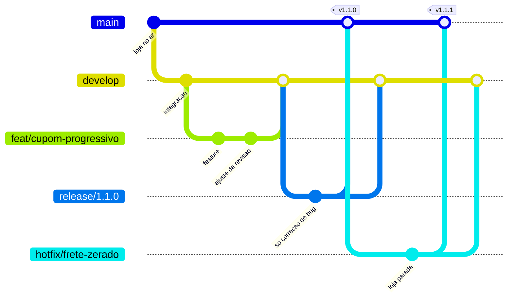

# Como trabalhar neste repositório

IKCOUS Marketplace. Dois desenvolvedores, assíncronos, loja no ar.

Este documento é para consulta rápida, não para leitura completa. Use o índice.
Se você está chegando agora, leia antes `docs/onboarding/03-SETUP-AMBIENTE.md`.

- [A trava que não existe](#a-trava-que-não-existe) ← **leia esta primeiro**
- [Modelo de branches](#modelo-de-branches)
- [Mensagem de commit](#mensagem-de-commit)
- [Posso commitar direto?](#posso-commitar-direto)
- [Abrindo um PR](#abrindo-um-pr)
- [Release](#release)
- [Hotfix](#hotfix)
- [Banco de dados](#banco-de-dados)
- [O que o CI checa](#o-que-o-ci-checa)

---

## A trava que não existe

Em 30/07/2026 o repositório passou a ser **privado**, porque havia chave
`service_role` do Supabase no histórico enquanto ele era público. A conta é
pessoal e está no plano Free. Consequência, testada na API e não deduzida:

```text
GET  /repos/BielWeed/ikcous-marketplace/branches/main/protection  → 403
GET  /repos/BielWeed/ikcous-marketplace/rulesets                  → 403
"Upgrade to GitHub Pro or make this repository public to enable this feature."
```

**Não existe branch protection neste repositório.** Nada do lado do GitHub
impede um push direto na `main`. Nenhum check é obrigatório para mergear.
O `CODEOWNERS` não atribui revisor automaticamente.

O que existe no lugar:

| Camada | O que faz | Como falha |
| --- | --- | --- |
| Hook `pre-push` do lefthook | Recusa push em `main` e `develop` | `git push --no-verify` passa por cima |
| Hook `commit-msg` | Recusa mensagem fora do padrão | `git commit --no-verify` passa por cima |
| CI no GitHub Actions | Mostra vermelho no PR | Não bloqueia o botão de merge |
| Acordo entre os dois | — | Só funciona se os dois quiserem |

E mais duas limitações reais dos hooks:

1. **Só valem para quem rodou `npm install` no clone.** Os hooks são instalados
   pelo script `prepare` do `package.json`. Clone novo sem `npm install` = zero
   proteção.
2. **Só valem em branch que contém o `lefthook.yml`.** Se você fizer checkout de
   um commit anterior a este PR, o lefthook não acha configuração e libera tudo.

### 20/08/2026 — a trava estava DESLIGADA, e o texto acima dizia que não

Até esta data, quem trabalhava numa **cópia paralela do repositório** (o
`git worktree`: uma segunda pasta que aponta para o mesmo histórico, para
mexer em duas coisas ao mesmo tempo sem uma atrapalhar a outra) podia
commitar uma senha de banco **e o commit passava**. Sem erro, sem vermelho,
sem aviso. Nada nesta página avisava, porque nada aqui tinha sido medido.

O que acontecia, em uma frase: o programinha que o git chama antes de cada
commit procurava o lefthook numa pasta onde ele não estava, não achava,
escrevia uma linha discreta — `Can't find lefthook in PATH` — e **terminava
dizendo que deu tudo certo**. O git acredita nesse "tudo certo" e grava o
commit. Das 5 cópias paralelas que existiam na máquina naquele dia, **3
estavam nesse estado**, e a linha discreta saía no meio de uma saída de
sucesso, onde ninguém repara nela.

O conserto são duas linhas no `lefthook.yml`:

- `lefthook: "$(git rev-parse --path-format=relative --git-common-dir)/..."`
  — ensina o hook a procurar o programa na pasta **principal** do projeto, e
  não dentro da cópia paralela, onde ele não existe. **É esta linha que
  conserta o problema hoje**, sozinha.
- `assert_lefthook_installed: true` — a reserva. Ela manda o hook **reprovar**
  em vez de aprovar quando o lefthook não é encontrado. Medido em 20/08/2026:
  do jeito que o lefthook escreve o programinha, o trecho onde essa reserva
  age está **fora do caminho** enquanto a linha de cima existir — ou seja, ela
  não muda nada que dê para observar hoje. Fica porque volta a valer no dia em
  que a linha de cima sumir ou parar de resolver. Não a credite pelo conserto.

**Como conferir, sem acreditar em ninguém:**

```bash
npm run hooks:prova
```

Ele monta um repositório descartável (dentro de `scratch/`, que o git ignora,
e apaga tudo no fim), e mede seis coisas na mesma rodada. A primeira é a que
mais importa no dia a dia: **os três programinhas que o git realmente vai
chamar nesta pasta — os de commit, de mensagem e de push — são o que a
configuração atual gera?** Depois vêm as outras cinco:
commitar uma senha falsa tem de ser **recusado**; commitar o mesmo arquivo
limpo tem de **passar** (e o secretlint tem de aparecer nas duas saídas, senão
um hook que não roda nada "aprovaria" o arquivo limpo); e o cenário antigo é
reproduzido lado a lado para mostrar que o "aprovava" virou "recusa". Termina
com um veredito. Se ele não fechar em `TRAVA LIGADA E FECHADA`, **não trate o
hook como proteção.**

`ls .git/hooks` não serve para conferir isso: os três arquivos estiveram lá o
tempo todo, inclusive nas cópias onde a trava estava desligada.

**A proteção ainda não está garantida — e é importante saber por quê.**

Os três arquivos de hook são **um só jogo, compartilhado por todas as cópias
paralelas** do repositório. O lefthook reescreve esse jogo sozinho toda vez
que alguém commita ou dá push de uma cópia cujo `lefthook.yml` está diferente
do último que ele sincronizou. Enquanto as duas linhas acima não estiverem na
branch base (`develop`/`main`) **e** cada cópia não tiver feito `git pull`,
um commit feito de qualquer cópia atrasada **desfaz o conserto para todo
mundo** — e a trava volta a aprovar em silêncio. Isso aconteceu em
20/08/2026, no meio da própria revisão desta mudança.

**E a troca acontece no meio do commit, não antes dele.** Medido em
20/08/2026 num repositório descartável, com marcadores plantados dentro do
arquivo de hook:

```text
shim ANTES  tem MARCADOR_A: 2   MARCADOR_B: 0
[hook: pre-commit]
sync hooks: ✔️(commit-msg, pre-commit)      <- reescreve AQUI
JOB-PRE-COMMIT-RODOU                         <- e só então roda o job
shim DEPOIS tem MARCADOR_A: 0   MARCADOR_B: 2
```

Duas consequências práticas, e nenhuma é óbvia:

- **O estado da trava não é uma propriedade da sua máquina — é uma
  propriedade da última cópia que commitou.** Você pode ter rodado a prova de
  manhã, com tudo verde, e estar desprotegido à tarde sem ter tocado em nada:
  basta outra cópia paralela (ou outra sessão) ter commitado de uma branch que
  ainda não tem as duas linhas. Não é "conserta uma vez e acabou"; é "confira
  antes de confiar".
- **Um ✔️ de um job não diz nada sobre os hooks seguintes do mesmo commit.**
  Como a reescrita acontece antes de os jobs rodarem, dá para ver na mesma
  saída um `✔️ eslint` e, logo abaixo, um `Can't find lefthook in PATH` —
  aconteceu exatamente assim com outra sessão em 20/08/2026. O visto verde é
  daquele job, não da trava.

E não é raro: em 20/08/2026, numa máquina com cinco cópias paralelas ativas,
os três hooks foram revertidos **três vezes em treze minutos** (12:03, 12:10 e
12:16) sem ninguém pedir. Por isso o passo a passo abaixo é para usar, não
para guardar.

**O que fazer com isso, na prática:**

- **Como você percebe:** rode `npm run hooks:prova`. O primeiro controle
  compara os **três** hooks em uso (`pre-commit`, `commit-msg` e `pre-push`)
  com o que a configuração gera e **reprova** quando algum diverge, dizendo
  qual.
- **Como você conserta:** rode `npx --no-install lefthook install` na sua
  pasta. Leva um segundo. Se ele reclamar que não achou o lefthook, rode
  `npm install` e repita.
  <br>O `--no-install` não é frescura: sem ele, no dia em que o
  `node_modules` estiver quebrado, o `npx` **baixa da internet** a versão mais
  nova do lefthook — e é essa versão desconhecida que vai reescrever os hooks
  de **todas** as cópias paralelas. A versão certa já está travada no
  `package-lock.json` e já está no disco. Com `--no-install`, o comando falha
  em vez de improvisar, que é o que se quer de uma ferramenta de segurança.
- **Quando isso acaba:** quando as duas linhas chegarem à branch base e todas
  as cópias tiverem puxado. Até lá, rodar a prova antes de confiar no hook não
  é paranoia — é a única forma de saber.

Duas coisas que continuam verdadeiras e que a correção **não** resolve:

- `--no-verify` continua passando por cima de tudo. Isto é um lembrete que
  funciona, não uma garantia.
- O secretlint pega senha de banco em URL de conexão, chave da AWS e token de
  Slack, mas **não** pega um JWT no formato `service_role` do Supabase —
  medido em 20/08/2026 com o preset atual. Ou seja: justamente o tipo de
  chave que já vazou neste repositório não é coberto pelo preset. Trocar ou
  somar regra ao secretlint é trabalho à parte.

O caminho para uma trava de verdade é GitHub Pro (US$ 4/mês, mantém o repositório
privado) ou tornar o repositório público com o histórico purgado. **O Gabriel
adiou essa decisão em 30/07/2026.** Está registrada como INFRA-240 no backlog.

Enquanto isso: se você usar `--no-verify`, avise no Discord. Não é proibido —
tem hora que é a saída certa. É que ninguém mais tem como saber.

---

## Modelo de branches



| Branch | Sai de | Volta para | Regra |
| --- | --- | --- | --- |
| `main` | — | — | Só código em produção. Todo commit aqui vira deploy. **Não é protegida pelo GitHub** — ver acima. |
| `develop` | `main` | — | Integração. Base de toda branch nova. Branch padrão do repositório. |
| `feat/<escopo>` | `develop` | `develop` | Funcionalidade nova. |
| `fix/<escopo>` | `develop` | `develop` | Correção que pode esperar o próximo release. |
| `chore/<escopo>` | `develop` | `develop` | Infra, dependência, configuração. |
| `docs/<escopo>` | `develop` | `develop` | Só documentação. |
| `refactor/<escopo>` | `develop` | `develop` | Muda a forma sem mudar o comportamento. |
| `release/<versão>` | `develop` | `main` **e** `develop` | Só recebe correção de bug. Nada de feature nova. |
| `hotfix/<escopo>` | **`main`** | `main` **e** `develop` | O único que sai da `main`. |

Existem branches antigas com prefixo `claude/` no remoto. São de sessões de
agente anteriores ao GitFlow. Não crie mais nenhuma; a limpeza delas está em
INFRA-180.

**O passo que todo mundo esquece:** `release` e `hotfix` fazem merge em **duas**
branches. Se você mergear o hotfix só na `main`, o bug volta no próximo release,
porque a `develop` nunca recebeu a correção. Isso já é a causa mais comum de
regressão em GitFlow — não confie na memória, siga o passo a passo abaixo.

**Toda branch acima é apagada à mão depois de mergeada**, no remoto e no local.
O `delete_branch_on_merge` do repositório está desligado (`INFRA-290`, #150), e
é por isso que as receitas abaixo terminam sempre com um passo de limpeza. Nas
que mergeiam em duas branches, esse passo vem **por último**: apagar antes do
segundo PR deixa ele sem head ref.

---

## Mensagem de commit

[Conventional Commits](https://www.conventionalcommits.org/pt-br/). Não é
preferência: o `commit-msg` recusa o que estiver fora, via `.commitlintrc.json`.

```text
tipo(escopo): assunto no imperativo, começando em minúscula

corpo opcional, explicando o PORQUÊ (o diff já mostra o quê)

Refs: #123
```

**Tipos:** `feat`, `fix`, `docs`, `style`, `refactor`, `perf`, `test`, `build`,
`ci`, `chore`, `revert`.

**Escopos** (o escopo é opcional; se usar, tem que estar nesta lista — ela vive
em `.commitlintrc.json`):

| Escopo | Onde |
| --- | --- |
| `account` | perfil, endereços, favoritos, notificações do cliente |
| `admin` | `src/views/admin/` e `src/components/admin/` |
| `auth` | `AuthContext`, login, OTP, RLS do ponto de vista da sessão |
| `brand` | identidade visual, ícones, textos de marca |
| `cart` | `CartContext`, `CartView` e componentes de carrinho |
| `catalog` | vitrine, busca, produto, comparação |
| `checkout` | fechamento de pedido, cupom no checkout, WhatsApp |
| `ci` | `.github/workflows/` |
| `db` | `supabase/migrations/`, RPCs, RLS, triggers |
| `deps` | dependência subindo ou descendo de versão |
| `edge` | `supabase/functions/` |
| `lib` | `src/lib/`, `src/utils/`, `src/hooks/` genéricos |
| `notifications` | Web Push, `send-push`, notificações |
| `orders` | pedido do lado do cliente e do admin |
| `pwa` | `src/sw/`, service worker, manifest, offline |
| `shipping` | frete, `calculate-shipping`, CEP |
| `tooling` | lint, hooks, `.gitignore`, scripts, config de build |
| `ui` | `src/components/ui/`, design system |

Precisa de um escopo que não está aí? Acrescente em `.commitlintrc.json` no
mesmo PR, e diga no corpo do PR por quê.

**Limite:** 100 caracteres na primeira linha. Assunto em minúscula. Sem ponto
final.

### Cinco exemplos bons

Todos reais, do histórico deste repositório:

```text
fix(db): grant execute on is_admin functions to anon and authenticated roles
fix(pwa): point PWA manifest's maskable icon entry at the square-corner variant
chore(lib): remove dead useDataVault hook and redundant default exports
chore(tooling): scope .gitignore's *.png rule to exclude app icon assets
feat(brand): add app icon generation script
```

O que eles têm em comum: um assunto só, imperativo, revisável sem abrir o diff,
e reversível isoladamente.

### Três exemplos ruins

Também reais. É por isso que as regras existem:

```text
fix(mkt): complete checkout, coupons, guest auth, and performance optimizations
```
> `mkt` é o repositório inteiro — escopo que abrange tudo não filtra nada. E são
> quatro mudanças sem relação num commit só: não dá para reverter uma delas.

```text
optimize(admin): enhance transitions, scroll restoration, offline support, error boundaries and custom alertdialogs
```
> 115 caracteres (o limite é 100), `optimize` não é tipo válido (seria `perf`),
> e cinco assuntos empacotados. O escopo largo é sintoma de commit grande demais.

```text
fix(AdminProductFormView): Handle silent failure on duplicate variant SKUs and coerce empty string SKUs to null
```
> 111 caracteres, escopo é nome de arquivo (só em `src/views/admin/` há 17 —
> não escala), e o assunto começa com maiúscula.

---

## Posso commitar direto?

Não. A tabela existe porque a dúvida aparece de qualquer jeito.

| Situação | Pode? | O que fazer |
| --- | --- | --- |
| "É só um typo no README" | Não | `docs/<assunto>` → PR |
| "É uma linha só" | Não | Uma linha quebra loja igual a mil |
| "A loja está parada, é urgente" | Não | `hotfix/<assunto>` a partir da `main` → PR. Leva 40s a mais |
| "O outro dev está dormindo" | Não | Abra o PR e escreva no Discord. Merge de PR sem revisão é decisão do autor, mas o PR fica registrado |
| "Estou só testando" | Não | Branch descartável. Não precisa nem abrir PR |
| "Sou o dono do repositório" | Não | Especialmente não. É a `main` que está no ar |

---

## Abrindo um PR

```bash
git switch develop && git pull
git switch -c feat/<assunto>
# trabalhe, commite
git push -u origin feat/<assunto>
gh pr create --base develop --fill

# depois do merge, apague a branch. O GitHub NÃO faz isso sozinho.
# Local primeiro, remoto depois — a ordem importa, ver abaixo:
git switch develop && git pull
git branch -d feat/<assunto>
git push origin --delete feat/<assunto>
git fetch --prune
```

**A limpeza é manual de propósito.** O `delete_branch_on_merge` do repositório
foi desligado em 05/08/2026 (`INFRA-290`, #150) porque o auto-delete apagava a
branch de release no instante do merge e inviabilizava o passo 6 do
[Release](#release) — que precisa dela viva. O preço é este: branch mergeada
fica no remoto até alguém apagar.

**Por que local antes de remoto.** Squash é o padrão aqui, e squash cria um
commit novo: o original da sua branch nunca vira ancestral da `develop`. O
`git branch -d` ainda aceita apagar, porque a branch bate com o ref de upstream
(`origin/feat/...`) — ele avisa "não mergeada em HEAD" e apaga assim mesmo. Mas
se você apagar o remoto primeiro, esse ref some no `--prune` e aí o `-d` passa a
recusar, exigindo `-D`.

Se cair no `-D`, confirme antes que o conteúdo entrou de verdade:
`git diff develop <branch>` tem que sair vazio. `-D` não pergunta nada, e
branch que nunca foi mergeada some igual.

Branch local que virou `[gone]` porque o remoto sumiu primeiro é outro caso, e
tem receita própria em [Branch órfã](#branch-órfã-quando-o-remoto-some-primeiro).

**O que precisa estar verde antes de pedir revisão:** todos os cinco jobs.

Se a `Catraca de lint` reprovar, ela diz qual contagem subiu — é dívida que
**este PR** introduziu, não a antiga. Ver
[A catraca de lint](#a-catraca-de-lint).

**Quem revisa:** o outro. Marque na mão — o `CODEOWNERS` não atribui sozinho
neste plano.

**O que o revisor procura**, nesta ordem:

1. Faz o que o PR diz que faz, e nada além disso
2. Alguém consegue seguir o "Como testar" sem perguntar nada
3. Se toca carrinho, cupom, frete, pedido ou banco: qual é o plano de reverter
4. Credencial, `console.log` esquecido, código comentado
5. Só depois: estilo e nomenclatura

**PR parado é o principal modo de falha de dupla assíncrona.** Se um PR passar
de 48h sem revisão, cobre no Discord. Não é cobrança pessoal, é o processo.

### Branch órfã: quando o remoto some primeiro

A receita acima apaga o local antes do remoto e não deixa branch órfã. Mas o
inverso acontece: alguém aperta o botão "Delete branch" na página do PR, ou o
outro dev apaga a branch dele e você tinha uma cópia local para revisar. Aí
sobra branch local marcada `[gone]`.

**Não use o `/clean_gone`** do plugin `commit-commands` para isso. Ele não faz
`--prune` antes de olhar — então não enxerga justamente essas branches — e
quando enxerga, apaga direto com `-D`, sem conferir nada. Medido em `INFRA-290`
(#150). Faça assim:

```bash
# 1. sem o --prune a marca [gone] nem aparece
git fetch --prune

# 2. liste. Use -v: o -vv imprime "[origin/x: gone]" e quebra qualquer filtro
git branch -v

# 3. branch com prefixo "+" tem worktree; ela sai primeiro
git worktree list
git worktree remove <caminho>

# 4. tente o -d antes do -D. Se apagar, acabou
git branch -d <branch>
```

**Se o `-d` recusar com `not fully merged`, pare.** Sem o ref de upstream, ele
recusa até branch que foi mergeada por squash — a recusa **não** distingue
trabalho salvo de trabalho perdido, e o `-D` apaga os dois calados. Quem
distingue é o diff:

```bash
git diff origin/develop <branch>
```

- **Vazio** → o conteúdo entrou. `git branch -D <branch>`.
- **Com conteúdo** → há trabalho fora da `develop`. Não apague; fale com o dono
  da branch. Se for sua, abra o PR que faltou.

O `origin/` não é detalhe: você acabou de dar `fetch`, não `pull`, então a
`develop` local costuma estar atrás. Comparar contra ela acusa conteúdo em
branch já mergeada. Para `hotfix/` e `release/`, compare contra `origin/main`.

---

## Release

```bash
git switch develop && git pull
git switch -c release/1.2.0

# 1. sobe a versão
npm version 1.2.0 --no-git-tag-version
# 2. escreve o CHANGELOG.md à mão: o que muda para quem USA a loja
# 3. commita
git commit -am "chore(tooling): prepara release 1.2.0"
git push -u origin release/1.2.0

# 4. PR release/1.2.0 -> main. MERGE COMMIT, não squash:
#    a release precisa manter os commits individuais para o hotfix
#    conseguir ser cherry-picked depois.
gh pr create --base main --title "release 1.2.0"

# 5. depois do merge na main, marque a tag
git switch main && git pull
git tag -a v1.2.0 -m "release 1.2.0"
git push origin v1.2.0

# 6. E ENTÃO O PASSO QUE TODO MUNDO ESQUECE:
gh pr create --base develop --head release/1.2.0 --title "chore: volta a release 1.2.0 para develop"

# 7. só DEPOIS do passo 6 mergeado, apague a branch:
git switch develop && git pull
git branch -d release/1.2.0
git push origin --delete release/1.2.0
git fetch --prune
```

**O passo 7 vem por último por um motivo.** O passo 6 precisa da
`release/1.2.0` viva no remoto: sem ela o `gh pr create` falha com
`No commits between develop and release/1.2.0 / Head ref must be a branch`.
Foi o que aconteceu na 1.0.3, quando o repositório ainda tinha
`delete_branch_on_merge: true` e o GitHub apagou a branch no merge do passo 4 —
ela precisou ser republicada a partir da cópia local para o passo 6 sair. O
auto-delete foi desligado por causa disso (`INFRA-290`, #150). Se um dia for
religado, o passo 6 volta a exigir `git push origin release/X.Y.Z` antes.

Versionamento semântico, sobre o comportamento da **loja**, não do código:

- **PATCH** (1.2.**1**) — corrigiu bug, ninguém percebe mudança de comportamento
- **MINOR** (1.**3**.0) — funcionalidade nova, nada quebrou
- **MAJOR** (**2**.0.0) — fluxo do cliente ou do lojista mudou de forma que exige
  reaprender

> O `package.json` está em `1.0.0` desde sempre e o campo `name` ainda é
> `"my-app"` (INFRA-210). Enquanto isso não for corrigido, a primeira release
> real deste processo é a que arruma os dois.

Só entra na `release/` correção do que a própria release quebrou. Feature nova
espera a próxima — a branch existe justamente para estabilizar, e feature nova
zera a estabilização.

---

## Hotfix

Hotfix é para **loja parada ou perdendo dinheiro agora**. Não é para pressa.
Se dá para esperar o próximo release, é `fix/` saindo de `develop`.

```bash
git switch main && git pull
git switch -c hotfix/<assunto>
# corrija o mínimo possível. Um hotfix grande é dois problemas.
git commit -am "fix(<escopo>): <o que>"
git push -u origin hotfix/<assunto>

# 1. PR para main, MERGE COMMIT
gh pr create --base main --title "hotfix: <assunto>"
# 2. tag de PATCH
git switch main && git pull
git tag -a v1.2.1 -m "hotfix <assunto>" && git push origin v1.2.1

# 3. O PASSO QUE CAUSA REGRESSÃO QUANDO ESQUECIDO:
gh pr create --base develop --head hotfix/<assunto> --title "fix: leva o hotfix <assunto> para develop"

# 4. só depois do passo 3 mergeado, apague a branch:
git switch develop && git pull
git branch -d hotfix/<assunto>
git push origin --delete hotfix/<assunto>
git fetch --prune
```

Se você pular o passo 3, o bug **volta** no próximo release, porque a `develop`
nunca recebeu a correção — e vai voltar sem ninguém entender por quê.

O passo 4 vem depois do 3 pela mesma razão do release: o PR para a `develop`
precisa da branch viva. Apagar antes obriga a republicá-la.

Antes de fechar: escreva no Discord o que aconteceu, o que causou e o que
impediria de acontecer de novo. Isso vira task, não culpa.

---

## Banco de dados

As regras operacionais completas estão em
`docs/onboarding/03-SETUP-AMBIENTE.md`, seção "Regras de segurança para acesso
ao Supabase de produção" — **essa é a lista oficial, numerada de 1 a 12.** Não
duplique aqui, referencie de lá. O que segue é só o que muda no fluxo de PR.

**Regra 1, acima de todas: nunca rode `supabase db push`.** O histórico de
migrations diverge muito do banco: cerca de 50 migrations locais nunca foram
aplicadas e cerca de 25 existem em produção sem arquivo local. Um `db push`
tentaria replayar as 50 — incluindo reescrita de RLS e `GRANT`/`REVOKE` — num
banco divergente, com a loja no ar.

Nenhum PR que altera schema é mergeado sem, no PR:

1. O SQL validado em `BEGIN; ... ROLLBACK;` contra produção, com a saída colada
2. O arquivo de rollback, dentro do mesmo PR
3. A confirmação de que o corpo da função ao vivo bate com o arquivo-base:
   ```sql
   SELECT pg_get_functiondef(p.oid)
   FROM pg_proc p JOIN pg_namespace n ON n.oid = p.pronamespace
   WHERE n.nspname = 'public' AND p.proname = '<funcao>';
   ```
4. Revisão do Gabriel. Ele é quem aplica — o agente e o Netim não escrevem em
   produção (regras 8, 9 e 11 do documento de setup)

O checklist condicional do template de PR cobre isso. Marque a label
`toca-banco` na issue.

> **Não existe migration pendente hoje.** Medido no banco em 05/08/2026, depois
> da AUTH-020 (#154): o ledger está em 126 linhas e as duas últimas que este
> documento acompanhava entraram — `20260729000002` (validação de cotação de
> frete) e `20260805120000` (OTP apontando para o projeto certo).
>
> Ledger não prova nada sozinho, então confirmei os objetos:
> `create_marketplace_order_v23` existe com uma definição, e os quatro
> marcadores da v23 (`0.05`, `shipping_quotes`, `v_calculated_total`,
> `p_total_amount`) estão no corpo vivo **e** no arquivo.
>
> Este bloco dizia o contrário até hoje — "não assuma que a RPC
> `create_marketplace_order_v23` existe no banco" — e estava errado para o lado
> perigoso: mandava o dev programar defesa para um problema que não existe. Foi
> escrito quando era verdade e ninguém voltou para conferir. **Antes de
> acrescentar uma pendência aqui, meça; antes de confiar numa que já está,
> meça também.** A consulta:
>
> ```sql
> SELECT version FROM supabase_migrations.schema_migrations
>  WHERE version IN ('<as que te interessam>');
>
> SELECT pg_get_functiondef(p.oid)
>   FROM pg_proc p JOIN pg_namespace n ON n.oid = p.pronamespace
>  WHERE n.nspname = 'public' AND p.proname = '<funcao>';
> ```

---

## O que o CI checa

`.github/workflows/ci.yml`, em PR e push para `develop` e `main`.

| Job | Comando | Estado em 30/07/2026 |
| --- | --- | --- |
| `Tipos` | `npm run typecheck` | verde — 911 arquivos, 16s |
| `Testes` | `npm test` | verde — 66 testes em ~5,8 s (medido em 05/08/2026: 32 Deno de edge function + 11 Deno do Truth Gate + 23 vitest. O job chamava `Testes (Deno)` e rodava 12 até a INFRA-150 e a PUSH-010 entrarem) |
| `Build e tamanho` | `npm run build` + `npm run size` | verde — 515 kB de 800 kB |
| `Varredura de segredo` | secretlint no diff | verde — 0 achados |
| `Catraca de lint` | `npm run lint:ratchet` | verde — dívida no teto |

Os cinco bloqueiam. "Bloqueia" aqui significa "os dois combinaram de não mergear
com isso vermelho" — o GitHub não impede nada, ver
[A trava que não existe](#a-trava-que-não-existe).

### A catraca de lint

`npm run lint` cru sai com erro, e vai continuar saindo enquanto houver dívida
antiga: **7 erros e 553 warnings** de eslint, **31 erros** de Biome, medidos no
CI. Nenhum dos dois criou essa dívida.

Duas saídas fáceis foram descartadas, pelo mesmo motivo:

- rodar `npm run lint` direto deixaria todo PR vermelho desde o dia 1;
- `continue-on-error: true` deixaria um X vermelho permanente no PR.

As duas treinam o mesmo reflexo — ignorar vermelho — e aí os jobs que importam
passam despercebidos junto.

A catraca compara com os tetos de `.lint-baseline.json` e **reprova só o que
subir**. Se o seu PR introduz um warning novo, ele reprova, e diz qual número
subiu. Se você derrubar um número, ela avisa para abaixar o teto no mesmo PR —
é isso que impede a dívida de voltar.

Nunca suba um teto sem explicar no PR por quê.

> Os números do teto foram medidos **no CI**, não numa máquina. No Windows o
> eslint conta 14 erros em vez de 7 se o `eslint.config.js` não estiver
> ignorando `.claude/worktrees` (uma cópia do próprio repositório), e o Biome
> conta 100 erros em vez de 31 porque o disco está em CRLF e ele formata em LF.
> Por isso o Biome só é cobrado dentro do CI. Normalizar fim de linha é a
> INFRA-220; zerar os warnings de eslint é a INFRA-250.

### Reproduzindo o CI local

```bash
npm run typecheck
npm test
NODE_ENV=production npm run build && npm run size
npm run secretlint
npm run lint:ratchet
```

Cuidado com `npm run build` **sem** `NODE_ENV=production`: `vite.config.ts:143`
lê `process.env.NODE_ENV` em vez do `mode` do Vite, e nesta máquina
`NODE_ENV=development` está setado no shell. Sem o override, você mede um bundle
de desenvolvimento e acha que regrediu.

---

## Instalando os hooks

Automático no `npm install`, via script `prepare`. Para conferir:

```bash
npx --no-install lefthook validate
ls .git/hooks
```

Deve listar `pre-commit`, `commit-msg` e `pre-push`. **Listar não é
funcionar** — quem responde se a trava está de pé é `npm run hooks:prova`.
Ver [A trava que não existe](#a-trava-que-não-existe). Se não listar:

```bash
npx --no-install lefthook install
```

O `--no-install` impede o `npx` de baixar `lefthook@latest` da internet quando
o `node_modules` está quebrado. A versão certa está travada no
`package-lock.json`; se o comando falhar, rode `npm install` e repita.
