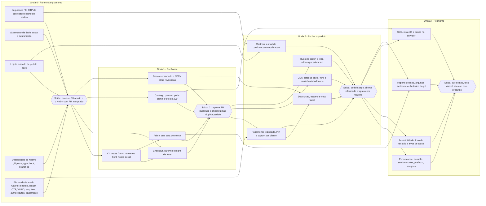

# ROADMAP — IKCOUS Marketplace

Sequência de execução das 111 tarefas de [`BACKLOG.md`](BACKLOG.md), em 4 ondas.
Escrito em 30/07/2026, a partir da classificação dos 85 achados de auditoria, do levantamento do
banco vivo, do relatório de saúde de engenharia e do levantamento de lacuna de produto.

**Como ler este documento.** Cada onda tem um objetivo em uma frase e um critério de saída
verificável — não "está melhor", mas algo que dá para conferir rodando um comando ou abrindo uma
tela. As tarefas são listadas pelo título exato do backlog. As notas de paralelização citam o
**arquivo** que causaria conflito, porque com dois devs e zero CI o conflito de merge é o custo
real, não a dificuldade da tarefa.

**Aviso sobre as estimativas.** Todas as estimativas de semanas são chute grosso. Este projeto não
tem histórico de velocity: não há CI, não há testes rodando, não há registro de quanto tempo levou
nenhuma tarefa anterior. Trate os números como ordem de grandeza, não como compromisso. A primeira
onda serve também para calibrar as outras três.

---

## Antes de começar: três pares de tarefas que se sobrepõem

O backlog tem 110 entradas, mas três pares descrevem o mesmo trabalho por ângulos diferentes.
Executar como par, num PR só, senão o segundo vira retrabalho:

| Par | Como executar |
| --- | --- |
| "Fazer `npm run typecheck` checar de verdade" + "Corrigir os dois comandos que mentem sobre a qualidade do build" | A segunda **contém** a primeira. Fazer só a segunda. |
| "Decidir o destino do segundo projeto Supabase que envia o OTP de convidado" + "Por que o envio do OTP depende de um SEGUNDO projeto Supabase e quem tem acesso a ele?" | Mesma conversa com o Gabriel. Uma reunião, um documento. |
| "Decidir a estratégia de reconciliação do ledger de migrations" + "O que fazer com as 42 migrations pendentes e as 28 versões do ledger sem arquivo?" | Mesma decisão. A primeira é a forma executável da segunda. |

São 111 itens no backlog, **108 unidades de trabalho** na prática.

---

## Onda 0 — Parar o sangramento

**Objetivo:** fechar os dois vazamentos de dado pessoal e financeiro que estão abertos hoje, e
tirar do caminho tudo que impede o Netim de commitar.

**Critério de saída** (todos verificáveis):

1. Chamar `generate_order_otp_v1` com o WhatsApp de um pedido real e um e-mail que não consta
   naquele pedido retorna falso e **não** insere linha em `otp_verifications` — comprovado em
   transação com `ROLLBACK`.

2. Usuário logado A, de posse do id de um pedido de convidado, recebe exceção de autorização ao
   chamar `update_order_status_atomic`.

3. Com `SET LOCAL ROLE authenticated` e um `auth.uid()` de cliente comum, `SELECT custo FROM produtos`
   falha ou devolve NULL nas 18 linhas ativas; `get_category_analytics` recusa cliente comum.

4. Criar um pedido de teste com o painel admin **fechado** e o lojista recebe aviso em até 1 minuto.
5. `git check-ignore -v .github/workflows/ci.yml` retorna exit 1 e `git check-ignore -v .env.bak`
   retorna exit 0.

6. Introduzir um erro de tipo proposital em qualquer arquivo de `src/` faz `npm run typecheck`
   falhar.

7. As 9 decisões do Gabriel estão **escritas** em `docs/onboarding/`, com data. Não "conversadas".
8. O Netim tem um PR mergeado.

### Tarefas (23)

#### Segurança — os dois vazamentos abertos (4)

- `AUTH-010` Exigir e-mail e WhatsApp juntos e amarrar o OTP de convidado a um pedido específico
- `PEDIDO-010` Trocar `!=` por `IS DISTINCT FROM` na checagem de dono de `update_order_status_atomic`
- `BANCO-010` Parar de expor a coluna `custo` para qualquer usuário autenticado
- `BANCO-020` Adicionar guarda de `is_admin` em `get_category_analytics`

#### Operação que perde venda hoje (2)

- `PEDIDO-020` Avisar o lojista quando entra um pedido novo
- `PEDIDO-080` Parar de prometer entrega de código OTP que não foi confirmada

#### Desbloqueio do Netim (5)

- `INFRA-030` Remover `*.yml` do `.gitignore` para permitir arquivos de CI
- `INFRA-050` Proteger o `.env.bak` no `.gitignore`
- `INFRA-120` Corrigir os dois comandos que mentem sobre a qualidade do build *(absorve "Fazer `npm run typecheck` checar de verdade")*
- `INFRA-020` Fazer `npm run typecheck` checar de verdade *(par da anterior)*
- `INFRA-180` Limpar as branches já mergeadas e resolver o `origin/master` zumbi

#### Incerteza que ameaça a vitrine inteira (2)

- `DOC-020` Confirmar se o embed de `product_variants` sobre a view funciona nesta instância
- `DOC-050` Fechar os links quebrados da documentação de onboarding

#### Fila de decisões do Gabriel (10)

- `CHECKOUT-010` Decidir: a loja vai cobrar dentro do site ou a cobrança continua acontecendo fora?
- `BANCO-040` Qual política de backup e PITR está ativa no plano Supabase?
- `BANCO-050` O que fazer com as 42 migrations pendentes e as 28 versões do ledger sem arquivo?
- `BANCO-030` Decidir a estratégia de reconciliação do ledger de migrations *(par da anterior)*
- `AUTH-020` Por que o envio do OTP depende de um SEGUNDO projeto Supabase e quem tem acesso a ele?
- `PEDIDO-050` Decidir o destino do segundo projeto Supabase que envia o OTP de convidado *(par da anterior)*
- `PUSH-030` As chaves VAPID estão configuradas no ambiente da edge function `send-push`?
- `INFRA-060` Qual é a fonte de verdade das variáveis de produção, e qual `DATABASE_URL` ficou viva depois da troca de 30/07?
- `CATALOGO-020` Por que o catálogo está travado em 200 produtos?
- `FRETE-010` Qual provedor de frete está realmente ativo em produção: `flat_fee`, Melhor Envio ou Frenet?

### O que dá para paralelizar — Onda 0

#### Dá: — Onda 0

- As duas trilhas de infra são disjuntas em arquivo. `.gitignore` (as duas tarefas de gitignore
  juntas, num PR só — mesmo arquivo) fica com um dev; `package.json` + `tsconfig.json` +
  `vite.config.ts` (os comandos que mentem) fica com o outro.

- "Parar de expor a coluna custo" e "Adicionar guarda de `is_admin`" são migrations novas em objetos
  diferentes. Paralelizam, **desde que os dois combinem o timestamp do nome do arquivo antes** —
  dois arquivos com o mesmo prefixo já aconteceu neste repo (há 1 prefixo duplicado nos 135 arquivos
  com timestamp).

- Toda a fila de decisões roda em paralelo com o código: não é trabalho de dev.
- "Confirmar se o embed funciona" e "Fechar os links quebrados" são leitura e texto. Zero conflito.

#### Não dá: — Onda 0

- **`src/hooks/useOrders.ts` é o gargalo da onda.** Quatro tarefas o tocam: o OTP de convidado
  (`:886`, `:910`), a checagem de dono (`:56`, `:734`), o aviso de pedido novo, e o texto do OTP.
  Um dev único assume a trilha inteira de pedido/OTP. Dividir aqui produz três dias de merge.

- "Exigir e-mail e WhatsApp juntos" e "Parar de prometer entrega de código OTP" tocam ambas
  `src/components/ui/custom/OrderSearch.tsx`, e a segunda depende de uma decisão que ainda não saiu.
  Sequenciar, não paralelizar.

- **Nada de banco avança sem a resposta de backup/PITR.** Com o ledger fora de sincronia e 25
  migrations pendentes que somam 190 `DROP POLICY` contra 127 `CREATE POLICY`, escrever migration
  sem ponto de restauração confirmado é aposta. Essa decisão é o caminho crítico da onda inteira.

**Sugestão de primeiro PR do Netim:** "Mostrar o código de rastreio para o cliente" (formalmente na
Onda 2) ou "Normalizar acentuação nos três pontos de busca do cliente" (Onda 1). As duas atravessam
banco → mapper → hook → view sem poder quebrar nada, e são a forma mais barata de ele aprender a
camada de dados. Puxar uma delas para cá é intencional, não furo de sequência.

**Duração estimada: 2 a 3 semanas** — e o limitante não é código, é a fila de decisões. Se o Gabriel
responder as 9 na primeira semana, a onda fecha em 2. Se as decisões arrastarem, o código termina e
a onda fica travada esperando. Chute grosso.

---

## Onda 1 — Confiança

**Objetivo:** montar a rede de segurança (CI + testes) e, com ela no ar, consertar os bugs dos
fluxos que movimentam dinheiro — para parar de ter medo de mexer no checkout.

### Critério de saída: — Onda 1

1. Um PR com erro de tipo proposital aparece **reprovado** na interface do GitHub.
2. `npm test` roda no front e no Deno, e o CI executa os dois em todo PR.
3. Um commit com erro de lint bloqueante é recusado localmente pelo hook, em menos de 10 s.
4. Dar F5 na rota de checkout com carrinho vazio não permite enviar pedido; chamar o RPC direto com
   `p_items = []` não cria linha em `marketplace_orders`.

5. Simular timeout na resposta do checkout e tocar de novo em finalizar resulta em **um** pedido,
   com estoque debitado uma vez e cupom consumido uma vez.

6. Adicionar produto com variação, dar F5 e abrir o carrinho: o texto da variação continua lá. O
   mesmo carrinho aberto em outro dispositivo mostra a variação.

7. Com o catálogo em cache e a rede desligada, a Home continua mostrando os produtos.
8. Simular falha de rede e salvar qualquer uma das 5 telas de admin que chamam `updateConfig`:
   aparece erro, o formulário **não** é limpo e o modal **não** fecha.

9. Envio de push com todos os endpoints inválidos mostra aviso, não toast verde.
10. Boot medido na aba Network: nenhum endpoint chamado mais de duas vezes.

### Tarefas (34)

#### Fundação de engenharia (4)

- `INFRA-040` Criar o primeiro workflow de CI rodando lint, typecheck e build
- `INFRA-140` Rodar no CI os 12 testes Deno que já existem na edge function de frete
- `INFRA-150` Instalar um runner de teste no front e cobrir os mappers
- `INFRA-160` Ativar hooks de git de verdade com lefthook

#### Checkout, carrinho e frete — o caminho do dinheiro (7)

- `CHECKOUT-020` Bloquear checkout com carrinho vazio no front e no RPC
- `CHECKOUT-030` Criar chave de idempotência do pedido e lock síncrono no botão de finalizar
- `CARRINHO-010` Preservar `variantNames` na reidratação do localStorage e na sincronia entre dispositivos
- `CARRINHO-020` Reidratar o snapshot de produto guardado no carrinho antes do checkout
- `FRETE-020` Unificar a regra de frete grátis, que hoje está escrita em sete lugares
- `FRETE-030` Frete grátis só para usuário logado é decisão de produto ou efeito colateral?
- `CATALOGO-060` Tornar determinística a escolha de preço e de variante enviada ao carrinho

#### Pedidos do lojista e do cliente (4)

- `PEDIDO-030` Impedir que a reconexão do realtime zere a lista de pedidos do admin
- `PEDIDO-040` Quebrar o loop de requisições do `OrderDetailsView` para usuário sem pedidos
- `PEDIDO-090` Enviar o push de mudança de status somente depois que a RPC confirmar
- `PEDIDO-100` Serializar a fila offline de status e descartar erro terminal em vez de reenfileirar

#### Catálogo que não pode sumir (3)

- `CATALOGO-010` Parar de esvaziar o catálogo quando a consulta pública de produtos falha
- `CATALOGO-070` Remover o teto de 200 produtos e os três sintomas que ele produz
- `BUSCA-010` Normalizar acentuação nos três pontos de busca do cliente

#### Admin que para de mentir (3)

- `ADMIN-010` Fazer `updateConfig` sinalizar falha em vez de engolir o erro e mostrar sucesso
- `ADMIN-020` Decidir se as colunas de vitrines e de banner completo entram no banco ou saem do código
- `ADMIN-030` Parar de apagar do storage a imagem de banner que o admin não enviou nesta sessão

#### Push e PWA (3)

- `PUSH-010` Fazer `send-push` reportar quantos envios falharam em vez de sempre `success:true`
- `PUSH-020` Checar a sessão antes de criar a assinatura push no navegador
- `PWA-010` Unificar a recuperação de erro de chunk e dar saída para o usuário

#### Privacidade da sessão (3)

- `AUTH-030` Fechar a enumeração de e-mails cadastrados na recuperação de senha
- `AUTH-050` Encerrar a sessão localmente no logout e limpar os caches de PII do usuário anterior
- `AUTH-040` Fazer a verificação de admin resolver por usuário em vez de semáforo global de módulo

#### Banco e boot (3)

- `INFRA-010` Eliminar as requisições duplicadas do boot causadas por callbacks instáveis
- `BANCO-060` Versionar em migration os objetos que existem em produção e não no repositório
- `BANCO-070` Revogar ou remover as RPCs órfãs que ninguém chama e que ainda têm EXECUTE

#### Documentação que destrava trabalho (4)

- `DOC-010` Introspectar e documentar as views `vw_produtos_public` e `vw_produtos_admin`
- `DOC-040` Medir o `max-rows` do PostgREST deste projeto e documentar
- `DOC-030` Documentar como deployar as 3 edge functions e quais segredos cada uma exige
- `DOC-060` Documentar o inventário real de RPCs e como contar os call sites corretamente

### O que dá para paralelizar — Onda 1

#### Dá: — Onda 1

- A trilha de CI (workflow, testes Deno, runner no front, lefthook) é quase toda em arquivos que
  ninguém mais toca: `.github/workflows/ci.yml`, `lefthook.yml`, arquivos de teste novos. **Exceção:**
  `package.json` é tocado por três dessas tarefas e já foi tocado na Onda 0 — quem pegar a trilha de
  CI leva as três juntas.

- As quatro tarefas de documentação não conflitam com nada. São a válvula de escape para quando o
  outro dev estiver com um arquivo travado.

- Banco (`Versionar em migration...`, `Revogar ou remover as RPCs órfãs...`) é `supabase/migrations/`
  puro. Paraleliza com qualquer trilha de front.

- Push e PWA: `supabase/functions/send-push/index.ts`, `src/hooks/usePushNotifications.ts` e
  `src/hooks/useUpdateCheck.ts` são disjuntos do resto da onda.

#### Não dá: — Onda 1

- **`src/contexts/StoreContext.tsx` é o pior gargalo do projeto inteiro.** Cinco tarefas desta onda o
  tocam: esvaziar o catálogo (`:397-436`), o teto de 200 (`:391`, `:402`), `updateConfig` (`:444-509`),
  as requisições duplicadas do boot (`:375`, `:439`, `:514-523`) e a unificação do frete grátis
  (`:600-605`). Um dev único assume o arquivo pela onda inteira. Não existe divisão limpa aqui.

- **`src/contexts/CartContext.tsx`:** três tarefas — `variantNames` (`:19-24`), reidratação do
  snapshot (`:184-190`, `:317-319`) e frete grátis (`:746-751`). Mesmo dono do StoreContext, porque
  a reidratação e o teto de 200 são o mesmo problema visto de dois lados.

- **`src/views/customer/CheckoutView.tsx`:** carrinho vazio e idempotência tocam as mesmas linhas
  (`:378-395`, `:1027`). Uma tarefa depois da outra, na ordem: carrinho vazio primeiro (é a guarda
  mais simples), idempotência depois.

- **`src/hooks/useOrders.ts` de novo:** quatro tarefas de pedidos. Segue com o mesmo dev da Onda 0 —
  ele já tem o arquivo na cabeça.

- "Remover o teto de 200 produtos" **não começa** antes da resposta de "Por que o catálogo está
  travado em 200 produtos?" (Onda 0). Sem ela, o dev está adivinhando se 200 é limite de performance
  ou chute antigo.

- "Unificar a regra de frete grátis" **não começa** antes de "Frete grátis só para usuário logado é
  decisão de produto?". As duas estão na mesma onda de propósito: a decisão é barata e o código
  depende dela.

**Divisão sugerida:** Dev A = StoreContext + CartContext + CheckoutView + catálogo (a trilha densa).
Dev B = CI + testes + banco + push/PWA + docs (a trilha larga e disjunta). Trocar na Onda 2, senão o
Dev B nunca aprende o núcleo.

**Duração estimada: 5 a 7 semanas.** É a onda mais longa e a mais desconfortável: muito trabalho num
punhado de arquivos, com um dev bloqueando o outro. A primeira semana serve para o CI subir; a
partir dali o ritmo deve dobrar, porque pela primeira vez existe uma rede. Chute grosso.

---

## Onda 2 — Fechar o produto

**Objetivo:** entregar o que falta para isto ser um marketplace e não um catálogo com botão de
comprar — dinheiro registrado, cliente informado, lojista com relatório.

### Critério de saída: — Onda 2

1. O admin marca um pedido como pago e como estornado, e a mudança persiste após recarregar. A lista
   de pedidos filtra por pago e não pago.

2. Escolhendo PIX, o cliente recebe copia-e-cola com o valor exato, e o código é aceito por dois
   bancos diferentes num teste real de leitura.

3. Fechar um pedido de teste resulta em e-mail recebido em até 2 minutos, com itens, total e
   endereço — inclusive para convidado.

4. O código de rastreio aparece na tela do cliente, com botão de copiar.
5. Mudar o status de um pedido cria linha em `notificacoes` e o cliente vê o aviso mesmo com push
   negado.

6. O admin baixa um CSV dos pedidos do período filtrado e ele abre corretamente no Excel em
   português, com acentuação.

7. Uma consulta SQL devolve o funil dos últimos 7 dias com os 4 números: viu produto, adicionou ao
   carrinho, iniciou checkout, concluiu pedido.

8. Tentar usar o mesmo cupom duas vezes com a mesma conta é recusado no checkout.
9. Nenhuma tela do admin mostra sucesso quando a operação falhou — as 5 telas de `updateConfig`
   (Onda 1) mais as de banner, produto, cupom e Q&A.

### Tarefas (32)

#### Dinheiro registrado (4)

- `CHECKOUT-040` Registrar status de pagamento do pedido (pendente/pago/estornado) no admin
- `CHECKOUT-050` Gerar PIX copia-e-cola no checkout com a chave da loja
- `CUPOM-020` Limitar cupom a um uso por cliente
- `CUPOM-030` Devolver o uso do cupom quando o pedido é cancelado

#### Cliente informado (3)

- `PEDIDO-060` Mostrar o código de rastreio para o cliente
- `PEDIDO-070` Enviar e-mail de confirmação de pedido para o cliente
- `PEDIDO-110` Gravar mudança de status do pedido na tabela `notificacoes`

#### Pós-venda e obrigação legal (3)

- `PEDIDO-130` Qual é a política de devolução e troca da loja?
- `PEDIDO-120` Habilitar os status de devolução e estorno no ciclo do pedido
- `CHECKOUT-060` A loja vai emitir nota fiscal? O CPF passa a ser obrigatório no checkout?

#### Lojista com dado na mão (4)

- `ADMIN-130` Exportar pedidos em CSV a partir do painel
- `ADMIN-140` Mostrar alerta de estoque baixo no dashboard e tornar o limiar configurável
- `ADMIN-150` Registrar eventos de funil na tabela `analytics_events`
- `ADMIN-160` Listar carrinhos abandonados no painel do admin

#### Admin que ainda mente (9)

- `ADMIN-040` Sincronizar o cache de módulo de banners e parar de mutar o state no reorder
- `ADMIN-050` Usar `null` em vez de `undefined` nos campos que o admin precisa poder zerar
- `CUPOM-010` Gravar a validade do cupom como fim do dia no fuso local, não meia-noite UTC
- `ADMIN-060` Corrigir o ciclo de vida do formulário de produto: duplo clique e rascunho perdido
- `ADMIN-070` Inverter as fases do `deleteProduct`: soft-delete no banco antes de mover a mídia
- `ADMIN-080` Fazer o modal de Perguntas e Respostas editar a resposta em vez de criar uma segunda
- `ADMIN-090` Fazer o interruptor de Avaliações desligar as avaliações de verdade
- `ADMIN-100` Resolver a disputa pela classe `dark` entre o App e o StoreContext
- `ADMIN-110` Distinguir falha de consulta de ausência de dados no dashboard de faturamento

#### Vitrine e notificação do cliente (3)

- `CATALOGO-080` Corrigir a resposta da loja invisível e o contador "Útil" das avaliações
- `PUSH-040` Fazer notificação de campanha global poder ser lida e excluída pelo cliente
- `CATALOGO-030` Tratar `deleted_at` no handler de UPDATE do `RealtimeSyncEngine`

#### Infra offline que trava a loja em silêncio (3)

- `INFRA-070` Garantir que o `RealtimeSyncEngine` sempre suba, mesmo com o IndexedDB lento
- `INFRA-080` Parar de mascarar falha de leitura do DataVault como lista vazia
- `INFRA-090` Fatiar o refetch do `catchUp` e parar de logar sucesso quando a query falhou

#### Dívida que fica cara se esperar (3)

- `CATALOGO-090` Unificar as três semânticas de estoque de variação
- `ADMIN-120` Decidir o que fazer com `AdminBannersView`, que tem 5.385 linhas num componente
- `CATALOGO-100` Os hard-codes de produto no `mappers.ts` podem sair?

### O que dá para paralelizar — Onda 2

**Dá — esta é a onda mais paralelizável das quatro.** As features são funcionalmente independentes e
moram em arquivos diferentes:

- CSV → `src/views/admin/AdminOrdersView.tsx`
- Estoque baixo → `src/views/admin/AdminProductsView.tsx` + `src/components/admin/dashboard/`
- Carrinhos abandonados → `src/views/admin/AdminCustomersView.tsx`
- PIX → `src/views/customer/CheckoutView.tsx`
- E-mail de confirmação → `supabase/functions/`
- Devolução → constraint de status + migrations

#### Não dá: — Onda 2

- **`src/lib/mappers.ts` recebe três tarefas:** o rastreio (`:234`), o status de pagamento e os
  hard-codes (`:26-28`, `:80-83`). Arquivo pequeno, três donos = conflito garantido. Um dev só, na
  ordem: hard-codes primeiro (limpa o terreno), rastreio, status de pagamento.

- **`src/views/admin/AdminBannersView.tsx` (5.385 linhas) + `src/hooks/useBanners.ts`:** a correção do
  cache/reorder e a decisão sobre quebrar o arquivo são a mesma pessoa. E a decisão vem **depois** da
  correção de storage da Onda 1 — quebrar o arquivo antes de os bugs saírem é trocar um problema
  conhecido por um desconhecido.

- **`src/contexts/CartContext.tsx` e `src/views/customer/CheckoutView.tsx`** aparecem no
  `analytics_events` (evento de adicionar ao carrinho e de iniciar checkout) e no PIX. Mesmo dono, ou
  o de eventos entra depois do PIX estar mergeado.

- "Habilitar os status de devolução" **não começa** antes de "Qual é a política de devolução e troca
  da loja?". Sem a política, não há como saber quais status criar.

- "Gerar PIX" e "Registrar status de pagamento" dependem da decisão de pagamento da Onda 0. Se a
  resposta for "gateway X", as duas tarefas mudam de forma — o status de pagamento passa a ser
  escrito pelo webhook do gateway, não pelo admin.

- Os três de infra offline (`RealtimeSyncEngine`, DataVault, `catchUp`) são a **mesma cadeia**: hoje
  `[]` significa duas coisas no DataVault, e os consumidores dependem dessa ambiguidade. Um dev, na
  ordem: DataVault primeiro (desambigua na fonte), depois os listeners, depois o `catchUp`.

**Duração estimada: 6 a 8 semanas.** É a onda com mais tarefas (32) mas também a de menor atrito
entre os dois devs. Se a Onda 1 entregou o CI e os testes, esta é a que deve mostrar a maior
velocidade. Chute grosso — e o intervalo é largo porque depende inteiramente da resposta de
pagamento: "gateway de verdade" e "PIX estático" são semanas diferentes de trabalho.

---

## Onda 3 — Polimento

**Objetivo:** performance, acessibilidade, SEO e a limpeza do que sobrou — o trabalho que ninguém
sente faltando até alguém reclamar.

### Critério de saída: — Onda 3

1. Navegar a Home inteira só com Tab mostra indicador de foco visível em todos os controles;
   os alvos de toque do carrossel e do header têm no mínimo 44×44 px.

2. Um build de produção limpo tem **zero** ocorrências de `console.log` em `dist/assets/*.js`.
3. Após 30 minutos de app aberto, o Cache Storage não tem nenhuma entrada de `/version.json`.
4. `https://ickous-marketplace.vercel.app/robots.txt` e `/sitemap.xml` respondem 200 com o conteúdo
   novo, e o sitemap tem uma URL por produto ativo.

5. Abrir uma URL inválida não deixa o app num estado ambíguo com a URL errada na barra.
6. `git ls-files .playwright-mcp/` retorna 0 linhas e `git ls-files '*.png' | grep -v '^public/'`
   retorna 0 linhas.

7. `npx knip` roda e o resultado está registrado; nenhum arquivo fantasma continua declarado como
   entry point.

8. Na aba Network da Home, a imagem do bloco de ofertas vem por `/storage/v1/render/image/public/`
   com `width`, não por `/object/public/`.

### Tarefas (21)

#### Performance (5)

- `INFRA-110` Remover `console.*` do bundle de produção e a sobrescrita global de `console.warn`
- `PWA-020` Parar de cachear cada `/version.json?t=` como entrada nova no Service Worker
- `INFRA-100` Parar o prefetch preditivo de rodar em todo render e de poluir o próprio histórico
- `CATALOGO-110` Passar `sizes` nos dois `LazyImage` que ainda baixam a imagem original
- `PWA-030` Por que existem 13 ramos de `manualChunks` no `vite.config.ts`?

#### Acessibilidade e UX (3)

- `INFRA-130` Restaurar o indicador de foco de teclado e corrigir os alvos de toque abaixo de 44 px
- `CATALOGO-040` Resetar a Home pelo critério de filtro, não pela referência do array nem pela URL
- `CATALOGO-050` Dar `key` ao `ProductView` para não reaproveitar estado entre produtos

#### SEO e rotas (4)

- `SEO-010` Versionar o `robots.txt` e colocar as URLs de produto no sitemap
- `INFRA-190` Dar destino a URL inválida em vez de renderizar a Home com a URL errada na barra
- `BUSCA-020` Mover a busca do cliente para o servidor com índice
- `SEO-020` Vale investir em SSR ou prerender para o preview de link de produto?

#### Higiene de repositório (6)

- `INFRA-170` Tirar os screenshots do controle de versão
- `INFRA-240` Vamos reescrever o histórico do git para tirar os 15,5 MB de screenshots?
- `INFRA-210` Corrigir a identidade do projeto no `package.json`
- `INFRA-220` Fazer o Biome cobrir as edge functions e remover o ignore de caminho absoluto
- `INFRA-230` Limpar as dependências e scripts que ninguém executa
- `INFRA-250` Zerar os 553 warnings de eslint e baixar o teto da catraca até zero

#### Dívida arquitetural remanescente (4)

- `INFRA-200` Remover os arquivos e objetos fantasmas que fingem ser arquitetura
- `ADMIN-170` Reduzir os seis pontos de edição necessários para adicionar um campo em `store_config`
- `AUTH-060` Parar de derivar `isAdmin` do objeto de sessão em cache no localStorage
- `FRETE-040` Por que R$ 15 é o fallback de frete e por que a tolerância de valor é R$ 0,05?

### O que dá para paralelizar — Onda 3

#### Dá: — Onda 3

- Acessibilidade (`src/index.css`, `src/components/ui/custom/Header.tsx`,
  `src/components/ui/custom/BannerCarousel.tsx`) é uma ilha. Zero conflito com o resto.

- SEO estático (`public/robots.txt`, `public/sitemap.xml`) idem.
- Service Worker (`src/sw/sw.ts`) idem.
- As duas tarefas de imagem (`sizes` nos `LazyImage`) idem.

#### Não dá: — Onda 3

- **`vite.config.ts` recebe quatro tarefas:** drop de console, `manualChunks`, arquivos fantasmas
  (comentários obsoletos nos `globIgnores`) e limpeza de dependências. Um dev, num PR só, senão são
  quatro rebases no mesmo arquivo de 400 linhas.

- **`src/App.tsx` (2.712 linhas) recebe quatro tarefas:** reset da Home por filtro, `key` no
  `ProductView`, destino de URL inválida e a remoção do `CompareView`. Mesmo dono. E o roteador é
  manual (`useState` + `pushState`, sem react-router), sem teste nenhum — quem mexe aqui precisa ter
  passado pela Onda 1 e conhecer as views.

- **A reescrita de histórico do git não paraleliza com nada.** Quebra o clone dos dois devs. Precisa
  de janela combinada e plano de reclone escrito. Fazer por último, na semana de fechamento.

- "Mover a busca do cliente para o servidor com índice" depende da resposta sobre o teto de 200
  produtos (Onda 0) e da remoção do teto (Onda 1). Sem as duas, a busca no servidor resolve metade do
  problema e reintroduz a outra metade.

- "Reduzir os seis pontos de edição de `store_config`" depende da decisão sobre as colunas de
  vitrines (Onda 1). Refatorar o caminho de config antes de saber quais campos existem é retrabalho
  garantido.

**Duração estimada: 3 a 4 semanas.** É a onda mais paralelizável e a menos arriscada — mas também a
primeira a ser cortada se o negócio pressionar. Se cortar, cortar da última linha para cima:
acessibilidade e SEO ficam, higiene de repositório espera. Chute grosso.

---

## Total

| Onda | Tarefas | Estimativa grossa |
| --- | ---: | --- |
| 0 — Parar o sangramento | 23 | 2 a 3 semanas |
| 1 — Confiança | 34 | 5 a 7 semanas |
| 2 — Fechar o produto | 32 | 6 a 8 semanas |
| 3 — Polimento | 22 | 3 a 4 semanas |
| **Total** | **111** | **16 a 22 semanas** |

Aproximadamente **4 a 5 meses** para uma dupla, sem nenhum histórico de velocity para calibrar.
Reavaliar ao fim da Onda 0: será a primeira medição real de quanto esta dupla entrega por semana
neste código.

**O que mais provavelmente vai furar a estimativa,** em ordem de probabilidade:

1. **A fila de decisões do Gabriel.** Nove decisões travam a Onda 0 e mais quatro travam as Ondas
   1 e 2. Nenhuma delas é trabalho de dev — todas dependem de informação que só ele tem.

2. **O ledger de migrations.** Se a estratégia escolhida for reconciliação arquivo a arquivo, isso
   sozinho pode virar uma onda inteira. São 41 versões locais fora do ledger e 28 versões no ledger
   sem arquivo.

3. **A decisão de pagamento.** "Integrar gateway" e "PIX estático com conferência manual" são ordens
   de grandeza diferentes de trabalho na Onda 2.

4. **`StoreContext.tsx` na Onda 1.** Cinco tarefas num arquivo, um dev, sem teste. É o ponto onde o
   cronograma tem mais chance de escorregar por retrabalho e não por escopo.

---

## Dependências entre as ondas

---

## Documentos relacionados

| Documento | O que tem |
| --- | --- |
| [`BACKLOG.md`](BACKLOG.md) | As 111 tarefas com evidência, critério de aceite e arquivos |
| [`06-ESTADO-ATUAL.md`](../onboarding/06-ESTADO-ATUAL.md) | O placar dos 85 achados e o semáforo por área |
| [`01-VISAO-GERAL.md`](../onboarding/01-VISAO-GERAL.md) | Panorama, riscos e estado de maturidade |
| [`02-ARQUITETURA.md`](../onboarding/02-ARQUITETURA.md) | Diretórios, abstrações e dívida arquitetural |
| [`03-SETUP-AMBIENTE.md`](../onboarding/03-SETUP-AMBIENTE.md) | Ambiente, armadilhas e regras de banco |
| [`04-GLOSSARIO.md`](../onboarding/04-GLOSSARIO.md) | Os nomes inventados |
| [`05-FLUXOS-CRITICOS.md`](../onboarding/05-FLUXOS-CRITICOS.md) | Os 5 fluxos que param a loja |

---

## Não verificado

- **As estimativas de semanas.** Não há velocity medida neste projeto: zero CI, zero testes rodando,
  nenhum registro de duração de tarefa anterior. Os números são inferência a partir do tamanho
  declarado de cada tarefa (P/M/G) no backlog, não medição.

- **A ordem interna dentro de cada onda.** As dependências entre ondas estão apoiadas nos campos
  `depende_de` do backlog; a ordem dentro de uma onda é sugestão, não obrigação.

- **Se as 9 decisões da Onda 0 são realmente respondíveis pelo Gabriel sozinho.** Duas delas (backup/
  PITR e variáveis da Vercel) exigem acesso a painéis que não foram abertos por ninguém ainda; pode
  ser que a resposta gere mais perguntas.

- **Se `AdminBannersView.tsx` pode ser quebrado com segurança.** A decisão está na Onda 2 justamente
  porque a resposta depende de histórico que não está no código.
