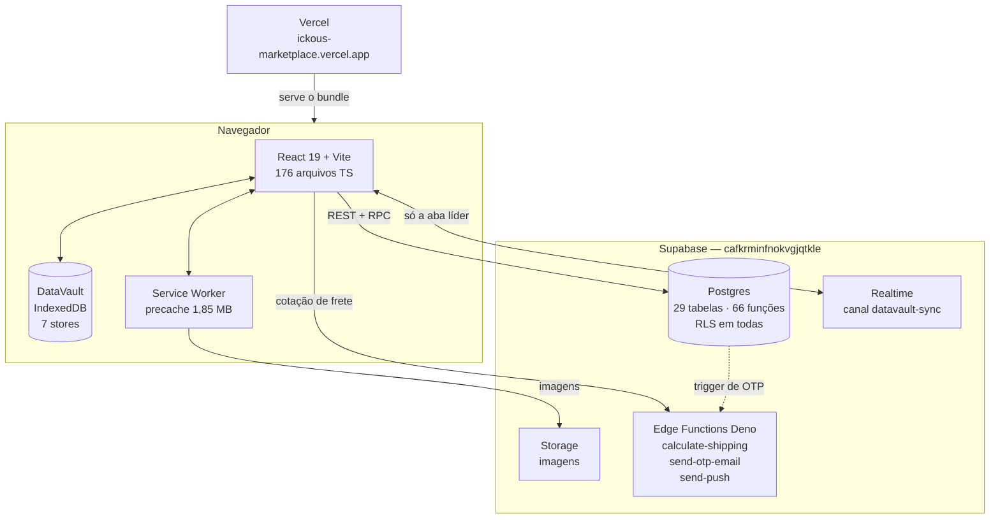

# Visão Geral — IKCOUS Marketplace

Marketplace de produtos com estoque imediato em Monte Carmelo/MG. O cliente navega o catálogo,
monta o carrinho, aplica cupom, calcula frete e fecha o pedido. O lojista gerencia produtos,
pedidos, banners, cupons, frete e configuração da loja por um painel admin dentro do mesmo app.

É um PWA instalável e offline-first: o catálogo é pintado do IndexedDB em milissegundos e depois
revalidado contra o Supabase.

---

## Como este documento foi feito

Em 30/07/2026, 8 agentes leram o código real — um por domínio funcional — e um passe adversarial
de 3 céticos tentou refutar cada afirmação estrutural, reabrindo os arquivos e consultando o
Postgres de produção.

**95 afirmações checadas, 22 refutadas (23%).** Onde uma refutação mudou a conclusão, está
marcado no texto. Onde nada pôde ser confirmado, está escrito "não verificado" — e isso vale
mais do que preencher no chute.

Para comparação: a auditoria de 29/07 refutou 2 de 78 (2,5%). A diferença é que aqui os céticos
tinham acesso ao banco e instrução explícita para derrubar.

---

## Os números do sistema

| | |
| --- | --- |
| Arquivos `.ts`/`.tsx` em `src/` | 176 (~72.600 linhas) |
| Telas do cliente | 14 |
| Telas do admin | 17 |
| Hooks | 35 |
| Componentes `.tsx` | 75 |
| Contextos React | 6 |
| Arquivos de migration no disco | **137** |
| Linhas no ledger de migrations do banco | 121 |
| Tabelas no schema `public` | 29 — **com RLS em 29/29** |
| Funções no schema `public` | 66 — **com `search_path` fixado em 66/66** |
| Edge functions (Deno) | 3 |
| Testes automatizados | **0** |
| Workflows de CI | **0** |

> A `AUDITORIA_2026-07-29.md` declara "38 migrations SQL" no escopo. O disco tem 137 arquivos.
> Trate a cobertura daquele relatório como menor do que ele afirma.

---

## Arquitetura em uma imagem

---

## As 10 coisas que você precisa saber antes de tocar em qualquer coisa

**1. O catálogo tem teto de 200 produtos, e isso é a causa-raiz de meia dúzia de sintomas.**
`StoreContext.tsx:391` e `:402` — não é paginação, é `.limit(200)`. Do 201º produto em diante, o
mais antigo deixa de existir para o cliente: sai do catálogo, do filtro, das três buscas, dos
favoritos, e a tela de detalhe fica **em branco** (`App.tsx:1939-1943` faz `return null`). Nada
na UI indica truncamento. Por que 200 não está documentado em lugar nenhum.

**2. Existem duas metades do sistema que discordam sobre o tamanho do catálogo.**
`fetchProducts` trunca em 200 e faz `replaceAll`; `catchUp` busca **todos** os ids sem limite e
faz `putMany` incremental, apagando o que não veio. Acima de 200 itens os dois oscilam, e nada
serializa as escritas — `StoreContext.tsx:424` vs `realtimeSyncEngine.ts:581-583`.

**3. `variant_names` e `home_sections` existem no frontend e em nenhuma migration.**
`grep -rn variant_names supabase/migrations/` retorna zero. A tela de **Vitrines** chama
`updateConfig({ homeSections })`, o StoreContext mostra "Configurações salvas", e a RPC
`upsert_store_config` **não trata essa coluna** — salva no vazio.

**4. A regra de frete grátis está escrita em sete lugares independentes, e o guard é de R$ 0,05.**
`CartContext`, `StoreContext`, `CartView`, `FreeShippingBlock` e a RPC exigem usuário logado;
`ShippingCalculator` e `CartReminder` **não exigem** — e são justamente os que escrevem "Grátis" na
frente do cliente. A edge function **não** entra na conta: ela só olha `frete_gratis` por item,
nunca o mínimo (`calculate-shipping/index.ts:374`, `:509`). A RPC recalcula tudo e recusa o pedido
se divergir mais de R$ 0,05. O modo de falha não é "preço errado" — é **"o cliente não consegue
comprar"**. Enumeração completa em [`05-FLUXOS-CRITICOS.md`](05-FLUXOS-CRITICOS.md).

**5. Nunca rode `supabase db push`.** O ledger tem 121 linhas para 137 arquivos, e existem
objetos cujo *corpo vivo* não corresponde a nenhum arquivo. Um `CREATE OR REPLACE` apagaria
silenciosamente o que foi aplicado por fora. Detalhes em [`03-SETUP-AMBIENTE.md`](03-SETUP-AMBIENTE.md).

**6. O OTP do convidado passou três semanas apontando para um projeto que não hospedava a função.**
Até 05/08/2026 a função viva `handle_new_otp_verification` fazia `net.http_post` para
`https://jvgyjlbjhbfrncwbytls.functions.supabase.co/send-otp-email` — um segundo projeto, onde a
`send-otp-email` **nunca foi publicada**. Todo POST era 404, e ninguém percebeu porque
`otp_verifications` nunca teve uma linha. A string não existia em nenhuma migration; foi aplicada
pelo SQL Editor.

Corrigido pelo #154, com a migration `20260805120000`. Hoje o trigger aponta para o projeto
principal e se autentica com um segredo próprio, guardado no Vault (`otp_trigger_secret`) — não com
a `service_role`. O segundo projeto foi **excluído** em 05/08/2026 (#85).

A lição que sobrevive: **corpo de função ao vivo pode divergir do arquivo, e o repo não é fonte de
verdade do schema.** Antes de mexer em qualquer função, ler o corpo com `pg_get_functiondef`.

**7. Travado em 85% significa "o React nunca montou".** A barra do loader tem teto codificado em
85 (`public/silent-guardian.js:72`) e só chega a 100 quando o React a remove. Não é lentidão de
rede — é crash antes do primeiro render. ⚠️ Falta de chave do Supabase **não cai mais aqui**: desde
a guarda de `src/lib/env.ts:71-87` o app remove o loader e pinta uma tela vermelha nomeando a
variável que faltou. Travado em 85% hoje significa algum outro crash.

**8. `custo` está exposto para qualquer usuário logado.**
`20260324000000_01_fix_produtos_permissions_v26.sql:9` concede `SELECT` em `produtos` a
`authenticated`, e `20260708230000_optimize_is_admin_rls.sql:106-110` define a policy como
`ativo = true OR (authenticated AND is_admin())`. Junto, isso reabre o vazamento que
`20260323000001_fix_produtos_custo_leak.sql` tinha fechado — e o comentário daquela migration
("Non-admin authenticated users still see 0 rows") ficou obsoleto e enganoso.

**9. `mappers.ts` tem dados de produção hard-coded.** `mappers.ts:26-28` substitui **todas** as
imagens de qualquer produto cujo nome contenha "Aliança Luxo" por uma URL da Amazon, ignorando o
que o admin cadastrou. E `:80-83` renomeia "boobie goods" para "Bobbie Goods" só na exibição — o
nome no banco continua o outro, então buscar pelo nome que aparece na tela não encontra o
produto. Motivo não documentado nos dois casos.

**10. Não existe teste nem CI.** Zero. Toda validação hoje é manual. Isso muda o custo de
qualquer refatoração e é o principal argumento das duas primeiras ondas do
[`ROADMAP.md`](../backlog/ROADMAP.md).

---

## Estado de maturidade, sem suavizar

| Domínio | Estado | O que sustenta a nota |
| --- | --- | --- |
| **Banco de dados** | 🟡 funciona com ressalva | RLS em 29/29 tabelas, `search_path` fixado em 66/66 funções, policies separadas por comando, `auth.uid()` sempre em subquery para evitar reavaliação O(N). É trabalho sério. Ressalvas: `vw_produtos_public` perdeu `security_invoker` e virou caminho de escrita que ignora RLS; `profiles` tem dois triggers BEFORE UPDATE com semânticas incompatíveis onde a ordem alfabética faz um matar o outro; o histórico de migrations não reproduz produção. |
| **PWA / Service Worker** | 🟡 funciona com ressalva | Os problemas difíceis foram diagnosticados de verdade e corrigidos **com explicação escrita**: comparação de versão por núcleo semver com trava de 2 purges, guarda contra falso positivo de heartbeat por suspensão de aba, recusa deliberada de fabricar 408 para não induzir `ChunkLoadError`, `globIgnores` que cortaram o precache de 6 MB para 1,85 MB. A ressalva: a confiabilidade vem de **redundância, não de desenho** — sete mecanismos de autocura sobrepostos, quatro removedores do loader, três caminhos de reload forçado, sem fonte da verdade. |
| **Camada de dados** | 🟡 funciona com ressalva | Boa arquitetura com três camadas de sedimento em cima. Duas das quatro peças anunciadas (`shared-brain`, `state-worker`) **nunca foram ligadas**, e o `knip.json` esconde isso do CI. `getLastSync` tem zero chamadores e 18 escritas inúteis. A mesma tabela é mapeada em dois lugares com resultados diferentes, e **a versão mais pobre é a que ganha no `catchUp`** — daí os banners perderem a arte. |
| **Autenticação** | 🟡 funciona com ressalva | O caminho e-mail/senha é genuinamente bem defendido: `admin` não depende de nada gravável pelo cliente, perfil só é lido/escrito por RPC `SECURITY DEFINER`, 4 camadas de guard de rota, e a autorização real está no RLS — logo os bypasses possíveis no cliente são cosméticos. Em cima disso há uma camada de otimização de boot com quatro timeouts e dois semáforos de módulo, que troca determinismo por velocidade percebida. |
| **Admin** | 🟡 funciona com ressalva | Decisões deliberadas e boas: gate de admin em três camadas com o chunk do painel atrás de uma RPC, eleição de aba líder, um canal Realtime alimentando IndexedDB, `LocalErrorBoundary` por tela. Ressalvas de escala: `AdminBannersView` tem **5.385 linhas em um componente**; as 5 abas principais estão duplicadas integralmente no `AdminArea`; adicionar campo em `store_config` exige tocar em **seis** pontos no caminho de dados, mais a tela de admin. |
| **Build e deploy** | 🟡 funciona com ressalva | **11 arquivos `.env*` na raiz, dos quais o Vite lê 4.** Três caminhos de deploy independentes e não coordenados (frontend automático pela Vercel, edge functions à mão, migrations por script caseiro), sem nada no repo que registre o que está no ar. Não existe `supabase/config.toml`. E `.gitignore` e `.vercelignore` discordam sobre `.env.production`: os dois caminhos de deploy produzem **bundles diferentes do mesmo commit** — mas só em `vercel deploy` por upload local, não pelo fluxo do GitHub (ver risco 5). |
| **Catálogo e busca** | 🟡 funciona com ressalva | As abstrações centrais são deliberadas. `imageUrl.ts` é o melhor código do domínio — comentário com números medidos (card 116 kB→20 kB, banner 1340 kB→27 kB) e a explicação de por que `resize=contain` é obrigatório. A ressalva é o teto de 200 e o modelo de variação: **três semânticas diferentes** de preço/estoque no mesmo domínio. |
| **Carrinho e checkout** | 🔴 frágil | O núcleo está bem pensado: a RPC não confia em nenhum número do cliente e as migrations explicam por escrito as divergências que corrigiram. O que torna frágil é o entorno — sete cópias da regra de frete grátis somadas ao guard de R$ 0,05, "Limpar Tudo" que não limpa (`onRemove("all")`), `variantNames` descartado pelo Zod na reidratação, e o snapshot de produto do convidado que nunca é revalidado. |

**Nenhum domínio saiu como "sólido".** Nenhum saiu como "gambiarra assumida" também. O padrão é
consistente: núcleos bem pensados e comentados, cercados de camadas que saíram de sincronia sem
erro visível.

---

## Três coisas que a auditoria de 29/07 dizia e que hoje são falsas

Verifiquei cada uma por introspecção direta do Postgres de produção. Se você leu aquele
relatório ou a memória do projeto, corrija:

**A migration v23 ESTÁ aplicada.** `create_marketplace_order_v23` existe com os 12 argumentos que
o front chama, `20260729000002 | shipping_quote_validation_v23` consta no ledger, e
`is_local_cep` + `shipping_quotes_cache` + o índice existem. A `v22` já é fachada delegando para
a v23. Um agente marcou "todo checkout falha por função inexistente" como armadilha de gravidade
alta — derivou do enunciado da tarefa sem consultar o banco. O cético pegou.

**O trigger de WhatsApp não existe no banco.** `marketplace_orders` tem **zero** triggers
non-internal, e a edge function `send-order-whatsapp` também não existe. Ou seja: não é um
`net.http_post` falhando com `Authorization` vazio — **não há disparo nenhum, nem tentativa**.

⚠️ **Mas não diga que "nunca chegou a produção".** A migration
`20260601000001_remove_whatsapp_infrastructure.sql` **foi aplicada** — consta no ledger, conferido
por consulta direta em 30/07 — e ela dropa `on_order_created_whatsapp` e
`handle_new_order_whatsapp()`. Como todos os `DROP` são `IF EXISTS`, ter rodado **não** prova que o
trigger existia, e o arquivo de remoção **não** prova que nunca existiu. O que está estabelecido é
só o estado de hoje.

**As chaves do `.env.production.local` não estão vazias.** Foram comentadas em 29/07 às 15:10,
com a justificativa escrita no próprio arquivo. Hoje o `.env.production` prevalece e tem as
chaves reais. ⚠️ Mas a armadilha continua armada: rodar `vercel env pull` de novo regrava o
arquivo com `VITE_SUPABASE_ANON_KEY=""` (a Vercel devolve string vazia para variáveis marcadas
como *sensitive*) e o build local volta a sair sem chaves. Hoje isso dá a tela vermelha do
`[EnvGuard]`, não mais o loader travado em 85%.

---

## A promessa que o produto não cumpre

O README e o comentário em `CheckoutView.tsx:449-459` dizem que o checkout finaliza no WhatsApp.
**Não finaliza.** O checkout termina numa tela de sucesso com confete, dentro do próprio
`CheckoutView` (`:1063-1121`). Não existe redirecionamento para WhatsApp em lugar nenhum do
repositório, e o mecanismo de backend que o faria (trigger + edge function) não existe no banco.

Isso não é bug de implementação — é uma funcionalidade central que nunca foi construída. Está no
topo do [`BACKLOG.md`](../backlog/BACKLOG.md).

---

## Os 5 riscos que mais ameaçam a loja hoje

Ordenados por impacto × probabilidade.

1. **Divergência de centavos derruba o checkout inteiro.** Sete implementações da regra de frete
   grátis contra um guard de R$ 0,05 — e duas delas nem checam se o usuário está logado. Qualquer
   desalinhamento vira "o cliente não consegue comprar", não "o preço saiu errado". Já aconteceu
   duas vezes (achados #27 e #28 da auditoria).
2. **`custo` legível por qualquer usuário logado.** Margem de lucro por produto exposta a quem
   criar uma conta. É segurança, não performance.
3. **O teto de 200 produtos.** Hoje inofensivo porque o catálogo é menor. No dia em que passar,
   produtos desaparecem da loja sem nenhum sinal na UI.
4. **Zero teste e zero CI.** Não há rede de segurança para nenhuma das mudanças acima.
5. **Mudança de status feita offline nunca vira push, nem depois.** `send-push` é invocado em um
   único lugar (`AdminOrdersView.tsx:452`), atrás da guarda `order?.userId && !silent && !isOffline`
   (`:442`). Sem conexão, a alteração entra na fila `orders_offline_updates_queue`
   (`useOrders.ts:721`) e o replay da reconexão (`:39-102`) reenvia **só a RPC** — o push não é
   refeito. O pedido muda de status no banco e o cliente não é avisado nunca; nada na UI do admin
   indica que a notificação não saiu. Fluxo completo em
   [`05-FLUXOS-CRITICOS.md`](05-FLUXOS-CRITICOS.md).

> Até 30/07/2026 este slot era `.gitignore` × `.vercelignore`. Depois de escopar o risco — ele só
> se materializa em `vercel deploy` por upload local, não no fluxo pelo GitHub — deixou de caber
> entre os cinco maiores. Continua registrado no
> [`03-SETUP-AMBIENTE.md`](03-SETUP-AMBIENTE.md) e na tabela de maturidade acima.

---

## Por onde continuar

| Documento | Para quê |
| --- | --- |
| [`02-ARQUITETURA.md`](02-ARQUITETURA.md) | Mapa de diretórios, as abstrações próprias e a dívida arquitetural |
| [`03-SETUP-AMBIENTE.md`](03-SETUP-AMBIENTE.md) | Do clone até `npm run dev`, os 11 arquivos `.env` e as armadilhas |
| [`04-GLOSSARIO.md`](04-GLOSSARIO.md) | Os nomes inventados — leia antes de abrir código |
| [`05-FLUXOS-CRITICOS.md`](05-FLUXOS-CRITICOS.md) | Os 5 fluxos que param a loja se quebrarem |
| [`06-ESTADO-ATUAL.md`](06-ESTADO-ATUAL.md) | Semáforo por área e o placar da auditoria |

**Se você tem 10 minutos:** leia as "10 coisas" acima e o [`04-GLOSSARIO.md`](04-GLOSSARIO.md).
São os dois que evitam mais tempo perdido.
