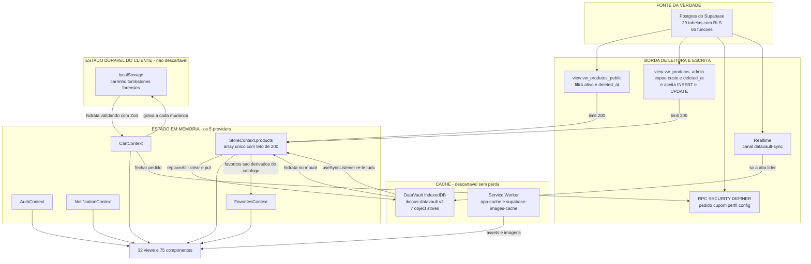
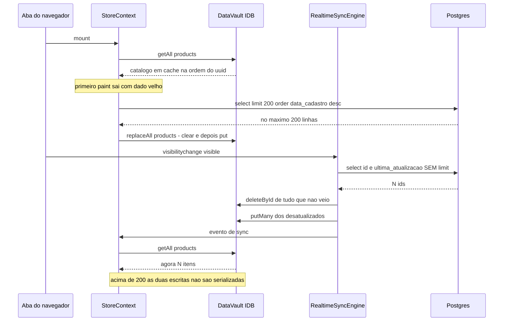

# Arquitetura — IKCOUS Marketplace

Este documento é sobre **mecânica e consequência**: onde as coisas moram, por que estão assim, e o que quebra se você mexer. Os
nomes inventados estão definidos em [`04-GLOSSARIO.md`](04-GLOSSARIO.md) — aqui eles são usados, não explicados.

Todo `arquivo:linha` abaixo foi conferido abrindo o arquivo em 30/07/2026. O que não deu para verificar está em [Não verificado](#não-verificado).

---

## 1. Mapa de diretórios

### Raiz

| Caminho | Propósito |
| --- | --- |
| `vite.config.ts` | 471 linhas, e faz muito mais que build: injeta branding no `index.html` (`:146-272`), gera `dist/version.json` (`:54-79`), reescreve o literal de versão dentro do `silent-guardian.js` (`:81-99`), configura o PWA (`:273-388`), define os chunks à mão (`:398-466`). |
| `middleware.ts` | **Vercel Edge Middleware, não Next.js.** Único código server-side que roda **na Vercel** — não existe `api/` e o `vercel.json` não declara `functions`; as 3 edge functions Deno rodam no Supabase. Em `/product-detail`, se o user-agent é crawler (`:10-13`), busca o produto direto na tabela `produtos` com a chave anon (`:23`) e devolve HTML só com meta tags OG (`:56-83`). Todo o resto passa (`:99-103`). |
| `vercel.json` | Rewrite SPA total (`:6-11`), `no-store` em `sw.js`/`version.json`/`index.html` (`:12-21`), `immutable` de 1 ano em `/assets/*` (`:22-30`), CSP longa com hash inline fixo (`:36`). |
| `knip.json` | 12 linhas, e **duas escondem código morto do CI** — ver [§4.3](#43-shared-brain-e-state-worker--nunca-foram-ligados). |
| `.size-limit.json` | Dois budgets por glob: `dist/assets/*.js` em 800 kB, `*.css` em 100 kB (`:3-9`). |
| 11 arquivos `.env*` | O Vite lê 4. Detalhado em [`03-SETUP-AMBIENTE.md`](03-SETUP-AMBIENTE.md). |
| 39 `.png` soltos, `dist/`, `hint-report/`, `test-results/`, `scratch/` | Sujeira local, toda ignorada (`.gitignore:14, 46, 47, 50, 55`). O `dist/` de 30/07 06:48 é útil como evidência de quais chunks o build produz de fato. |

### `src/` — 176 arquivos `.ts`/`.tsx`

| Diretório | Arquivos | Propósito real |
| --- | --- | --- |
| `src/` (raiz) | 6 | `App.tsx` com **2.712 linhas** (roteador, callbacks, transições, 18 componentes sob demanda); `main.tsx` (102) monta `GlobalErrorBoundary > AuthProvider > NotificationProvider > App` (`:92-101`); `pwa-sentinel.ts`, `shared-brain.ts`, `state-worker.ts`. Fora da contagem de `.ts`/`.tsx`, dois CSS: `index.css` (1.299 linhas) tem os tokens de tema, inclusive o `--admin-gold` (`:56`), e é o único importado (`main.tsx:40`); `App.css` (179, utilitários de safe-area e scrollbar) **não é importado em lugar nenhum**. |
| `src/contexts/` | 6 | Os 5 providers vivos + `NotificationContextCore.ts` (16 linhas, só `createContext` + hook, separado para quebrar ciclo de import). |
| `src/hooks/` | 35 | Sem meio-termo: `useFavorites.ts` é proxy de `useContext`; `useProducts.ts` tem **1.368 linhas** e dois modos. |
| `src/lib/` | 8 | Infraestrutura sem React: `realtimeSyncEngine.ts` (877), `dataVault.ts` (519), `mappers.ts` (238), `forensicsDB.ts` (133), `env.ts` (87), `imageUrl.ts` (62), `utils.ts` (31), `supabase.ts` (28). |
| `src/views/` | 32 | `admin/` (17), `customer/` (14), `shared/` (1 — só `AuthView.tsx`). |
| `src/components/` | 75 | `ui/` (53, dos quais 34 em `ui/custom/`), `admin/` (16, com dois subdiretórios aninhados: `admin/dashboard/` e `admin/orders/`), `layouts/` (2), `pwa/` (2), `debug/` (1), mais `LazyImage.tsx` solto na raiz. |
| `src/utils/` | 8 | Helpers sem estado — exceto `truth_gate.ts`, que é validação de negócio. |
| `src/types/` | 4 | 2.160 linhas em `database.types.ts`, e `supabase.ts` é **byte a byte idêntico**, com zero importadores. |
| `src/sw/` | 1 | `sw.ts` (354). Fonte do Service Worker, compilada pelo `injectManifest`. |
| `src/config/` | 1 `.ts` + 1 `.json` | `branding.json` é lido **duas vezes**: no build (`vite.config.ts:26-28`) e em runtime (`branding.ts`, 108 linhas). |

> **Onde o diretório contradiz o nome.** `src/components/ui/` sugere primitivos Radix, e 19 dos 53 arquivos são isso; os outros
> 34 estão em `ui/custom/` e são componentes de domínio (`ShippingCalculator`, `CouponInput`, `OrderTimeline`, `ProductQA`). E
> `src/components/layouts/` tem 2 arquivos, mas são 1.741 linhas de roteamento e chrome do admin, não layout.

### Fora de `src/`

| Caminho | Propósito |
| --- | --- |
| `supabase/migrations/` | **137 arquivos** `.sql`. Dois não têm timestamp (`add_user_id_to_orders.sql`, `favorites_migration.sql`), então a ordenação lexicográfica os joga para o fim. |
| `supabase/functions/` | 3 edge functions Deno: `calculate-shipping/index.ts` (774 linhas), `send-push` (138), `send-otp-email` (116). |
| `supabase/setup/` e `supabase/tests/` | `Executar_Verificacao_Completa.bat`, `Verificar_Completo.ps1`, `README.md`, `relatorio_verificacao.md`, `projetos/ikcous.md` — e um único `database_verification_test.sql`. Não é setup do CLI — **não existe `supabase/config.toml`**. |
| `scripts/` | 4 `.cjs` de banco + `generate-app-icons.mjs`. Os `.cjs` são o mais próximo de suíte de testes que existe — ver [§6.5](#65-os-testes-existem-e-não-estão-onde-você-procura). |
| `public/` | Assets crus. `silent-guardian.js` (84 linhas) e `loading.css` rodam **antes do React**. `public/images/` está **vazio** hoje. |
| `docs/` | `onboarding/` é este conjunto; `superpowers/` guarda 3 planos e 3 specs de tarefas já executadas — histórico, não referência. |

---

## 2. Decisões de arquitetura, e o porquê de cada uma

### 2.1 Offline-first com IndexedDB próprio em vez de react-query/swr

**Confirmado:** nenhuma biblioteca de data-fetching nas 28 dependências do `package.json`; zero ocorrências de `react-query`,
`@tanstack` ou `swr` no repo. Metade do porquê **está escrita** em `dataVault.ts:1-11`: sem limite de 5 MB, leitura async sem
`JSON.parse` na main thread, migrations versionadas em transação atômica, timestamp de sync por store. É justificativa contra o
*localStorage* — que é de fato o que o `DataVault` substituiu (`:466-473` lista as 5 chaves migradas). O stale-while-revalidate
foi então reescrito à mão e declarado em comentário (`StoreContext.tsx:378-379`), com três peças manuais: hidrata do IDB no mount
(`:73-150`), revalida da rede, compara por `JSON.stringify` do catálogo inteiro para evitar re-render (`:421`). **Por que não
usar biblioteca em cima disso: motivo não documentado — perguntar pro Gabriel.**

### 2.2 Eleição de aba líder para o Realtime

**O porquê está escrito**, em `useLeaderElection.ts:14-19`: *"Prevents N tabs from all triggering SW updates or Supabase
connections simultaneously"*. Uma aba abre o socket; as outras recebem delta por `BroadcastChannel`. Mecânica: `localStorage`
como lock com TTL de 5 s e heartbeat a cada 2,5 s (`:3-4`, `:133-140`), `BroadcastChannel("ikcous_leader_coordination")` para
ping/alive/resign (`:8-11`, `:101-118`), aba escondida resigna após 3 s (`:157-179`). **Trocar de aba muda qual aba fala com o banco.**

O hook é consumido em **10 pontos** — `StoreContext.tsx:65`, `CartContext.tsx:105`, `FavoritesContext.tsx:27`,
`NotificationContext.tsx:13`, `AdminLayout.tsx:57`, `useOrders.ts:114`, `useQuestions.ts:78`, `useReviews.ts:60`,
`useRealtimeUpdate.ts:18`, `AdminDashboardView.tsx:93` — cada um decide sozinho o que fazer com `isLeader`. Não há política central.

### 2.3 Painel admin no mesmo bundle, atrás de gate

Não é "mesmo bundle": é **chunk separado atrás de uma chamada de rede**. `App.tsx:54-98` é um `React.lazy` cujo primeiro ato é
`await supabase.rpc("is_admin")` (`:56`); só com `true` o `import("@/components/layouts/AdminArea")` acontece (`:95-97`). O
comentário em `App.tsx:303` explica o desenho — skeletons e fallback foram movidos para dentro do `AdminArea` *"to prevent
structural exposure before auth check completes"*. O `globIgnores` do PWA reforça: `assets/Admin*.js` sai do precache
(`vite.config.ts:376`), então o cliente comum nunca baixa o painel. Há uma segunda camada redundante no mesmo arquivo,
`AdminAccessDenied` (`App.tsx:305-325`), que checa `isAdmin` do `AuthContext`. A autorização real está no RLS: o que dá para
burlar no cliente é cosmético.

### 2.4 RPC `SECURITY DEFINER` em vez de escrita direta com RLS

199 ocorrências de `SECURITY DEFINER` em 88 dos 137 arquivos de migration; o front chama **30 RPCs distintas em 41 pontos de
chamada**. O número só fecha contando as três formas de invocação: `.rpc("nome")` na mesma linha (17 ocorrências), `.rpc(` com o
nome na linha seguinte, e `(supabase.rpc as any)("nome")` — esta última sozinha responde por mais da metade. **Grepar só `.rpc(`
perde metade do sistema.** Os dois porquês **estão documentados**:

**Reduzir superfície e impedir escalada de coluna.** `update_my_profile_secure`
(`20260707151000_add_avatar_to_profile_update.sql:8-30`) só sabe escrever `full_name`, `whatsapp`, `avatar_url` e `updated_at` —
a coluna `role`, que decide quem é admin, não está na lista e não há como chegar nela pela RPC. A mesma rodada apagou duas RPCs
legadas com o comentário explícito *"Remover RPCs legadas e inseguras para reduzir a superfície de ataque"*
(`20260708200000_harden_database_profiles_and_legacy_rpcs.sql:38-40`) e instalou um trigger `BEFORE UPDATE` que reverte
alteração de `role` feita por não-admin (`:32-36`).

**Zero-trust no dinheiro.** O cabeçalho de `20260729000002_shipping_quote_validation_v23.sql:1-33` é a melhor peça de
documentação de arquitetura do repo: explica que a RPC anterior ignorava `p_shipping_cost` e recalculava, por que uma função
nova em vez de parâmetros com `DEFAULT` (sobrecarga ambígua derrubaria o checkout), e que o preço do frete **vem da cotação que
o próprio servidor gravou**. O guard de divergência está em `:308` (`> 0.05`).

> Não é regra geral. Produto é escrito **direto na view**: `useProducts.ts:482-483` faz
> `.from("vw_produtos_admin").insert(...)`. Duas políticas de escrita convivem.

### 2.5 `manualChunks` à mão

`vite.config.ts:398-466`, 13 ramos, 12 nomes distintos (`vendor-react` aparece duas vezes), todos escolhidos por pessoa.

**Um único ramo tem porquê inferível: `vendor-charts`.** O `globIgnores` do PWA o cita pelo nome (`:377`) para tirar do precache,
e o comentário `:366-369` diz que sem esses ignores o precache passava de 6,5 MB, dos quais ~5 MB nenhum cliente comum usa.

> **Não generalize esse argumento — o próprio bloco o refuta.** O mesmo `globIgnores` casa `assets/ImageAdjuster-*.js` e
> `assets/PhoneSimulator-*.js` (`:378-379`), e nenhum dos dois está no `manualChunks`: são nomes que o Rollup derivou sozinho do
> `lazy import` (o `dist/` de 30/07 tem `ImageAdjuster-DSw5qifV.js`). **Glob estável não exige `manualChunks`.** `assets/Admin*.js`
> (`:376`) também não é nome de `manualChunks`. Para os outros 12 ramos: **motivo não documentado — perguntar pro Gabriel.**
> O [`04-GLOSSARIO.md`](04-GLOSSARIO.md) dizia que esses nomes são contrato com o `.size-limit.json`; **não são** — aquele arquivo
> casa por glob genérico, `dist/assets/*.js` (`.size-limit.json:3-4`), e funcionaria igual com nomes gerados. Corrigido no 04 em
> 30/07/2026.

**Dois ramos são código morto; outros dois estão vivos com padrão morto dentro.** Mortos: `vendor-router` (`:405-409`) e
`vendor-panels` (`:430-432`) — `react-router-dom` e `react-resizable-panels` não estão no `package.json`, e o roteamento é feito
à mão no `App.tsx` com `history.pushState`. Vivos com lixo: `vendor-ui-helpers` (`:422-429`) casa 4 padrões e só 2 existem
(`sonner`, `canvas-confetti`); `vendor-date` (`:416-421`) casa 2 e só `date-fns` existe. A aritmética confere contra o `dist/`:
12 nomes menos os 2 ramos mortos = **10 chunks `vendor-*`**, exatamente o que o build de 30/07 produziu.

### 2.6 Service Worker com `injectManifest` em vez de `generateSW`

`vite.config.ts:274-276` (`strategies`, `srcDir: "src/sw"`, `filename: "sw.ts"`). O SW é código próprio, 354 linhas; o único ponto Workbox é `self.__WB_MANIFEST` em `sw.ts:24`.

O porquê **é inferível do código**: são **três** comportamentos que `generateSW` não expressa por config. `networkQuality`
alimentada por `postMessage` que, em `slow`/`offline`, **para de revalidar** e serve só cache (`:71`, `:157-166`); a recusa
deliberada de fabricar 408 no `catch` do fetch, com motivo escrito — 408 faz o navegador achar que o chunk carregou vazio e
dispara `ChunkLoadError` (`:192-195`); e o handshake de heartbeat com o `pwa-sentinel` (`:206-216`).

> O cache de imagens do Supabase (`sw.ts:18-19`, `:124-152`) **não** entra na lista, embora pareça. `caches.open` +
> `cachedResponse || fetchPromise` + `cleanOldImageCache` (`:130-150`) é stale-while-revalidate com expiração por número de
> entradas: a receita canônica do Workbox escrita à mão, e exatamente o que `workbox.runtimeCaching` do `generateSW` faz por
> configuração — sozinho, não sustentaria a escolha.

---

## 3. As camadas e o fluxo de dados

**Leitura do diagrama:** só a caixa de cima é verdade. As duas de `CACHE` — IndexedDB e Service Worker — podem ser apagadas
inteiras sem perda; e são apagadas em dois caminhos concretos: `useUpdateCheck.ts:163-167` deleta o `ikcous-datavault` no purge,
e `StoreContext.tsx:114-144` limpa as 7 stores a qualquer exceção na hidratação. **O `localStorage` não entra nesse grupo:** o
carrinho pré-login só existe ali, então limpá-lo é a única perda real que o cliente sofre. O trecho crítico é o par de setas
`SC -> IDB` e `RT -> IDB`: **dois donos do mesmo object store**, sem lock compartilhado.

---

## 4. Abstrações próprias

### 4.1 `DataVault` — `src/lib/dataVault.ts` (519 linhas)

Wrapper de IndexedDB escrito à mão, com migration própria, para dar primeiro paint sem esperar rede. Banco `ikcous-datavault`
versão 2 (`:15-16`), 7 stores tipados (`:19-26`), migrations sequenciais (`:37-75`), singleton com `_initPromise` (`:79-80`).
Uso: `await DataVault.init()` sempre devolve a mesma instância; 11 métodos, de `getAll` a `setLastSync`. **O que quebra se mexer:**

- `getAll` usa `objectStore.getAll()` (`:226`), que devolve **na ordem da chave primária** — uuid. Mexer aí muda a ordem do
  primeiro paint **dentro de cada grupo de estoque**, e só isso: a partição em-estoque-primeiro de `HomeView.tsx:141-145` roda
  sempre, antes do `switch (sortBy)`, e `Array#sort` é estável — com `sortBy = "default"` o `switch` devolve `0` (`:154-156`).
- `replaceAll` é `clear()` + `put()` na mesma transação (`:389-416`). Chamar com lista truncada **apaga** o que estava lá.
- Bump da `DATA_VAULT_VERSION` sem migration correspondente faz o `for` de `:116-121` não achar função e subir de versão sem
  alterar schema; a store esperada não existe e todo `getAll` cai no `catch` que devolve `[]` (`:231-235`).
- `getLastSync` (`:444-450`) tem **zero chamadores** — o `grep` devolve uma linha só, a própria declaração. Já `grep -rn
  setLastSync src/` devolve 19 linhas, das quais 1 é a definição (`:455`): são **18 chamadas** (1 interna em `:495`, 17
  espalhadas) alimentando um dado que ninguém lê. O [`01-VISAO-GERAL.md`](01-VISAO-GERAL.md) contava 14; corrigido lá em 30/07/2026.

**Store nova no vault = 5 lugares**, e o quinto quase nunca é lembrado. Linhas de `src/lib/dataVault.ts` salvo indicação:
(1) union `StoreName` (`:19-26`, hoje 7 nomes — 6 stores de dados mais `_meta`, que só guarda timestamp de sync);
(2) `MIGRATIONS[3]` nova (`:37-75`) — é `Record<number, MigrationFn>`, **não array**: a chave *é* a versão de destino, por isso
começa em 1; (3) incrementar `DATA_VAULT_VERSION` (`:16`, hoje `2`), que precisa casar com a chave nova; (4) incluir o nome no
array de 7 stores em `StoreContext.tsx:122-130`, que limpa o vault a qualquer exceção na hidratação — store fora dali nunca é
limpa, e vira cache podre permanente; (5) se a store espelha tabela do Supabase, uma entrada em `TABLE_CONFIGS`
(`realtimeSyncEngine.ts:56-143`, hoje 6 tabelas → 6 stores), que alimenta os filtros `postgres_changes` do canal (`:184-218`).
Sem o passo 5 a store nunca recebe realtime, e o `catchUp` — hardcoded tabela a tabela (`:589-609` e `:643-745`, sem nenhum laço
sobre `TABLE_CONFIGS`) — também não a reconcilia: registro apagado no servidor fica no IndexedDB do cliente até um purge.

> **Nenhuma migration já executada pode ser editada — nem a `[1]` nem a `[2]`.** O navegador guarda a versão do IndexedDB por
> origem: o laço de `:116-122` vai de `event.oldVersion` (`:109`) até `DATA_VAULT_VERSION`, e em quem já está na v2 o
> `onupgradeneeded` sequer dispara. Editar a `[2]` só muda instalação nova, criando duas populações com schemas diferentes. A
> única exceção é o `performNuclearPurge` (`useUpdateCheck.ts:165`), que apaga o banco e faz o próximo boot rodar `[1]` e `[2]`
> de novo. **A versão antiga desta regra nomeava só a `[1]`** — a `[2]` subiu no commit `2e16cdf`, de 29/07/2026, e já rodou em
> todo mundo que abriu o app desde então.
>
> E o sintoma de bump sem migration é maior do que o bullet acima descreve: `:117-118` pula em silêncio, a leitura cai no catch
> e devolve `[]` (`:231-235`), mas a **escrita rejeita** (`:323-326`, `:411-414`). Como todo hook termina em `replaceAll` +
> `setLastSync`, o primeiro erro real vem do write, não do read.

### 4.2 `RealtimeSyncEngine` — `src/lib/realtimeSyncEngine.ts` (877 linhas)

Objeto singleton (não classe) que liga o Realtime do Supabase ao `DataVault`, para manter o cache fresco sem polling e sem cada
tela abrir seu canal. `TABLE_CONFIGS` mapeia 6 tabelas → 6 stores, cada uma com seu `mapRecord` (`:56-143`); o método
`start` (`:170`) é chamado só pelo `StoreContext.tsx:526-541`. A aba líder monta **um** canal `datavault-sync` com 6
filtros `postgres_changes` (`:180-218`) e reemite por `BroadcastChannel("ikcous_realtime_db_sync")` (`:152-155`, `:206-215`); a
secundária só escuta o broadcast (`:293-300`). React consome via `useSyncListener` (`useDataVault.ts:18-37`). **O que quebra se mexer:**

- `catchUp` (`:571-862`) é a peça mais perigosa: busca `id, ultima_atualizacao` de **todos** os produtos sem `.limit()`
  (`:581-583`), **apaga do IDB** o que não veio (`:756-776`) e refaz por `putMany` os desatualizados, com janela de graça de 1 s
  (`:797-798`, `:804-819`). Roda em três gatilhos: `SUBSCRIBED` (`:227`), `online` (`:266-271`) e **cada `visibilitychange`
  visible** (`:273-280`). E lê de `produtos` ou `vw_produtos_public` (`:577-578`), **não** de `vw_produtos_admin` — fonte
  diferente da do `fetchProducts`.
- O mutex `_isCatchingUp` (`:149`, `:572-573`) protege `catchUp` contra si mesmo, **não** contra o `fetchProducts`.
- Update ou delete de variação recalcula `product.stock` como **soma** das ativas (`:454-458`, `:510-514`) e emite evento
  sintético de `products` — são as cópias 2 e 3 da regra de soma, enumerada inteira em [§6.2](#62-duplicação-de-regra-de-negócio).

### 4.3 `shared-brain` e `state-worker` — nunca foram ligados

`src/shared-brain.ts` (45 linhas) é um `SharedWorker` que manteria estado entre abas: `self.onconnect` em `:15`, mensagens
`SYNC_STATE` e `BROADCAST` em `:27-41`. **`grep -rn "SharedWorker" src/` retorna uma única linha — o próprio comentário do
arquivo (`:4`).** O cabeçalho diz "Camada 2 da v26.0 THE VOID": rótulo de uma arquitetura que não existe.

`src/state-worker.ts` (46 linhas) é um Web Worker que filtraria produtos fora da main thread: `self.onmessage` em `:14`,
`PROCESS_FILTERS` em `:23-30`, `CALC_TOTALS` em `:33-41`. **`grep -rn "new Worker" src/` retorna zero.** É a **quarta**
implementação de busca do projeto (as três vivas: `SearchBar.tsx:162-204`, `HomeView.tsx:129-137`, `useSearch.ts:26-28`).

> Os dois estão declarados como `entry` no `knip.json` (`:6-7`), então o knip os trata como ponto de entrada legítimo e **não
> reporta como mortos**. São 91 linhas inertes; o custo não é o peso — é que um dev novo lê o nome, o comentário épico e a entrada
> no `knip.json` e conclui que ali mora lógica de verdade.

### 4.4 `silent-guardian` — `public/silent-guardian.js` (84 linhas)

JS puro, sem módulo, executado pelo `index.html` antes de qualquer bundle, para dar feedback visual imediato e ter uma alavanca
de limpeza da base instalada. Ghost Purge (`:7-41`), Nuclear Fallback (`:43-55`) e o teto de 85 da barra (`:68-83`, teto em
`:72`) estão definidos no [`04-GLOSSARIO.md`](04-GLOSSARIO.md). **O que quebra se mexer:**

- `:58` contém `globalThis.__APP_VERSION__ = "1773003981700"; // Build sync point`, e o `vite.config.ts:85-88` faz
  `content.replace(/"1773003981700"/g, ...)` **no arquivo já copiado para `dist/`**. Alterar o literal — inclusive só as aspas —
  faz o replace não casar e **falhar em silêncio**: o build sai, e o app fica com a versão fóssil.
- Existem **quatro** removedores do loader concorrendo: este (`:44-55`), `main.tsx:69-90`, `env.ts:34` (remove para a tela de
  erro aparecer) e `App.tsx:338-346` (remove direto quando `splash_shown` está no sessionStorage). Nenhum é dono.

### 4.5 `pwa-sentinel` — `src/pwa-sentinel.ts` (88 linhas)

Watchdog de ping/ACK entre a página e o Service Worker, chamado uma vez em `main.tsx:53`, fora da árvore React. `initSentinel`
(`:7`) abre `BroadcastChannel("sw-heartbeat")` (`:15`) e um `setInterval` de 30 s (`:35-87`); o outro lado é `sw.ts:206-216`.
Depois de **5 minutos** sem ACK, desregistra todos os SWs, escreve o motivo em `pwa_reload_reason` e força reload (`:64-82`).

**O que quebra se mexer.** As duas guardas contra falso positivo são o valor real do arquivo e estão comentadas com o
raciocínio: aba escondida não conta (`:41-44`) e, se o próprio timer atrasou mais de 45 s, a aba foi suspensa e o pulso é
resetado em vez de acusado (`:46-55`). Remover qualquer uma transforma "celular no bolso" em reload automático.

### 4.6 O padrão de contextos — 5 providers, 2 pontos de montagem

O [`01-VISAO-GERAL.md`](01-VISAO-GERAL.md) conta 6 contextos (`:36`) e não está errado: são **5 providers vivos** mais o
`NotificationContextCore.ts`, arquivo de 16 linhas que só exporta `createContext` + hook para quebrar ciclo de import.

| Provider | Onde monta | Fonte de verdade | Particularidade |
| --- | --- | --- | --- |
| `AuthProvider` | `main.tsx:95` | `supabase.auth` + RPC `is_admin` | Dois fast paths antes da rede: claim `app_metadata` do JWT (`AuthContext.tsx:130-136`) e cache negativo no localStorage (`:138-147`). |
| `NotificationProvider` | `main.tsx:96` | tabela de notificações | Único que importa o `createContext` de outro arquivo (`NotificationContextCore.ts`). |
| `StoreProvider` | `App.tsx:349` | `DataVault` + rede | Dono do catálogo e da config; `contextValue` memoizado à mão com as 8 deps (`:628-649`). |
| `CartProvider` | `App.tsx:350` | `localStorage` + banco | **Três** contexts no mesmo provider (`:60-62`, `:828-836`): state, actions e um combinado. |
| `FavoritesProvider` | `App.tsx:351` | tabela `favorites` × `StoreContext` | Favoritos não são entidade: são `allProducts.filter(p => dbFavoriteIds.includes(p.id))` (`:186-190`). |

**O que quebra se mexer.** A ordem de aninhamento é dependência real: `CartContext.tsx:1` importa `useStore` e
`FavoritesContext.tsx:28` lê `useProducts()` — inverter a ordem em `App.tsx:348-357` quebra os dois. Sobre o split triplo do
carrinho (`CartContext.tsx:60-62`, três `createContext` seguidos **sem nenhum comentário**), o que dá para afirmar é só o uso
observado: três consumidores assinam apenas o state (`Header.tsx:46`, `BottomNav.tsx:21`, `App.tsx:477`) e um assina apenas as
ações (`App.tsx:496`); `useCart()` (`useCart.ts:12-14`) devolve o **combinado**, então quem usa o wrapper legado re-renderiza
com qualquer mudança. **Por que o split existe: motivo não documentado — perguntar pro Gabriel.**

### 4.7 Abstrações de domínio

| Abstração | Onde vive | Mecânica e consequência |
| --- | --- | --- |
| **tombstones de carrinho** | `CartContext.tsx:64-100` | `Map<key, {key, deletedAt}>` no localStorage, TTL de 7 dias (`:79`). Sem eles, o merge com o banco ressuscita o que o cliente apagou; com eles, o item fica **bloqueado** por 7 dias. Rebaixar o TTL não destrava nada retroativamente: o corte é comparado na leitura. |
| **`assinaturaDoCarrinho`** | `CartContext.tsx:712-719` | Fingerprint `productId:variantId:quantity` ordenado; o efeito de `:721-724` zera cotação e CEP a cada mudança. Incluir qualquer campo instável nessa string faz o cliente perder o frete sem motivo aparente. |
| **`TruthGate`** | `src/utils/truth_gate.ts:14-115` | O [`04-GLOSSARIO.md`](04-GLOSSARIO.md) listava quatro regras — corrigido lá em 30/07/2026; são **cinco** axiomas mais um warning: preço ≥ 0 (`:24-30`), estoque ≤ 10000 (`:33-39`), nome não vazio (`:42-47`), custo ≥ 0 (`:50-56`) e `originalPrice > price` (`:71-81`), mais um *warning* de margem negativa que não bloqueia (`:57-68`). Violação faz `throw` (`:106-112`). Só roda nos dois pontos de escrita admin: `useProducts.ts:480` e `:622`. **Não valida nada na leitura do catálogo.** |
| **`LocalBufferedInput` / `onFlush`** | `src/components/admin/LocalBufferedInput.tsx` (333 linhas) | Substitui `onChange` por `onFlush`, que recebe o valor **cru** após debounce de 200 ms ou blur (`:14`, `:62`). O `useEffect` de `:92-107` só aceita valor de fora quando o campo **não** está focado (`isFocusedRef`) — é isso que evita o cursor pular. Usado em 6 telas admin. A máscara `currency` tem a armadilha documentada em `:48-56`: a prop chega em reais, o que o usuário digita é lido em centavos. |
| **`DeferredTabContent`** | `AdminArea.tsx:90-107` | Monta na primeira ativação e **nunca desmonta** (`hasBeenActive`). As 5 abas principais acumulam estado montado; as 11 secondary views do `switch` de `:514-678` são o oposto — remontam a cada entrada e perdem estado. |
| **`imagemRedimensionada` / `conjuntoDeImagens`** | `src/lib/imageUrl.ts` (62 linhas) | Troca `/object/public/` por `/render/image/public/` e anexa `width`, `resize=contain`, `quality` (`:15-16`, `:45`); URL não-Supabase volta intacta por design (`:39`). O comentário `:41-45` guarda a medição que justifica o `resize=contain` — só com `width`, um original 1376x768 voltava 200x768 distorcido. No `LazyImage` a transformação é **opt-in pelo prop `sizes`** (`LazyImage.tsx:93`), e de 14 usos de `<LazyImage>` só **2** passam `sizes` (`ProductCard.tsx:154`, `BannerCarousel.tsx:123`). |
| **`mapProductFromDB`** | `src/lib/mappers.ts:49-151` | Única fronteira entre o schema em português e o tipo `Product` em inglês, lendo os dois vocabulários no mesmo `\|\|` (`:56-70`) porque mapeia tabela **e** view. Acumulou negócio: soma de `stock_increment` (`:85-93`), dois hard-codes de produção (`:26-28`, `:80-83`) e quatro fallbacks que trocam valor (nome vazio → `"Produto sem nome"` em `:56`, categoria `null` → `"Geral"` em `:67`, `createdAt` ausente → `"1970-01-01T00:00:00.000Z"` em `:76`, rating 0 → 5 em `:114`). **Nunca lança**: o catch de `:128-150` devolve um produto-fantasma visível na UI. |
| **`lazyWithPreload` / `PreloadedOrLazy`** | `src/utils/lazyWithPreload.ts:10-43` e `:45-67` | Guarda o módulo em closure e expõe `preload()` / `getLoaded()`. O `PreloadedOrLazy` chama `getLoaded()` e, se já tem o componente, renderiza **sem `Suspense`** (`:54-57`) — é por isso que voltar a uma tela já visitada não pisca. Trocar por `React.lazy` puro reintroduz o fallback em toda navegação. |

---

## 5. Convenções observadas na prática

**Criar uma tela = escrever o nome dela no roteador manual: 7 lugares no cliente, 12 no admin.** Não há react-router — a tela só
existe onde o nome está escrito, e o TypeScript não acusa nenhuma ausência. **Cliente:** (1) union `View` em
`types/index.ts:245`; (2) a const `lazyWithPreload()` — `App.tsx:12-47` **e** `:107-139`, o bloco é partido em dois; (3) o `case`
em `renderCustomerSecondaryView` (`App.tsx:1950`), senão a tela abre em branco (`default: return null` em `:2101`);
(4) `validViews` dentro de `syncWithUrl` (`App.tsx:1399`) — sem ele o F5 deixa a URL errada na barra e renderiza `home`
(`App.tsx:506`); (5) `VIEW_COMPONENTS` (`App.tsx:147`) e (6) `VIEW_PREFETCH_MAP` (`usePrefetchOnHover.ts:15`), que só fazem
preload e prefetch — `user-profile` roda em produção sem o (6), e faltar ali dá *flash*, não rota quebrada; (7) uma linha de
"back" em `getNavigationDirection` (`App.tsx:405-424`), senão o voltar anima para frente.

**Admin:** o nome **tem** de começar com `admin` — `App.tsx:2606` é `currentView.startsWith("admin") && currentView !== "admin-login"`,
roteamento por prefixo e não por lista, com `admin-login` como única exceção escrita à mão. Batizar errado joga a tela na árvore
do cliente, com `BottomNav` e sem o gate `isAdmin`. Troque (2) e (3) por `AdminArea.tsx:11` e `:529`, e some seis:
título do fallback (`AdminArea.tsx:154-169`), `adminViewIndices` (`App.tsx:369`), `adminViews` (`App.tsx:2112` — `privateViews`
herda por spread em `:2139`, é **uma** edição e não duas), `subAdminViews` (`App.tsx:1442`), o ramo de reroute do popstate
(`App.tsx:1462-1516`) e `getParentView()` (`AdminLayout.tsx:486`) — estes dois precisam apontar para o **mesmo** pai, e hoje
`admin-banners`, `admin-push` e `admin-whatsapp-config` divergem. Nada disso cria o ponto de entrada: alguém ainda precisa chamar
`onNavigate` (ex.: `AdminSettingsView.tsx:371`). Se a tela recebe `?id=`, some **4 listas idênticas** (`App.tsx:869`, `:1562`,
`:1702`, `:1740`) e mais `knownViews` (`NotificationsView.tsx:95`), cujos membros **diferem** das outras quatro — tela aberta por
push que não esteja ali cai em `home`. Tela de cliente que exige login são 3 edições: `App.tsx:726`, `:1520` e `privateViews`
em `:2132`.

> **`VIEW_COMPONENTS` não é mapa de renderização** — é a pegadinha que mais engana. Ele mapeia toda view admin para `AdminArea`,
> `orders` → `CartView` e `recently-viewed` → `HomeView`; o grep devolve só a definição (`:147`) e um uso (`:924`), dentro de um
> `.preload()`. Nenhum JSX lê esse mapa. E o union `View` tem entradas **mortas**: `product` (a real é `product-detail`),
> `referral` e `admin-sros` (`types/index.ts:248`, `:277`, `:276`) têm zero ocorrências no roteador. Não reuse esses nomes.
>
> **O caso que prova a regra:** `admin-carousels` ficou navegável em memória mas fora do roteador, e F5 caía na home. O fix
> (`cd7eeb0`, 30/07/2026) precisou de **7 edições em 2 arquivos**, seis delas só no `App.tsx` — e a rota já estava correta em
> outros 5 lugares. Hoje está registrado em 14 pontos e **não é mais um bug**: é o número empírico de quanto custa uma tela.

**Nomenclatura bilíngue com fronteira única.** Banco em português (`produtos`, `preco_venda`, `data_cadastro`), tipo do app em
inglês (`Product.price`, `.createdAt`); `mappers.ts:56-70` é o único lugar que atravessa. **O idioma dos identificadores data o
código, e o `git log -S` confirma:** `transformacaoFalhou` e `podeRedimensionar` (`LazyImage.tsx:48`, `:93`) e `assinaturaDoCarrinho`
(`CartContext.tsx:712`) entraram todos no commit `9542f04`, de 29/07/2026 — em arquivos criados em 05/04/2026 que até ali eram só
inglês. O `imageUrl.ts` inteiro (`imagemRedimensionada`, `ehImagemSupabase`) nasceu nesse mesmo dia. Não há regra escrita.

**Lógica de negócio em três lugares, nenhum deles camada de serviço:** dentro do `useMemo` da view (`HomeView.tsx:115-166`),
dentro do hook (`useSearch.ts:19-70`) e dentro do mapper (`mappers.ts:85-93`). Não existe `src/services/` nem `src/domain/`.

**Erro degrada em silêncio, por padrão.** `console.error` prefixado + valor de fallback, quase nunca `throw`: mapper devolve
produto-fantasma (`mappers.ts:128-150`), `fetchProducts` só loga (`StoreContext.tsx:434-435`), `catchUp` usa `console.warn` por
query (`realtimeSyncEngine.ts:612-617`), toda escrita no vault leva `.catch(() => {})` (`StoreContext.tsx:342-344`, `:423-428`).
`toast.error` é reservado a ação iniciada pelo usuário — **leitura de catálogo nunca avisa nada ao cliente.** E `console.log`
prefixado é o mecanismo de depuração oficial, não sobra: `[StoreContext]` (`:515-520`), `[HomeView] Filtered: n/m` (`:159-163`),
`[App] Redirect check:` (`:1809-1818`), `[Mapper] Critical error` (`mappers.ts:129`), `[VOR-G17] Receipt Generated` com CSS de cor (`truth_gate.ts:99-104`).

**Componente = view grande com subcomponentes locais**; só o reusado entre views vai para `ui/custom/`. `CompactVariantDropdown`
vive dentro de `ProductView.tsx`, `SearchInput` dentro de `SearchView.tsx:45-75`. Error boundary em duas granularidades: um
`GlobalErrorBoundary` no topo (`main.tsx:94-100`) e **40 usos** de `<LocalErrorBoundary>` em 6 arquivos, o maior consumidor sendo o `AdminArea.tsx` — uma por tela admin.

**Paginação de UI é o mesmo bloco copiado:** `visibleCount` em 12, `IntersectionObserver` com `threshold: 0.1`, `rootMargin` de
300px e `root = node.closest("main")`, idêntico em `ProductList.tsx:33`/`:40-66` e `SearchView.tsx:113`/`:116-144`. O container de scroll do app é o `<main>`, não a janela.

**Debounce é ad-hoc e empilha.** Existe `src/hooks/useDebounce.ts` e metade dos lugares não o usa: 150 ms manual no `SearchBar`
(`:48-53`) mais `useDeferredValue` no mesmo arquivo (`:29`), 300 ms manual no `SearchInput` da `SearchView` (`:55-60`), 300/500 ms
via `useDebounce` no `useSearch` (`:15-17`), 200 ms no `LocalBufferedInput` (`:62`). Na `SearchView` dois se somam: até 600 ms.

**"Produto com estoque primeiro" está reescrito 6 vezes** e nunca foi extraído para um comparador: `HomeView.tsx:141-145`,
`:171-175`, `:185-187`, `:196-198`; `useSearch.ts:44-48`; `SearchView.tsx:162-164`.

**Guard de race por arquivo, sem abstração comum:** `JSON.stringify` antes do `setState` (`StoreContext.tsx:421`), contador
`loadId` (`useProducts.ts:284`, `:386`), `AbortController` por chamada (`:278-282`), flag de módulo `_isCatchingUp`
(`realtimeSyncEngine.ts:572-573`), lock `checkingLock` de módulo (`AuthContext.tsx:151-160`). Cinco soluções, um problema.

**Escolha de view no ponto de uso.** `isAdmin ? admin : public` é refeito em cada lugar: `StoreContext.tsx:291` e `:386-400`,
`useProducts.ts:226-239`, `realtimeSyncEngine.ts:577-578`. Não há constante que centralize o nome da view.

---

## 6. Dívida arquitetural conhecida

### 6.1 Arquivos patológicos

`AdminBannersView.tsx` tem **5.385 linhas em um componente** — mais que `src/lib/` inteiro (1.975 linhas somadas). Depois dele:
`AdminProductFormView.tsx` (3.219, contém a cópia 4 da soma de `stock_increment` em `:760-763`), `App.tsx` (2.712, com 18
componentes `lazy`), `AdminProductsView.tsx` (1.718), `ProductView.tsx` (1.415, onde vivem duas das três semânticas de
variação), `useProducts.ts` (1.368, dois hooks no mesmo nome separados pelo flag `autoFetch` em `:162-163`) e `AdminLayout.tsx`
(1.045). `src/views/admin/` soma **23.562 linhas** em 17 arquivos — média de 1.386 por tela.

### 6.2 Duplicação de regra de negócio

**Estoque de variação: 3 semânticas incompatíveis.** A soma tem **4 cópias**, e esta é a numeração usada no documento inteiro:
cópia 1 = `mappers.ts:85-93`; cópias 2 e 3 = `realtimeSyncEngine.ts:454-458` e `:510-514`; cópia 4 = `AdminProductFormView.tsx:760-763`.
As outras duas: mínimo entre eixos selecionados em `ProductView.tsx:538-543`, valor absoluto de uma variação em `CartContext.tsx:543-545`. O card mostra a soma, o detalhe mostra o mínimo.

**Frete grátis: 7 lugares no caminho do carrinho, mais 3 selos de catálogo.** Os sete exigem usuário logado —
`CartContext.tsx:746-751` (é o `shippingFee` que carrinho e checkout consomem, `CartView.tsx:59` e `CheckoutView.tsx:78`),
`StoreContext.tsx:600-605`, `CartView.tsx:257`, `FreeShippingBlock.tsx:18-20` e `:28` (gate de sessão em `:81`),
`CartReminder.tsx` (a checagem de `user` **nunca esteve** em `isFree`: está na barra de progresso, `:88`, e no render, `:123`
e `:128`), `ShippingCalculator.tsx:157-160` (o `Boolean(user)` de `:159`) e a RPC `create_marketplace_order_v23`
(`20260729000002...sql:224-229`, `v_user_id IS NOT NULL` em `:227`, `auth.uid()` em `:151`) — a única que o front chama
(`useOrders.ts:839`; a `v22` virou fachada que delega, `:393`).

**Os 3 selos de catálogo não exigem login e não olham o carrinho:** `ProductCard.tsx:199` (prop opcional em `:29`, default
`false` em `:46`), `ProductView.tsx:557-558` (render em `:908`) e `PremiumOffers.tsx:382` — este é do `HeroOfferCard`, prop em
`:249`, **não** é `ProductCard`. Eles prometem elegibilidade da **loja**, não do pedido: não avaliam `subtotal` nem `user`. Não
há furo de cobrança — o valor sai do `CartContext` e da RPC — mas há furo de promessa: com a regra ligada e o cliente deslogado,
todo card do catálogo diz "Frete Grátis" e o carrinho cobra frete. Dos **7 call sites** de `<ProductCard`, 6 passam
`config.freeShippingMin > 0`; `ProductView.tsx:1298` (grade de recomendações) não passa nada e cai no default — o mesmo produto
exibe selo na busca e não exibe na recomendação.

Não contam como cópia da regra quem só exibe resultado já decidido: `ShippingProgress.tsx:89` (deriva de `shipping === 0` e só
monta com sessão, `CartView.tsx:408`), `CartView.tsx:551`/`:555` e `OrderDetailsView.tsx:467`. A edge function **não é um
deles**: `grep -n free_shipping_min supabase/functions/calculate-shipping/index.ts` não devolve nada e o `.select` de `:346`
sequer pede a coluna — ela só lê `frete_gratis` por item (`:376`, `:392`, `:527`). E `StoreContext.calculateShipping`
(`:580-614`) está **no `contextValue` (`:637`) e não tem um único consumidor** — o `calculateShipping` de
`ShippingCalculator.tsx:45` é outra função, local. Código morto carregando uma cópia da regra mais frágil do sistema.

> O [`01-VISAO-GERAL.md`](01-VISAO-GERAL.md) contava "cinco lugares" e incluía a edge function na lista. **Corrigido lá em
> 30/07/2026 a partir desta contagem**: a edge function não é um deles.
>
> **Correção de 04/08/2026, e é erro de fato, não de linha.** A versão anterior deste parágrafo afirmava que
> `CartReminder.tsx:25-27` **não** exigia login. Exigia — e já exigia quando o texto foi escrito: a checagem de `user` nunca
> esteve na variável `isFree`, sempre esteve na barra e no render, e `git log` do arquivo para em `1b3306f` (29/07), anterior ao
> commit deste documento (`f64280f`, 30/07). Na `develop` **um só** dos sete não exigia login, o `ShippingCalculator`, e é
> exatamente o que o [#128](https://github.com/BielWeed/ikcous-marketplace/pull/128) fecha. Esse PR mexe nos dois arquivos por
> motivos **diferentes**: no `ShippingCalculator` acrescenta a checagem de sessão (convidado via toda opção como "GRÁTIS" e era
> cobrado no fechamento); no `CartReminder` acrescenta a guarda `hasFreeShippingGoal`, sem a qual `isFree` era verdadeiro com a
> regra desligada — todo total é `>= 0` — e `progress` dividia por zero. Os 3 selos de catálogo nunca tinham sido contados.

**Mapper duplicado: a tradução DB→domínio mora em 2 a 3 lugares por entidade.** Só `produtos`, `product_variants` e pedidos
usam `src/lib/mappers.ts`. As outras tabelas do realtime repetem o mapper à mão: banners em `realtimeSyncEngine.ts:77-85` +
`useBanners.ts:176-205` + `:331-357`; categorias em `realtimeSyncEngine.ts:65-72` + `useCategories.ts:81-88` + `:166-172`;
cupons (`realtimeSyncEngine.ts:126-136` + `useCoupons.ts:35-44`) e `store_config` (`realtimeSyncEngine.ts:90-121` +
`StoreContext.tsx:205-260`) com 2 cópias. **Entidade nova = atualizar todas as cópias.** A terceira cópia, quando existe, é o
re-mapper pós-insert dentro do próprio hook — duas das três moram no mesmo arquivo, o que engana quem procura em três lugares
diferentes.

Banners é a que já divergiu, e a causa é externa ao repositório: o commit `77f32d6` (28/07/2026, sync do fork
`app_mkt_cliente_novo`) trouxe **15 colunas** do fork para `useBanners.ts` e `database.types.ts:146-170` **sem a migration**
— `git log -S template_type -- supabase/` devolve zero commits. No Core a tabela `banners` tem **8 colunas**: `select=subtitle`
responde `42703`, e escrita com coluna inexistente responde `PGRST204`. Consequência: `addBanner` (`useBanners.ts:302-324`,
21 colunas sem guard) e o save do diálogo falham **nos dois modos** — `AdminBannersView.tsx` define as 21 chaves em `:396-418`,
`:1110-1132` e `:1138-1159`. Só passam o toggle `updateBanner({active})` e a RPC de reordenar.

> **Não apague os 15 campos do hook.** Eles existem no fork; o que falta é a migration no Core. O conserto intuitivo — "completar
> o mapper do sync engine para bater com o hook" — é o errado: copiaria 15 campos fantasmas para dentro do IndexedDB. O
> `mapRecord` de `realtimeSyncEngine.ts:77-85` já está certo, cobre 7 das 8 colunas reais. E o UPDATE de realtime **não** mutila
> a tela, ao contrário do que a versão antiga desta regra dizia: todo consumidor trata `undefined` como default
> (`BannerCarousel.tsx:129` usa `!== false`, `:142` usa `|| "#000000"`). O que ele descarta de fato é `startDate`/`endDate`.

**Adicionar campo em `store_config` custa 6 pontos de edição em 3 arquivos, mais a tela de admin, mais 1 RPC.** Rastreado com
`localCepRange`: `types/index.ts:216`; `StoreContext.tsx:37` (default), `:276-279` (`mapConfig`), `:319` (insert de
inicialização), `:485-486` (`updateConfig`); `realtimeSyncEngine.ts:119` (mapa do realtime); e a RPC
`20260729000001_fix_upsert_store_config_partial.sql:145-147`. Esquecer um dos seis não dá erro: o campo não persiste, ou não
volta do realtime. **Falta ainda a tela** — `AdminShippingView.tsx:56` (state do form), `:145` (hidratação), `:187`
(dirty-check), `:301` (submit) e `:869-873` (o input); sem esses o campo existe e o lojista não consegue setar. O
[`01-VISAO-GERAL.md`](01-VISAO-GERAL.md) dizia "cinco lugares"; corrigido lá em 30/07/2026 para seis no caminho de dados, mais a tela.

### 6.3 As duas metades que discordam sobre o tamanho do catálogo

`fetchProducts` (`StoreContext.tsx:377-439`) trunca em `.limit(200)` nas duas queries (`:391`, `:402`) e grava por `replaceAll`
(`:424`). `catchUp` (`realtimeSyncEngine.ts:571-862`) busca todos os ids sem limite (`:581-583`) e grava por `putMany` (`:819`).
Nada serializa, e o `useSyncListener(["products"])` (`StoreContext.tsx:566-578`) relê o IDB inteiro para o state. Acima de 200
produtos o sintoma não é erro: é o número de produtos mudando a cada troca de aba, porque `catchUp` dispara em todo
`visibilitychange` visible (`realtimeSyncEngine.ts:273-280`) — ver [§4.2](#42-realtimesyncengine--srclibrealtimesyncenginets-877-linhas).

### 6.4 Objetos e arquivos fantasmas

- **`vw_produtos_admin` não existe em nenhuma das 137 migrations** (`grep -rl` nelas devolve zero). **Cinco** arquivos de código
  dependem dela, em sete pontos — `StoreContext.tsx:388`, `useProducts.ts:228`, `:483`, `:669`, `useReviews.ts:314`,
  `OrderDetail.tsx:880`, `AdminUserDetailView.tsx:130` — e ela aparece tipada em `database.types.ts:1445`, no formato que o
  `supabase gen types` emite. Daí a inferência de que **existe em produção e foi criada fora do histórico de migrations** — é
  inferência, não observação: nenhum script do `package.json` regenera esses tipos e não rodei query. Nenhum arquivo do repo
  descreve suas colunas.
- **`src/types/supabase.ts` é byte a byte idêntico a `database.types.ts`** (2.160 linhas cada) e tem **zero importadores**. Está
  em `knip.json:11` na lista `ignore`, então o knip nunca reclama. Mesmo padrão: `src/App.css` (179 linhas) não é importado.
- **Os dois `globIgnores` de `vite.config.ts` têm comentário obsoleto.** `images/demo/**` aponta para `public/images/`, que está
  **vazio** hoje; e `og-image.png`, comentado como "~670 kB", tem **30 kB** desde o commit `78e7d3c`. A economia real é menor.
- **`CompareView.tsx`** (267 linhas) está completa, é renderizada com `products: []` e handlers vazios (`App.tsx:2062-2074`), e nenhum lugar do app navega para `compare`.

### 6.5 Os testes existem, e não estão onde você procura

O [`01-VISAO-GERAL.md`](01-VISAO-GERAL.md) marca zero testes automatizados (`:42`, `:131`), e isso é verdade para o frontend:
nenhum runner, nenhum `.test.ts`. Mas `scripts/` tem quatro programas que exercitam o banco **de produção** dentro de transações
que terminam em `ROLLBACK`, com o raciocínio escrito no cabeçalho de cada um: `db-apply.cjs` (223 linhas — o `:5-11` explica por
que existe em vez de `supabase db push`), `db-test-guest-checkout.cjs` (186, exercita a regra de frete da RPC real sem criar
pedido), `db-test-migration-v23.cjs` (174, aplica/testa/desfaz a migration na mesma transação) e `db-prove-regression.cjs` (152,
reinstala a definição **antiga** da função e confirma que os cenários de bug **falham** — prova que o teste mede algo).

Nenhum roda em CI, porque não existe CI. A dívida não é "faltam testes de banco" — é que os que existem dependem de alguém lembrar de rodá-los.

---

## Não verificado

**Estado do banco** (esta tarefa é somente leitura de código; não rodei query):

- **A definição real de `vw_produtos_admin`** — colunas, `security_invoker`, se expõe `custo`. Sei só o que o código espera dela.
- **Se o embed `.select("*, product_variants(*)")` sobre uma VIEW funciona nesta instância.** A migration
  `20260323000000_fix_pgrst200_rpc_variants.sql` documenta que isso dava PGRST200 e criou a RPC `get_products_with_variants`
  como contorno — e o frontend **nunca chama essa RPC**, continua usando o embed (`StoreContext.tsx:389`, `:401`).
- **O `max-rows` do PostgREST deste projeto.** `catchUp` não passa `.limit()` (`:581-583`), então o teto é o do servidor. O
  default do Supabase é 1000, mas não conferi: o `N` da oscilação 200↔N tem um limite que eu não sei qual é.
- **Se a oscilação 200↔N acontece em produção.** É dedução do código (duas escritas concorrentes no mesmo store sem mutex
  compartilhado), não observação em navegador — e depende de o catálogo já ter passado de 200, o que eu não contei.
- **Se a CSP de `vercel.json:36` está coerente com o bundle atual.** Hash de script inline fixo (`sha256-1PA00...`); se o conteúdo inline mudar, o hash quebra. Não conferi qual script ele cobre.

**Motivo não documentado — perguntar pro Gabriel** (procurei comentário, migration e plano em `docs/superpowers/`; não há):

- **Por que o teto é 200 produtos**, por que o hard-code da "Aliança Luxo" e por que o rename "Bobbie Goods".
- **Por que 12 dos 13 ramos do `manualChunks` existem.** Só `vendor-charts` tem dependência verificável (§2.5).
- **Por que o `CartContext` tem três `createContext`** (`:60-62`). O uso observado contradiz a explicação óbvia (§4.6).
- **Por que não usar react-query/swr em cima do IndexedDB.** `dataVault.ts:1-11` justifica IndexedDB contra localStorage, não a ausência de biblioteca de data-fetching.
- **Se `AdminBannersView.tsx` chegou a 5.385 linhas por decisão ou por acréscimo**, e **o que "G17" significa**
  (`truth_gate.ts:2`), igual ao registrado no [`04-GLOSSARIO.md`](04-GLOSSARIO.md).

---

| Documento | Para quê |
| --- | --- |
| [`01-VISAO-GERAL.md`](01-VISAO-GERAL.md) | As 10 coisas que param a loja e o placar da auditoria |
| [`03-SETUP-AMBIENTE.md`](03-SETUP-AMBIENTE.md) | Do clone até `npm run dev`, os 11 `.env` e as armadilhas |
| [`04-GLOSSARIO.md`](04-GLOSSARIO.md) | Os nomes inventados — leia antes de abrir código |
| [`05-FLUXOS-CRITICOS.md`](05-FLUXOS-CRITICOS.md) | Os 5 fluxos, passo a passo |
| `06-ESTADO-ATUAL.md`, `../backlog/BACKLOG.md`, `../backlog/ROADMAP.md` | **Ainda não existem** — saem do segundo bloco de prompts |
