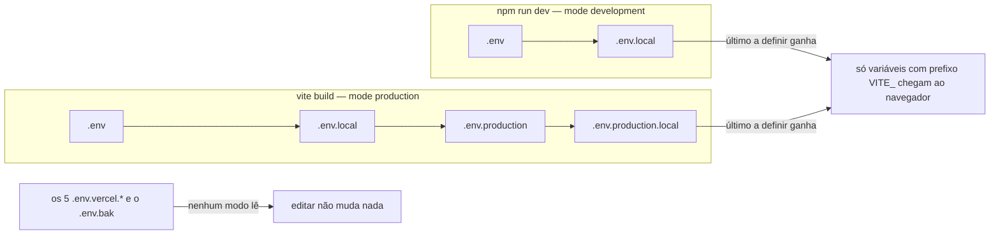
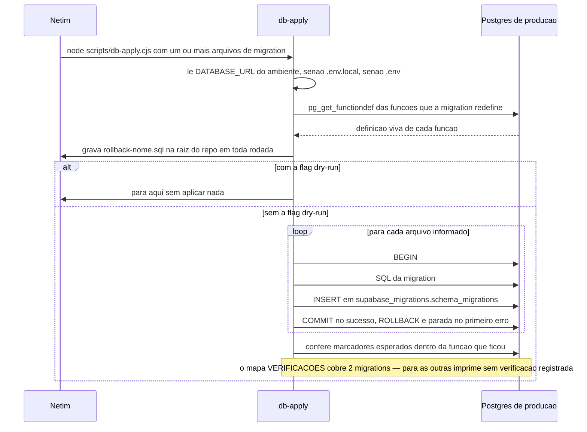

# Setup de Ambiente — do clone até a loja rodando

Guia para o segundo dev entrar na máquina dele e chegar até `npm run dev` funcionando, com
credencial do Supabase de **produção** — leitura livre, escrita só com aviso prévio, regras na
seção 6. Não existe Supabase local neste projeto (não há `supabase/config.toml`, busca recursiva
no repo retorna zero).

Tudo aqui foi medido em **30/07/2026** na máquina do Gabriel (Windows 11). Onde algo não foi
executado, está escrito "não medido"/"não verificado". **Comandos com `$env:`/`Get-*` são PowerShell;
os com `grep`/`diff`/`ls -a` rodaram no Git Bash do git — não existem no PowerShell.** Vocabulário:
[`04-GLOSSARIO.md`](04-GLOSSARIO.md); aqui é mecânica e consequência, não nomes.

---

## 1. Pré-requisitos

**O `package.json` não tem campo `engines`.** Verificado: `engines`, `packageManager` e `volta`
todos retornam `undefined`; não existem `.nvmrc`, `.node-version` nem `.tool-versions`. Ou seja,
**o projeto não exige nenhuma versão de runtime** — a única versão realmente fixada é a do
TypeScript, e por `~` (só patch flutua).

| Ferramenta | Medido nesta máquina | Mínimo exigido pelo projeto | Como obter |
| --- | --- | --- | --- |
| Node.js | `v25.8.2` | **nenhum** | instale a mesma linha 25.x para eliminar "versão de Node" da lista de diferenças entre as duas máquinas |
| npm | `11.11.1` | **nenhum** | vem com o Node |
| TypeScript | `5.9.3` (`npx tsc -v`) | `~5.9.3` — `package.json:88`. **O único fixado** | `npm install` resolve |
| Vite | `7.3.6` | `^7.3.6` — `package.json:90` | idem |
| git | `2.48.1.windows.1` | **nenhum** | — |
| GitHub CLI (`gh`) | `2.89.0` | **nenhum** | na prática necessário para abrir e revisar PR. Para o clone basta credencial autenticada (SSH ou PAT) — o repo é **privado** (`gh repo view` → `"isPrivate":true`) |
| Supabase CLI | `2.90.0` (a própria CLI avisa que existe `2.110.0`) | **nenhum** — sem `config.toml`, nada no repo fixa versão | só para `functions deploy` e introspecção |
| Deno | `2.9.2` | **nenhum**. Existe `deno.json` na raiz, mas ele só configura `exclude` e regras de lint (`deno.json:2-7`) — não fixa versão nem import map | só para mexer em `supabase/functions/` |
| Vercel CLI | `53.4.0` | **nenhum** | opcional — e leia a armadilha 1 antes de rodar `vercel env pull` |

> Recomendação prática, já que o repo não impõe nada: fixe Node e npm por acordo entre os dois devs e
> anote no PR. Sem `engines`, `npm install` aceita qualquer Node e a divergência só aparece em runtime.

---

## 2. Do clone até `npm run dev`

**Passo 1 — clonar.** O repo é privado, então `gh auth status` precisa estar OK antes:
`gh repo clone BielWeed/ikcous-marketplace` e `cd ikcous-marketplace`.

*Deu certo se:* `git remote -v` termina em `BielWeed/ikcous-marketplace` — em `https://` ou em
`git@github.com:`, os dois valem (depende do seu `gh config get git_protocol`).

**Passo 2 — escolher a branch.** O default do repositório é **`develop`** (`gh repo view` →
`defaultBranchRef.name`), e é dela que sai toda branch nova. A `main` só recebe release testada.
Ramifique com `git switch -c <prefixo>/<assunto>`; prefixos válidos: `feat/`, `fix/`, `chore/`,
`docs/`, `refactor/`. Merge é **por PR no GitHub**, nunca na `develop` ou na `main` local — e um
hook de `pre-push` recusa o push direto nas duas. O fluxo completo está no `CONTRIBUTING.md`.

*Deu certo se:* `git branch --show-current` **não** devolve `develop` nem `main`.

> Corrigido em 30/07/2026. Uma versão anterior deste passo dizia que a branch `develop` não
> existia e mandava ramificar de `main`. Ela passou a existir com o GitFlow do prompt 3, e
> virou o default do repositório no mesmo dia.

**Passo 3 — instalar dependências:** `npm install --legacy-peer-deps`.

> Divergência real: o `README.md:35` manda `npm install` puro, mas o `vercel.json:4` usa
> `"installCommand": "npm install --legacy-peer-deps"`. Use a forma da Vercel — é o que roda no
> deploy, e paridade vale mais do que o README.

*Deu certo se:* `npm ls --depth=0` sai com exit 0 e sem nenhuma linha `UNMET DEPENDENCY` (medido
agora nesta máquina: exit 0, lista limpa). *Duração:* **não medido** — o `node_modules` desta
máquina já estava populado e a instalação do zero não foi executada.

**Passo 4 — montar o `.env`.** Copie o `.env.example` (é o único `.env*` versionado — `git ls-files`
retorna só ele) e **acrescente as 4 chaves que faltam nele**. Detalhe na seção 4.

*Deu certo se:* seu `.env` tem 7 chaves, não 3. Com 3,
`node scripts/db-apply.cjs --dry-run <migration que exista>` morre em `DATABASE_URL não encontrada
(nem no ambiente, nem em .env.local, nem em .env).` (`scripts/db-apply.cjs:81-83`). **Sem argumento
nenhum o script para antes disso**, em `:110-114`, sem olhar a `DATABASE_URL` — ela só é lida na 125.
Se a `DATABASE_URL` estiver certa, essa verificação **deixa um `rollback-*.sql` na raiz** — regra 4.

**Passo 5 — provar que o TypeScript compila:** `npm run typecheck`.

*Deu certo se:* **zero linha de saída** e exit 0, em 14 a 18 s conforme o cache. Silêncio é aprovação aqui.
O script é `tsc -b --force` e cobre os projetos referenciados — inclusive o `tsconfig.node.json`, que
checa o `vite.config.ts`. É o mesmo comando que o hook de `pre-push` roda e que o job `Tipos` do CI
executa, então o que passa aqui passa lá. Ver armadilha 4 para o histórico.

**Passo 6 — subir o dev server:** `npm run dev`.

*Deu certo se:* a primeira linha útil é `[PWA Build] Version determined: 1.0.0-dev`
(vem de `vite.config.ts:48`; o sufixo `-dev` porque `vite.config.ts:38` decide por
`mode === "development"`), seguida do banner do Vite em `http://localhost:5173/`.
*Deu errado se:* `error when starting dev server: Error: Port 5173 is already in use` e o
processo morre — armadilha 7. Reproduzido nesta sessão.

**Passo 7 — abrir `http://localhost:5173/`.** Três desfechos possíveis, e cada um significa uma
coisa diferente:

| O que você vê | Significado |
| --- | --- |
| Barra de progresso subindo até 85%, depois a loja | Certo. Os 85% são teto codificado, não medição de carga — item 4 do [`04-GLOSSARIO.md`](04-GLOSSARIO.md) |
| Tela **vermelha** "🚨 ERRO DE AMBIENTE" | Faltou `VITE_SUPABASE_URL` ou `VITE_SUPABASE_ANON_KEY`. A guarda está em `src/lib/env.ts:71-87` e a mensagem cita `.env.production.local` por nome (`:81`) |
| Travado em 85% **para sempre**, sem mensagem | A árvore React nunca montou — item 4 do [`04-GLOSSARIO.md`](04-GLOSSARIO.md). **Não é falta de env**: isso hoje dá tela vermelha (armadilha 1). Abra o console |

*Confirmação independente:* o dev server desta máquina está de pé desde 29/07 03:30 e responde `200`
em `http://localhost:5173/`, com `/@vite/client` no HTML e o `<div id="silent-guardian-loader">`
presente (`index.html:75`).

---

## 3. Os onze arquivos `.env` — e os quatro que importam

A raiz tem **11** arquivos `.env*` (`ls -a | grep -c "^\.env"` → `11`). O Vite lê **4**.

> Levantamentos anteriores deste projeto contavam **8**. A medição de hoje dá 11, e os 3 mais novos
> por mtime são os de 30/07 de madrugada (`.env.bak`, `.env.vercel.pulled.bak`, `.env.vercel.pulled`)
> — consistente com serem as adições, mas mtime não prova criação. Conte antes de confiar nos dois.



Não existem `.env.development` nem `.env.development.local`, então `npm run dev` lê só dois arquivos.
Não há `envPrefix` customizado no `vite.config.ts`, logo o prefixo é o padrão `VITE_`.

| Arquivo | Para que serve | Versionado | Quem lê | Precedência no Vite |
| --- | --- | --- | --- | --- |
| `.env` | Base de dev. É também o **último** fallback de `DATABASE_URL` do `db-apply` | não — `.gitignore:4` | Vite (dev e build) + `scripts/db-apply.cjs:72` | mais baixa |
| `.env.local` | Gerado pelo Vercel CLI. Guarda `VERCEL_OIDC_TOKEN` e `RESEND_API_KEY`. Nenhuma chave `VITE_` | não — `.gitignore:5` e `:40` | Vite (dev e build) + `scripts/db-apply.cjs:72` — **é o 1º lugar onde o `db-apply` procura a `DATABASE_URL`**, antes do `.env` | 2ª |
| `.env.production` | **Hoje é a fonte real das chaves Supabase do build local.** 3 chaves preenchidas | não — `.gitignore:8` | Vite (**só no build**) | 3ª |
| `.env.production.local` | Gerado por `vercel env pull`. 24 chaves ativas — **só 10 com valor, 14 com `=""`** (entre elas `DATABASE_URL` e `RESEND_API_KEY`) — mais **3 comentadas de propósito** nas linhas 25-27. Nenhuma das 14 vazias tem prefixo `VITE_`, e é só por isso que hoje nada disso chega ao bundle | não — `.gitignore:40` | Vite (**só no build**) | **mais alta — vence todas** |
| `.env.example` | Template de onboarding. Só 3 chaves, com placeholders | **SIM — o único** | ninguém | — |
| `.env.bak` | Backup manual de 30/07 04:53. As mesmas 7 chaves do `.env`, todas preenchidas | **não versionado e NÃO ignorado** — armadilha 5 | ninguém | — |
| `.env.vercel.prod` e `.env.vercel.pulled.prod` | Dumps de 16/07, duplicatas um do outro: os **27** nomes são idênticos (`diff` dos nomes ordenados sai vazio), inclusive as mesmas 4 `VITE_`. **Retrato da tela branca**: `VITE_SUPABASE_URL` e `VITE_SUPABASE_ANON_KEY` ativas e vazias (valor `""`, medido) | não — `.gitignore:7` | ninguém | — |
| `.env.vercel.pulled` e `.env.vercel.pulled.bak` | Dumps de 30/07 de madrugada (`.pulled.bak` 04:53, `.pulled` 04:54), 3 chaves, incluem `DATABASE_URL` real. A do `.bak` tem 134 caracteres contra 111 na versão sem `.bak` — a string de conexão **mudou** em 30/07. **Qual das duas está viva e por que mudou não está documentado — perguntar pro Gabriel.** Não use nenhum dos dois como fonte: monte a sua pelo painel (seção 4) | não — `.gitignore:7` | ninguém | — |
| `.env.vercel.test` | Dump de preview de 19/02. Só `VERCEL_OIDC_TOKEN`, presumidamente expirado | não — `.gitignore:7` | ninguém | — |

**Regra de bolso:** para o dev local mexa só no `.env`; para o build local, só no `.env.production`;
nunca escreva no `.env.production.local`; no `.env.local` só encoste se a `DATABASE_URL` do
`db-apply` vier errada — **ele tem precedência sobre o `.env`** (`scripts/db-apply.cjs:72` itera
`[".env.local", ".env"]`, nessa ordem). Os outros **7** (`.env.example`, `.env.bak`, os 5 `.env.vercel.*`) não afetam nada.

> **Isto estreita o risco #5 do [`01-VISAO-GERAL.md`](01-VISAO-GERAL.md):204-205** (repetido em
> `:146`), que afirma sem qualificador que os dois caminhos de deploy produzem bundles diferentes do
> mesmo commit. A divergência existe — o `.vercelignore` tem 4 linhas (`node_modules`, `dist`,
> `.env`, `.env.local`) e **não** lista `.env.production`, `.env.production.local`, `.env.vercel.*`
> nem `.env.bak` — mas só se materializa em `vercel deploy` por upload local. No deploy pelo GitHub
> nenhum `.env*` sobe, porque **nenhum deles está no git**. Corrigir a formulação do 01.

---

## 4. Quais variáveis pedir e quais pegar sozinho

Antes de tudo: **peça ao Gabriel convite de membro no projeto Supabase `cafkrminfnokvgjqtkle`
e no projeto Vercel `ickous-marketplace`.** Sem isso, nada abaixo existe para você.

| Variável | De onde vem |
| --- | --- |
| `VITE_SUPABASE_URL` | **Pega sozinho:** Supabase → Project Settings → API. É pública, vai para o bundle mesmo |
| `VITE_SUPABASE_ANON_KEY` | **Pega sozinho:** mesma tela. Também pública por desenho — a autorização real está no RLS |
| `DATABASE_URL` | **Monta sozinho, com senha do Gabriel:** Supabase → Connect (pooler). Não copie dos dumps `.env.vercel.pulled*` — a string mudou em 30/07 e não se sabe qual das duas está viva (seção 3) |
| `VERCEL_OIDC_TOKEN` | **Pega sozinho:** não se digita, sai de `vercel link` + `vercel env pull`. **Leia a armadilha 1 antes** |
| `SUPABASE_SERVICE_ROLE_KEY` | **`<pedir pro Gabriel>`** — segredo de servidor. **Nunca** com prefixo `VITE_`, nunca em arquivo que o Vite leia para o bundle |
| `RESEND_API_KEY` | **`<pedir pro Gabriel>`** — segredo de terceiro (envio de e-mail do OTP) |
| `VITE_VAPID_PUBLIC_KEY` | **`<pedir pro Gabriel>`** — par da chave privada de push, que não está no repo: `git ls-files vapid_keys.json` retorna **0 linhas** (o `.gitignore:9` também o ignora, mas gitignore não prova ausência) |
| senha do banco | **`<pedir pro Gabriel>`** — para montar a `DATABASE_URL` |

`VITE_MAINTENANCE_MODE` não é segredo — e não é booleana: `src/App.tsx:2094` faz
`import.meta.env.VITE_MAINTENANCE_MODE === "true"`, única ocorrência em todo o código (`grep -rn` em
`src/`, `vite.config.ts` e `index.html`). Só a string exata `true` liga o modo manutenção; qualquer
outro valor, inclusive vazio ou ausente, deixa a loja normal. Ponha `false` (ou nada) no seu `.env`.

**Somando:** o `.env.example` entrega 3 chaves; o `.env` real tem 7. As 4 que faltam no template
são `DATABASE_URL`, `SUPABASE_SERVICE_ROLE_KEY`, `RESEND_API_KEY` e `VITE_MAINTENANCE_MODE`.

---

## 5. Armadilhas conhecidas

### 1. Tela vermelha (ou 85% eterno) depois de rodar `vercel env pull`

**Sintoma.** O build local sai sem banco. Hoje isso pinta a tela vermelha "🚨 ERRO DE AMBIENTE";
antes da guarda existir, ficava travado em 85% sem mensagem.

> O [`01-VISAO-GERAL.md`](01-VISAO-GERAL.md) dizia que falta de chave leva ao 85% — **corrigido lá
> em 30/07/2026 a partir desta leitura.** Hoje não leva: `src/lib/env.ts:71-87` chama
> `renderBootFailure` (`:29-69`), que **remove** o `#silent-guardian-loader` (`:34`) e pinta um
> `background:#dc2626` **antes** do `throw` do [`[EnvGuard]`](04-GLOSSARIO.md). O cabeçalho (`:4-11`)
> registra que o loader eterno "sem nenhuma mensagem" era o comportamento **anterior** a esta guarda.

**Causa.** `.env.production.local` é o último da ordem de carga e **vence com valor vazio também**.
Uma linha `VITE_SUPABASE_URL=""` ali apaga o valor bom do `.env.production`. O retrato está
preservado em `.env.vercel.prod`, com as duas chaves ativas e valor `""` (medido).

**Estado hoje: desarmada de propósito, não por acidente.** As três linhas foram **comentadas** em
29/07 (mtime: `2026-07-29T18:10:48Z`, que é **15:10 no fuso local** — o mesmo instante que o
[`01-VISAO-GERAL.md`](01-VISAO-GERAL.md):172 cita como "às 15:10", não uma divergência de 3 h),
com a justificativa escrita dentro dele: as linhas 25-27 são `# VITE_MAINTENANCE_MODE=""`,
`# VITE_SUPABASE_ANON_KEY=""` e `# VITE_SUPABASE_URL=""`, cada uma seguida do comentário
`# removido: valor vazio sobrescrevia o .env.production`.

**Correção.** Não descomente as linhas 25-27. E entenda que a armadilha **volta a armar sozinha**:
`vercel env pull` regrava o arquivo inteiro, e no pull de 16/07 as três voltaram ativas com `""`.
Depois de **qualquer** `vercel env pull`, confira as linhas com prefixo `VITE_` e comente as que
voltarem vazias. O arquivo também contém um `VERCEL_OIDC_TOKEN` — não compartilhe.

> **Por que a Vercel devolve vazio não está documentado — perguntar pro Gabriel.** A hipótese
> "variável marcada como *sensitive*", que estava aqui e continua no
> [`01-VISAO-GERAL.md`](01-VISAO-GERAL.md):175, **não explica o conjunto**: das 24 chaves ativas
> hoje, 14 estão vazias e 12 delas são metadado de build, não segredo — `VERCEL_URL` mais os 11
> `VERCEL_GIT_*`. Medido lendo só os nomes. **Não verificada** — corrigir nos dois documentos.

### 2. `npm run build` entrega bundle de desenvolvimento, com exit 0

**Sintoma.** Build passa sem erro nem warning, e o bundle quase dobra. **Causa.**
`NODE_ENV=development` está setado no perfil desta máquina e sobrevive em cada shell novo (medido
agora: `$env:NODE_ENV` = `development`). Duas coisas acontecem: `vite.config.ts:143` tem
`process.env.NODE_ENV === "development" && inspectAttr()`, que injeta o plugin de inspeção **dentro
do build de produção**, e as libs resolvem para o ramo de dev.

| | `NODE_ENV=production` | `NODE_ENV=development` |
| --- | --- | --- |
| total de `.js` | 2645,2 kB | **4707,7 kB (+78%)** |
| `vendor-react-*.js` | 188,5 kB | 386,4 kB, com a string dev-only `Invalid hook call` |
| precache do PWA | 1852,47 KiB | 2696,71 KiB |
| erros/warnings | 0 / 0 | 0 / 0 |

> O [`01-VISAO-GERAL.md`](01-VISAO-GERAL.md) publicava **2,69 MB** de precache como número do
> sistema — 2696,71 KiB ÷ 1000 = 2,69, ou seja era a medição do build **contaminado**. O correto é
> **1852,47 KiB**: o corte do `globIgnores` foi maior do que o 01 dizia. **Corrigido lá em
> 30/07/2026**, depois de somar as 77 entradas de precache do `dist/` limpo (1853,67 KiB — a
> diferença de ~1 KiB para o número do plugin não foi investigada). A identidade dos dois números
> contaminados é inferida da coincidência de dígitos, não de log guardado.

**Correção.** Sempre `$env:NODE_ENV='production'; npx vite build`. Para conferir sem olhar tamanho:
`Select-String -Path dist/assets/vendor-react-*.js -Pattern 'Invalid hook call'` — se achar, o build
está contaminado. O `dist` atual desta máquina tem `vendor-react-9kfeT4KA.js` com 193.060 bytes, que
é o build limpo. O deploy da Vercel não herda isso — `NODE_ENV=production` é o padrão lá.

### 3. `supabase db push` — nunca, e este é o motivo

Não é preferência de estilo. Medido agora, por `SELECT` no ledger de produção:

| | |
| --- | --- |
| Versões em `supabase_migrations.schema_migrations` | **121** |
| Arquivos `.sql` em `supabase/migrations/` | **137** (135 com prefixo de timestamp, 2 sem) |
| Prefixos de timestamp duplicados no disco | **1** — `20260708020000` tem dois arquivos (`add_avatar_url_to_admin_questions_rpc.sql` e `enable_realtime_for_monitored_tables.sql`), nenhum deles no ledger. Por isso 135 arquivos = **134 versões distintas**, e a conta fecha: 134 − 41 = 93 casadas, 121 − 93 = 28 |
| Migrations locais **nunca aplicadas** | **42 arquivos / 41 versões distintas** — a diferença é exatamente o prefixo duplicado acima. As mais antigas: `20260701000000`, `20260701144200`, `20260703080000` |
| Versões no ledger **sem arquivo local** | **28** — amostra: `20260703040519`, `20260703065418`, `20260704205832` |
| Arquivos sem prefixo de timestamp | **2** — `add_user_id_to_orders.sql` e `favorites_migration.sql`, que nunca casam com versão do ledger, por construção |

**Consequência.** `db push` tentaria replayar as **42 pendentes (41 versões)** em cima de um banco
que já divergiu. E existem objetos cujo **corpo vivo não corresponde a nenhum arquivo** — as 28
versões do ledger sem arquivo local foram aplicadas por fora, provavelmente pelo SQL Editor. Um
`CREATE OR REPLACE` apagaria em silêncio o que foi aplicado por fora. É uma loja no ar.

> Medido para não deixar isso na inferência: **19 dos 42 arquivos pendentes contêm `CREATE OR
> REPLACE FUNCTION`** — e esse é todo o alcance da leitura, nenhum SQL foi lido linha a linha nem
> comparado ao schema vivo. O argumento acima é o do [`01-VISAO-GERAL.md`](01-VISAO-GERAL.md):104-106.

**O caminho certo** é `scripts/db-apply.cjs`, que escolhe explicitamente o que aplicar — seção 6. O
comentário do script (`:6-7`) ainda cita os números velhos de 29/07 ("~50 locais / ~25 no banco"); os medidos hoje são 42 pendentes (41 versões) e 28.

### 4. ~~`npm run typecheck` não checa nada~~ — RESOLVIDO em 30/07/2026

**Esta armadilha não existe mais.** O número fica para não quebrar as referências do documento.

**O que era.** `tsconfig.json:2` é `"files": []` e o resto é só `references` (solution-style); o
script era `tsc --noEmit` **sem `-b`**, e nessa forma o tsc obedece o `files: []` e não entra nos
projetos referenciados. `npx tsc --noEmit --listFiles` imprimia **0 linhas** — exit 0 em 0,74 s
analisando arquivo nenhum.

**O que é hoje.** `package.json:11` é `"typecheck": "tsc -b --force"`. Medido em 04/08/2026: exit 0
em 14 a 18 s conforme o cache, e um erro de tipo injetado num clone descartável produziu
`src/lib/utils.ts(32,14): error TS2322` com **exit 2**. Cobre também o `tsconfig.node.json` — erro
plantado no `vite.config.ts` reprova. O mesmo comando roda no hook de `pre-push` e no job `Tipos` do
CI, que tem 5 jobs e histórico de execuções verdes.

> Continua valendo o hábito: `strict`, `noUnusedLocals` e `noUnusedParameters` estão ligados
> (`tsconfig.app.json:23-25`), então variável não usada reprova o build. Não é ruído — é o gate.

### 5. `git add .` comita credencial real

**Sintoma.** As 7 chaves preenchidas do `.env`, incluindo `DATABASE_URL` e
`SUPABASE_SERVICE_ROLE_KEY`, entram num commit. **Causa.** `.env.bak` está untracked **e não
ignorado**: `git check-ignore .env.bak` retorna exit 1. O `.gitignore` cobre `.env` exato (`:4`),
`.env.local` (`:5`), `.env.*.local` (`:6`), `.env.vercel*` (`:7`), `.env.production` (`:8`) e
`.env*.local` (`:40`) — nada casa com `.env.bak`, nem com os `rollback-*.sql` que o `db-apply` grava.
**Correção.** Neste repo, **nunca** `git add .` nem `git add -A`; adicione arquivo por arquivo. Este
repo já teve credencial em histórico público antes.

### 6. ~~Seu arquivo de CI não entra no commit~~ — RESOLVIDO em 30/07/2026

**Esta armadilha não existe mais.** O número fica para não quebrar as referências do documento.

**O que era.** Um `*.yml` cru, sem escopo, no `.gitignore`. `git check-ignore -v
.github/workflows/ci.yml` casava com ele, então criar o arquivo e dar `git add` falhava **em
silêncio**.

**O que é hoje.** A regra foi removida no PR #11. Medido em 04/08/2026: não há nenhuma linha `*.yml`
ativa — no lugar ficou o bloco de comentário de `.gitignore:78-87`, que documenta por que a tentativa
anterior com exceções (`!.github/workflows/*.yml`) não resolvia. `git check-ignore -v
.github/workflows/ci.yml` sai **vazio, exit 1**. O `.github/` tem 8 arquivos versionados: `ci.yml`
(175 linhas, 5 jobs), `CODEOWNERS`, o template de PR, 4 templates de issue e o
`copilot-instructions.md`.

> A parte do documento que sobrevive é a lição, não o sintoma: **`.gitignore` com padrão global sem
> escopo faz `git add` falhar sem erro.** Continuam nessa forma o `:19` (`*.txt`, que é a causa da
> armadilha 10) e o `*.png`. Antes de concluir que "o git não quer adicionar meu arquivo", rode
> `git check-ignore -v <caminho>` — ele nomeia a linha exata que está bloqueando.
>
> **Histórico, porque este documento já se corrigiu uma vez aqui:** uma versão anterior dizia que
> essa regra era a causa de o projeto não ter CI. Refutado por git — `git blame` datou a linha em
> 28/07/2026, o primeiro commit do repo é de 05/04/2026, e `git log --all --diff-filter=A --
> ".github/workflows/*"` saía vazio: a pasta nunca tinha existido em branch nenhuma. **Por que o
> projeto passou de abril a julho sem CI continua sem resposta escrita.**

### 7. `npm run dev` aborta em vez de trocar de porta

**Sintoma.** `error when starting dev server: Error: Port 5173 is already in use`, processo morre.
**Causa.** `vite.config.ts:125-126` fixa `port: 5173` com `strictPort: true`, e o HMR também está
preso em 5173 (`vite.config.ts:129`). **Reproduzido nesta sessão.** **Correção.** Libere a 5173 antes
(`Get-NetTCPConnection -LocalPort 5173`). `--port 5174` **sobe** o servidor — o `strictPort` recusa a
porta pedida, não a alternativa — mas o HMR continua tentando 5173 e o hot reload morre em silêncio;
isso é leitura de config, **não testado nesta sessão**. Caminho seguro é liberar a 5173.

### 8. `supabase --version` suja o `git status`

**Sintoma.** `M supabase/.temp/cli-latest` sem você ter editado nada. **Causa.** A CLI grava o
resultado da checagem de versão nesse arquivo, e `supabase/.temp/` **é versionado**:
`git ls-files supabase/.temp` lista 9 arquivos de estado (`cli-latest`, `linked-project.json`,
`pooler-url`, `project-ref`, …) e `check-ignore` dá exit 1. **Correção.** É ruído; rode
`git checkout -- supabase/.temp/cli-latest` antes de commitar.

### 9. `npm run size` aprova bundle contaminado

**Sintoma.** Exit 0 e você conclui que o bundle está bom. **Causa.** Duas coisas. Primeiro,
`size-limit` **não builda** — `.size-limit.json:3` aponta para `dist/assets/*.js`, então ele mede o
`dist` que já estiver no disco (sem `dist`, não mede nada). Segundo, o limite de 800 kB
(`.size-limit.json:4`) é folgado o bastante para o bundle de dev passar: o `dist` contaminado de 30/07
mediu 634,93 kB brotlied e passou; o limpo mede 515,14 kB. **Correção.** Builde antes de medir, e não
use `npm run size` para detectar o vazamento de `NODE_ENV` — use a busca da armadilha 2.

### 10. `dist` local ≠ `dist` da Vercel

**Sintoma.** `public/robots.txt` existe no seu disco e no seu `dist`, mas não no site publicado.
**Causa.** `.gitignore:19` (`*.txt`) ignora `public/robots.txt` — confirmado por `check-ignore`, e
`git ls-files` mostra 0 arquivos `.txt`. A Vercel builda do checkout do git (`vercel.json:2`,
`buildCommand: npm run build`), então o `public/` dela não tem o arquivo. **Correção.**
`git add -f public/robots.txt`, ou consertar a `:19`.

### 11. Origem nova funciona local e é bloqueada em produção, sem erro na tela

**Sintoma.** Você adiciona um CDN, uma fonte do Google, um endpoint de terceiro ou uma imagem de
outro domínio. Funciona em `npm run dev`, passa no build, passa no CI — e no site publicado o recurso
simplesmente não carrega. Nenhum erro de UI, nenhum toast: só uma linha de violação no console.

**Causa.** A CSP é uma allowlist fechada e mora **só** no `vercel.json:36`. Hoje ela permite:

| Diretiva | Origens liberadas |
| --- | --- |
| `img-src` | `'self'`, `blob:`, `data:`, `https://*.supabase.co`, `https://images.unsplash.com`, `https://placehold.co` |
| `font-src` | `'self'`, `data:`, `https://fonts.gstatic.com` |
| `connect-src` | `'self'`, `https://*.supabase.co`, `wss://*.supabase.co`, `https://*.sentry.io`, `https://fonts.googleapis.com`, `https://fonts.gstatic.com`, `https://images.unsplash.com`, `https://placehold.co` |

**Por que o local não avisa:** não existe CSP nenhuma no dev server. `grep -i "Content-Security\|http-equiv" index.html` e
`grep -i "headers\|Content-Security" vite.config.ts` devolvem **zero** — o header nasce no edge da Vercel, depois de todo o gate
local. Logo, todo o seu ciclo de desenvolvimento é verde e a falha só existe em produção.

**Correção.** Acrescentar a origem na diretiva certa do `vercel.json:36` **no mesmo PR** que introduz o recurso. E lembre que
`vercel.json` é excluído do clone e do sync Core→cliente: correção de CSP feita aqui **não** chega em loja nenhuma derivada.
Replique à mão.

---

## 6. Regras para o Supabase de produção

Você vai ter credencial do banco de uma loja no ar. São 12 regras, divididas em três listas.

**Faz sozinho, sem avisar ninguém:**

- **1.** `SELECT` em qualquer tabela, e `EXPLAIN` / `EXPLAIN ANALYZE` sobre `SELECT`.
- **2.** Introspecção de schema: `information_schema`, `pg_policies`, `pg_indexes`, `pg_get_functiondef`.
- **3.** Ler logs no dashboard (Postgres logs, API logs, logs de Edge Function).
- **4.** `node scripts/db-apply.cjs --dry-run <arquivo.sql>` — não escreve **no banco** (`:161-165` sai
  antes do laço de aplicação, que começa em `:168`). **Escreve no disco:** grava e sobrescreve
  `rollback-<nome>.sql` na raiz (`:158`, fora de qualquer condicional), e o git **não** ignora esse
  arquivo (`git check-ignore` → exit 1) — ver armadilha 5.

**Avisa antes, no Kanban, e espera resposta:**

- **5.** Qualquer DDL: `CREATE` / `ALTER` de tabela, coluna, índice, função, trigger ou view.
- **6.** Qualquer `INSERT` / `UPDATE` / `DELETE` em `marketplace_orders`, `produtos`, `product_variants`, `store_config` ou `coupons`.
- **7.** `node scripts/db-apply.cjs <arquivo.sql>` sem `--dry-run`.
- **8.** `supabase functions deploy` — muda o comportamento da loja no ar **sem passar por PR**.

**Proibido, sem exceção:**

- **9.** `supabase db push` — motivo na armadilha 3.
- **10.** `DROP` de qualquer objeto, e `TRUNCATE` de qualquer tabela.
- **11.** Alterar policy de RLS, `GRANT` / `REVOKE`, ou `ALTER ... OWNER` sem revisão em PR.
- **12.** Colar valor de credencial em arquivo que não seja o seu `.env` local — nem em documento, nem em issue, nem em mensagem.

### Duas "correções" de segurança que derrubam a loja

As duas parecem melhoria óbvia numa auditoria, e as duas quebram a vitrine anônima. Estão aqui porque
o custo de descobrir isso em produção é a loja fora do ar.

**Não ligue `security_invoker` em `vw_produtos_public`.** A ausência é **deliberada**, e está escrita
na própria migration: `20260713000000_fix_public_products_view.sql:4` diz *"Remove security_invoker to
allow anonymous SELECT without exposing 'custo' column"*. Com `security_invoker = on` a view passa a
rodar com o privilégio de quem chama; e o `anon` **não tem SELECT em `produtos`** (`SET LOCAL ROLE
anon` → `permission denied for table produtos`). Resultado: catálogo vazio para todo visitante
deslogado. A proteção do `custo` hoje vem da lista de colunas da view, que não o inclui — é proteção
por omissão, e trocar por proteção por regra exige **antes** dar SELECT ao `anon` na tabela base, ou
manter a view como está. `v_store_config`, ao contrário, **mantém** `security_invoker`
(`20260712230000_add_local_shipping_config.sql:20`) — as duas views não seguem a mesma regra, de propósito.

**Não faça `REVOKE` de `is_admin()` para `anon`.** A função é chamada dentro de policies que o `anon`
atravessa; revogar o EXECUTE quebra as queries anônimas. Se o objetivo é reduzir superfície, o caminho
é revisar as policies que a usam, não o `GRANT`.

> Isso **não** significa que a modelagem está boa. Significa que os dois defeitos são reais e o
> conserto ingênuo é pior que o defeito. Qualquer mudança aqui é migration com PR, revisão do Gabriel
> e teste do caminho anônimo — não `ALTER` avulso.

### Ritual obrigatório antes de qualquer escrita

O padrão deste projeto é **provar o resultado dentro de uma transação que você vai desfazer**:

```sql
BEGIN;
  -- seu UPDATE/DDL aqui
  UPDATE produtos SET ativo = false WHERE id = '...';
  -- a conferência vai DENTRO da mesma transação
  SELECT id, ativo FROM produtos WHERE id = '...';
ROLLBACK;   -- sempre nesta primeira passada
```

Leia o resultado do `SELECT`. Só se ele for exatamente o esperado você repete o bloco trocando
`ROLLBACK` por `COMMIT`. Se o `SELECT` surpreender, você não quebrou nada.

**Backup de dado é outro assunto, e não existe nada automatizado para ele neste projeto.** O
`rollback-*.sql` que o `db-apply` grava salva o **corpo vivo das funções que a migration redefine**
(`pg_get_functiondef` em `scripts/db-apply.cjs:97`, coletado pelo laço em `:145-152`) — e só isso,
**não é backup de dado**. Antes de `UPDATE`/`DELETE` em massa, tire o snapshot você mesmo com
`CREATE TABLE bkp_produtos_20260730 AS SELECT * FROM produtos WHERE <o recorte que vai mudar>` — isso
é DDL, cai na regra 5: avise antes. Sem escrever nada, use o painel Supabase → Database → Backups.

Para migration, o `db-apply.cjs` faz o equivalente do ritual acima e salva o rollback de função:



**A ordem no código é gravar-depois-decidir**: o `fs.writeFileSync(arquivoRollback, ...)` está em
`scripts/db-apply.cjs:158`, **fora de qualquer condicional**, e o corte do dry-run só vem em
`:161-165`. Ou seja, a rodada real **sobrescreve** o `rollback-*.sql` que o dry-run acabou de gerar —
copie antes se quiser guardar o retrato. Linhas para conferir o resto: `:70-84`, `:87-93`, `:154-159`,
`:174-190`, `:177-181` (`ON CONFLICT DO NOTHING`), `:51-68` (`VERIFICACOES`), `:199-201`.

Na raiz há **três** arquivos que são saída desse script, não lixo: os dois `rollback-*.sql` e o
`estado-atual-pos-migration-20260729.sql` — este, apesar do nome, **não é snapshot de dado**, é um
rollback renomeado (a 1ª linha ainda é `-- Rollback gerado automaticamente antes de aplicar: 20260729000000_…, 20260729000001_…`).

---

## 7. Comandos do dia a dia

Tempos de **uma execução cada**, nesta máquina, com `NODE_ENV` controlado. "Exit hoje" é o estado
real em `main` — se vier vermelho no seu primeiro dia, não foi você.

| Comando | Quando | Duração | Exit hoje | O que a saída significa |
| --- | --- | --- | --- | --- |
| `npm run dev` (`package.json:7`) | sempre | não medido em partida limpa; falha em ~2 s se a 5173 estiver ocupada | 0 / **1** se porta ocupada | `[PWA Build] Version determined: 1.0.0-dev` + banner do Vite |
| `npm run typecheck` (`:11`) | antes de abrir PR | **14 a 18 s** | 0 | `tsc -b --force`: 0 linha de saída = os projetos referenciados estão limpos. É o mesmo comando do `pre-push` e do job `Tipos` do CI |
| `npx tsc -p tsconfig.app.json --noEmit` | só para isolar `src/` do resto | **17,30 s** | 0 | subconjunto do anterior; não cobre o `tsconfig.node.json` |
| `npm run lint` (`:9`) | antes de PR | **58,08 s** | **1** | **560 problemas: 7 erros, 553 warnings** — remedido em 04/08/2026, e é o que a Catraca cobra. O `1120 / 14 / 1106` que este documento trazia contava duas vezes: a varredura pegou `.claude/worktrees/`, que é uma cópia do repo |
| `npm run biome:check` (`:18`) | diagnóstico local, **não** é o número que vale | **2,41 s** | **1** | ~24× mais rápido que o eslint, regras sobrepostas. **No Windows a contagem infla**: cada `␍` de CRLF vira erro de formatação que o Linux do CI não vê. Medido aqui em 04/08: 103 erros. **O número que a Catraca cobra é o do CI: 31 erros, 3 warnings** — lido do log do job `Catraca de lint` em duas runs distintas (`30944348274` e `30950267639`), e é o que está gravado em `.lint-baseline.json`. Para saber se você subiu dívida, rode `npm run lint:ratchet`, não o biome cru |
| `$env:NODE_ENV='production'; npx vite build` | build local correto | **20,93 s** | 0 | 3934 módulos, 2645,2 kB de `.js`, precache de 85 entradas |
| `npm run build` (`:8`) sem tocar `NODE_ENV` | **nunca localmente** | 39,56 s | 0 | passa e entrega bundle de dev — armadilha 2 |
| `npm run size` (`:20`) | **depois** de buildar | **33,09 s** | 0 | JS 515,14 kB / 800 kB; CSS 26,7 kB / 100 kB. Sobe um Chrome headless |
| `node scripts/db-apply.cjs --dry-run x.sql` | antes de aplicar migration | não medido; conexão + `SELECT` no ledger levou ~3 s | não medido | imprime o host, grava `rollback-*.sql`, não aplica |
| `npm run knip` (`:16`) | investigar código morto | **não medido** | não medido | ver a ressalva no [`01-VISAO-GERAL.md`](01-VISAO-GERAL.md):143. A ressalva de lá diz que o `knip.json` "esconde isso do CI"; **o CI existe desde 30/07** (5 jobs), mas nenhum deles roda `knip` — então quem ele esconde continua sendo o dev que roda o comando à mão |
| `npm run spellcheck` (`:17`), `lint:css` (`:16`), `lint:html` (`:19`), `sqlfluff:lint` (`:15`) | raramente | **não medido** | não medido | `sqlfluff` não é dependência npm — precisa do binário Python |

**Não rode `--fix` nem `biome format --write` em massa.** São 712 warnings auto-corrigíveis no eslint
e 16 correções no biome; um commit gigante de formatação vai colidir com o outro dev — e não existe
CI para segurar isso (armadilha 6).

---

## Não verificado

- **Se `npm run dev` sobe do zero nesta máquina.** A 5173 já estava ocupada por um dev server de
  29/07, então testei só o caminho de falha (reproduzido) e confirmei o servidor existente por HTTP;
  o banner de "ready" do Vite não foi observado. Pelo mesmo motivo, **`--port 5174` com HMR quebrado
  é inferência** de `vite.config.ts:126` e `:129`.
- **Se `public/robots.txt` está mesmo ausente em `ickous-marketplace.vercel.app`.** A inferência (não
  está no git → não chega ao build da Vercel) é sólida, mas nenhuma requisição HTTP foi feita.
- **Se a `SUPABASE_SERVICE_ROLE_KEY` do `.env` é credencial viva.** Tem 41 caracteres, curto para JWT
  `service_role` clássico — pode ser placeholder ou formato novo. Não testada; a regra do projeto é
  testar antes de tratar como incidente.
- **O que está no painel de env vars da Vercel**, **por que `vercel env pull` devolve `""`** e **qual
  `DATABASE_URL` ficou viva depois da troca de 30/07**. O `vercel env ls` não foi rodado; os 5 dumps
  `.env.vercel.*` têm datas entre 19/02 e 30/07 e frescor desconhecido. A hipótese "*sensitive*" não
  explica as 14 vazias de hoje, 12 das quais são metadado de build — motivo não documentado.
- **Se as 42 migrations pendentes (41 versões) são seguras de aplicar, e o que fazem as 28 versões do
  ledger sem arquivo.** Dos 42 medi só quantos contêm `CREATE OR REPLACE FUNCTION` (**19**); nenhum
  SQL foi lido linha a linha nem comparado ao schema vivo. As 28 sem arquivo não têm como ser lidas.
- **Qual política de backup/PITR está ativa no plano Supabase.** O painel não foi aberto.
- **Se o build da Vercel produz o mesmo resultado.** Nenhum log de build da Vercel foi inspecionado.
- **As Edge Functions.** Nenhuma foi invocada nem deployada. Existem 3 (`calculate-shipping`,
  `send-otp-email`, `send-push`) mais um `tsconfig.json` em `supabase/functions/`.
- **Versão do PowerShell na máquina do Netim.** Esta sessão reportou `7.6.3`, onde `&&` funciona; a
  memória do projeto registra 5.1, onde não funciona. Vale nos dois: separe com `;` e atribua com
  `$env:VAR='valor'` — **não existe** prefixo inline `VAR=valor comando` em PowerShell nenhum.
- **`02-ARQUITETURA.md`, `05-FLUXOS-CRITICOS.md`:** irmãos deste documento, escritos no mesmo lote —
  podem ainda não existir no seu clone. **`06-ESTADO-ATUAL.md`, `../backlog/BACKLOG.md` e
  `../backlog/ROADMAP.md` não existem ainda**, apesar de já serem linkados pelo
  [`01-VISAO-GERAL.md`](01-VISAO-GERAL.md).
