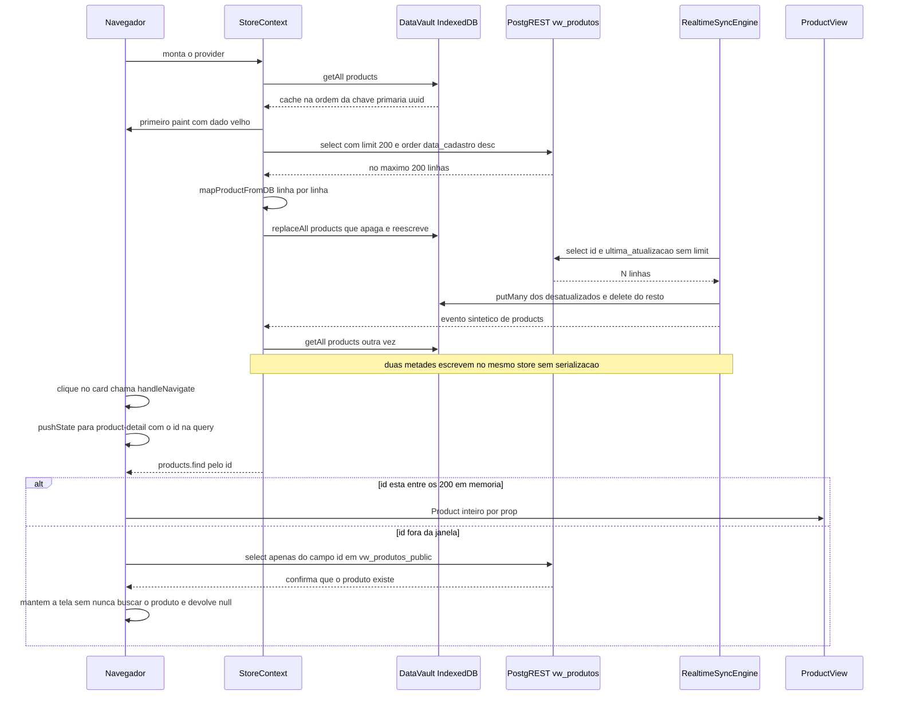
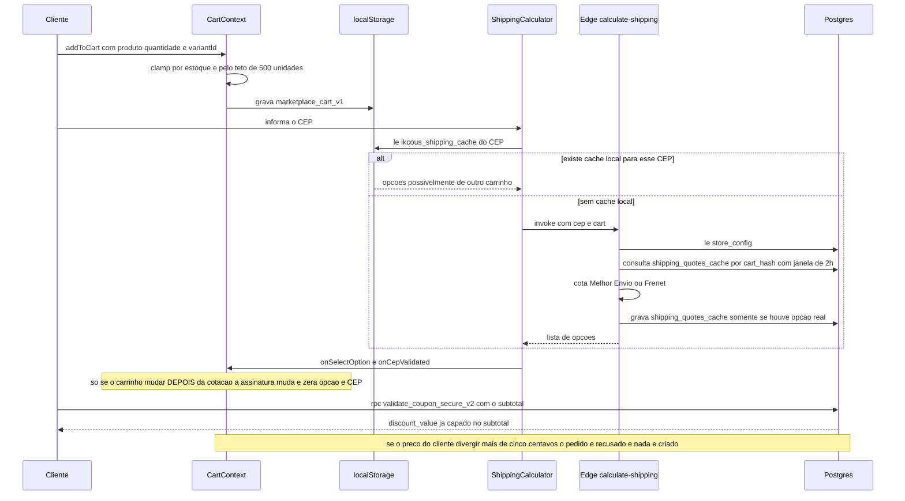
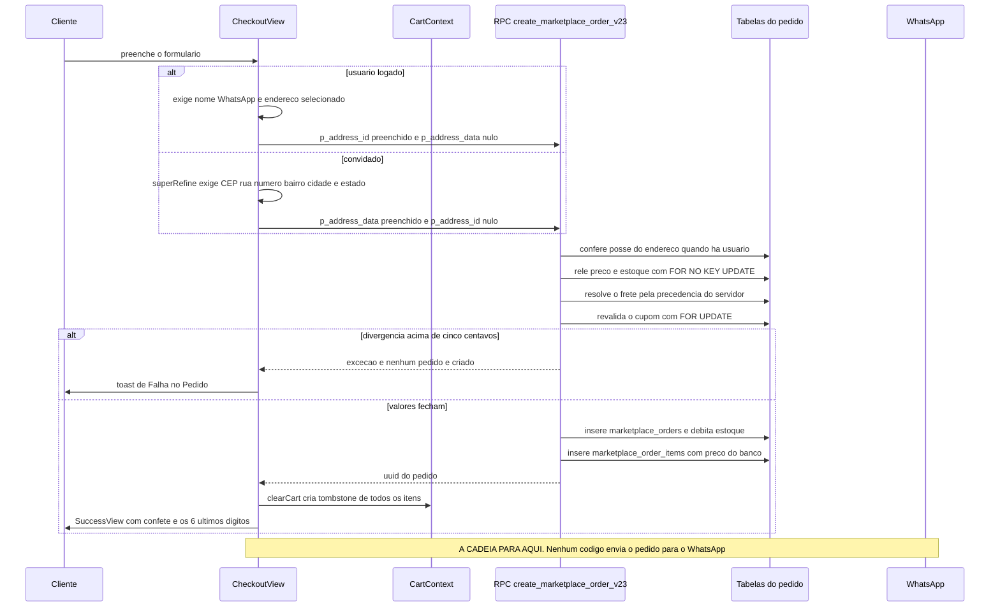
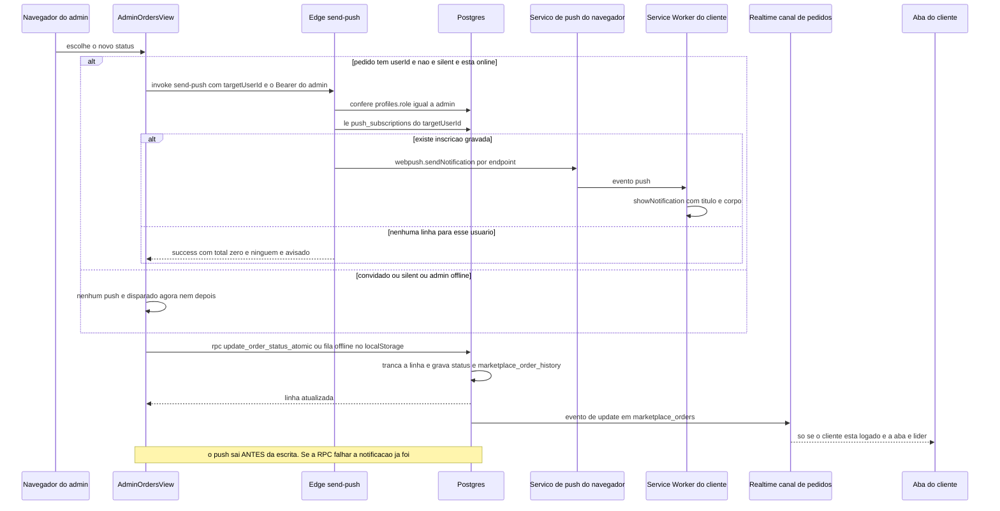
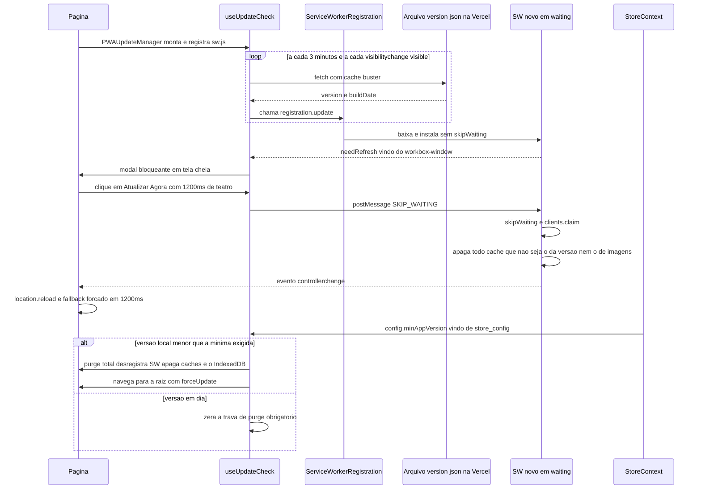

# Fluxos Críticos — os 5 que param a loja

Cinco caminhos. Se qualquer um deles quebrar, o cliente não compra ou o lojista não opera. Este
documento descreve o que o código **faz**, não o que o README promete — quase toda afirmação tem
`arquivo:linha` reaberto em 30/07/2026; as negativas ("não existe X") são fechadas por grep citado.

Vocabulário (`DataVault`, `catchUp`, tombstone, `assinaturaDoCarrinho`, Nuclear Purge, Ghost Purge,
os codinomes decorativos) está em [`04-GLOSSARIO.md`](04-GLOSSARIO.md); aqui é mecânica e
consequência. Panorama em [`01-VISAO-GERAL.md`](01-VISAO-GERAL.md), diretórios em
[`02-ARQUITETURA.md`](02-ARQUITETURA.md).

| # | Fluxo | Estado | O elo mais frágil |
| --- | --- | --- | --- |
| 1 | [Catálogo até abrir um produto](#fluxo-1--catálogo-até-abrir-um-produto) | 🟡 | Resolução do produto é `products.find` num array truncado em 200 |
| 2 | [Carrinho, cupom e frete](#fluxo-2--carrinho-cupom-e-frete) | 🟡 | Contingência de frete no cliente com preço que o servidor não aceita |
| 3 | [Fechar o pedido](#fluxo-3--fechar-o-pedido-convidado-e-logado) | 🔴 | Termina em tela de confete. **Não existe disparo de WhatsApp** |
| 4 | [Status do pedido e push](#fluxo-4--admin-muda-o-status-e-o-cliente-recebe-push) | 🔴 | Push sai do navegador do admin, antes de gravar, e só para cliente logado e inscrito |
| 5 | [Update do PWA](#fluxo-5--o-app-detecta-nova-versão-e-se-atualiza) | 🟡 | Confiabilidade por redundância; a detecção por Realtime não tem emissor |

---

## Fluxo 1 — Catálogo até abrir um produto

O catálogo do cliente é **um array em memória** dentro do `StoreContext`. Não há paginação, não há fetch por id no app do cliente (o único `select` por id busca só a coluna `id`, `App.tsx:1828-1832`), e a tela de detalhe é uma projeção pura desse array.

| # | Onde | O que acontece |
| --- | --- | --- |
| 1 | `StoreContext.tsx:109-112` | `vault.getAll("products")` hidrata o state e desliga o loading. Primeiro paint sem esperar rede. |
| 2 | `StoreContext.tsx:114-144` | Qualquer exceção na hidratação cai neste catch, que **limpa as 7 stores** do vault (`:122-133`) e volta pro estado de carregando. |
| 3 | `StoreContext.tsx:514-523` | Effect dispara `fetchConfig()` + `fetchProducts()`. Dependências são as próprias funções, que dependem de `isAdmin` e `loading`. |
| 4 | `StoreContext.tsx:386-395` | Admin verificado: `vw_produtos_admin` + `.is("deleted_at", null)` + **`.limit(200)`** (`:391`). |
| 5 | `StoreContext.tsx:398-411` | Todo o resto — e o fallback de erro do admin: `vw_produtos_public` + **`.limit(200)`** (`:402`). Ambas usam o embed `.select("*, product_variants(*)")`. |
| 6 | `mappers.ts:85-93` | `stock` do produto = **SOMA** dos `stock_increment` das variações ativas. |
| 7 | `StoreContext.tsx:421-424` | Compara `JSON.stringify(prev)` com `JSON.stringify(mapped)` — o catálogo inteiro, duas vezes, a cada revalidação — e persiste com `replaceAll` (`dataVault.ts:389-400`: `clear()` + `put()` na mesma transação). |
| 8 | `realtimeSyncEngine.ts:571-583` | `catchUp` busca `id, ultima_atualizacao` de **todos** os produtos, sem `.limit()`. Roda no `SUBSCRIBED`, no evento `online` (`:266-271`) e a cada `visibilitychange` visible (`:273-279`). |
| 9 | `StoreContext.tsx:566-578` | `useSyncListener(["products"])` re-lê o IDB inteiro e joga tudo no state. |
| 10 | `HomeView.tsx:115-138` | Filtro de categoria por `toLowerCase().trim()` e busca em nome + descrição + categoria. **Não filtra `isActive`.** |
| 11 | `ProductList.tsx:84-90` → `App.tsx:1049-1055` → `:666` → `:879` | Clique no card → `handleNavigate("product-detail", id)` → `pushState` para `/product-detail?id=<uuid>`. |
| 12 | `App.tsx:1937-1943` | `getProductById(products, id)` é literalmente `products.find` (`:360-361`). **`if (!product) return null`.** |
| 13 | `ProductView.tsx:516-543` | Agrupa variações `active` por `name`, calcula `currentPrice` pelo **último** eixo com override truthy (`:534-537`) e `currentStock` como **MÍNIMO** dos selecionados (`:538-543`). |

### O que pode dar errado — Fluxo 1

| Sintoma | Causa | Evidência |
| --- | --- | --- |
| O 201º produto não existe para o cliente: sai do catálogo, do filtro, das buscas, dos favoritos e da tela de detalhe. Nada na UI indica truncamento. | `.limit(200)` fixo. Não é paginação — é corte no fim de uma lista ordenada por `data_cadastro DESC`, então quem cai fora é sempre o mais antigo. | `StoreContext.tsx:391` e `:402` |
| Link de produto abre **tela branca** indefinida, sem mensagem e sem skeleton. | `return null` quando o id não está no array. O verificador de rede só decide **redirecionar ou não** — ele nunca busca o produto: a query seleciona apenas a coluna `id`. Confirmado que o id existe, a tela permanece em `product-detail` e `getProductById` continua devolvendo `undefined`, porque o array em memória está truncado em 200. **Falta um fetch por id — não há condição para inverter.** | `App.tsx:1943`; query só de `id` em `:1828-1832`; `:1837-1842` confirma existência e loga "avoiding redirect"; o redirect só acontece no `catch` (`:1848-1856`) |
| O número de produtos muda sozinho ao trocar de aba. | `fetchProducts` grava 200 por `replaceAll`; `catchUp` busca sem `.limit()` e grava N por `putMany`, apagando por `deleteById` o que não veio. Nada serializa as duas escritas e o listener re-lê o IDB inteiro. | `StoreContext.tsx:424` vs `realtimeSyncEngine.ts:581-583` (query sem limit), `:819` (`putMany`), `:760` (`deleteById`) e `:273-279` (gatilho) |
| "Nenhum produto" com console limpo — sem erro, sem toast. | No galho não-admin, um `{data:null, error}` do PostgREST não seta a variável local `error` (declarada em `:383`); o `throw` de `:413` não dispara, e `:432` zera o state. O `console.error` está no catch, inalcançável nesse caminho. | `StoreContext.tsx:398-411`, `:432`, `:435` |
| Card "Erro ao carregar" no catálogo. | O mapper nunca lança: em falha devolve produto-sentinela com `id: error-<timestamp>` e categoria `"Erro"`. | `mappers.ts:128-140` |
| Estoque do card ≠ estoque do detalhe. | SOMA no mapper, MÍNIMO na tela de detalhe. Mesmo campo, duas contas. | `mappers.ts:85-93` vs `ProductView.tsx:538-543` |
| Ordem do catálogo muda entre o primeiro e o segundo paint. | Cache devolve na ordem do uuid (`objectStore.getAll()`), rede devolve em `data_cadastro DESC`. | `dataVault.ts:226` vs `StoreContext.tsx:392` |

### Se quebrar, olhe aqui primeiro — Fluxo 1

1. `src/contexts/StoreContext.tsx:377-439` — o `fetchProducts` inteiro: qual view foi usada, se o `error` foi engolido, se caiu no `setProducts([])`.
2. `src/App.tsx:1806-1866` — os `console.log` de `[App] Redirect check` e `verifyProduct` dizem exatamente qual id foi pedido e quantos produtos havia em memória.
3. `src/lib/mappers.ts:49-151` — `[Mapper] Critical error` no console significa linha do banco que não casou com o tipo.
4. `src/lib/realtimeSyncEngine.ts:571-860` — erros de query do `catchUp` só saem como `console.warn`; procure por eles antes de culpar o `fetchProducts`.
5. `src/lib/dataVault.ts:389-416` — se o IDB estiver com dado velho ou inconsistente, é aqui que `replaceAll` sobrescreveu.
6. `src/contexts/StoreContext.tsx:114-144` — se o cache "sumiu inteiro", foi este catch.

---

## Fluxo 2 — Carrinho, cupom e frete

O carrinho vive no `CartContext` e no `localStorage`; o frete é cotado por uma edge function que
grava no banco; o cupom é validado por RPC. **Dois armazenamentos e três janelas**: `localStorage`
por CEP (cliente); `shipping_quotes_cache` gravado e lido pela edge function em 2h por `cart_hash`
(`calculate-shipping/index.ts:451-459`); e a **mesma tabela** lida pela RPC do pedido em 24h por
CEP + id da opção (`20260729000002...sql:255-265`). Chaves diferentes na mesma tabela.

| # | Onde | O que acontece |
| --- | --- | --- |
| 1 | `App.tsx:1914-1926` → `CartContext.tsx:509-520` | `addToCart` sem checagem de login — carrinho de convidado é suportado por desenho (`:518-520`). |
| 2 | `CartContext.tsx:540-545` | Estoque disponível = `variant.stockIncrement` se houver variação, senão `product.stock`. **Terceira semântica** do mesmo campo (a primeira é SOMA, a segunda MÍNIMO). |
| 3 | `CartContext.tsx:547-561`, `:589-597` | Esgotado → toast e aborta. Senão `Math.min(qtd, estoque, MAX_ITEM_QUANTITY)`. |
| 4 | `CartContext.tsx:712-724` | `assinaturaDoCarrinho` é o fingerprint `productId:variantId:quantity` ordenado; quando muda, `selectedShippingOption` e `shippingCep` são zerados. |
| 5 | `CartView.tsx:395-397` | A `ShippingCalculator` só é renderizada quando **nenhum** item tem `freeShipping`. |
| 6 | `ShippingCalculator.tsx:60-86` | Cache local `ikcous_shipping_cache_<cep>`. Chave é **só o CEP** — não inclui composição do carrinho. |
| 7 | `ShippingCalculator.tsx:93-119` | Invoca a edge function com `{cep, cart}`, salva no cache (`:108`) e **auto-seleciona a primeira opção** (`:112-119`). |
| 8 | `calculate-shipping/index.ts:423-439` | Todo item com frete grátis → devolve `free-shipping-promo` com preço 0 e **retorna antes de gravar cache**. |
| 9 | `calculate-shipping/index.ts:441-447` | Provider `flat_fee` (ou carrinho inválido) → `flat-fee-standard` ou `local-delivery` (`:401-422`), também sem gravar cache. |
| 10 | `calculate-shipping/index.ts:717-741` | Só o caminho de cotação real grava em `shipping_quotes_cache` com `origin_cep`, `destination_cep`, `cart_hash` e `options`. |
| 11 | `CheckoutView.tsx:334-348` → `useCoupons.ts:65-104` | `validate_coupon_secure_v2` (`:73`) devolve `discount_value` já capado no subtotal. O desconto fica em state local da tela. |
| 12 | `CheckoutView.tsx:324-325` | `finalTotal = total - discount`, onde `total` vem do contexto (`:87`) como `cartTotal + shippingFee`. |
| 13 | `20260729000002_shipping_quote_validation_v23.sql:224-277` | O servidor **refaz** a conta: item com frete grátis ou logado acima do mínimo → 0; `flat-fee-%` → `store_config.shipping_fee` (`:238-239`); `local-delivery` → confere faixa de CEP (`:241-248`); qualquer outro id → busca o preço em `shipping_quotes_cache` nas últimas 24h (`:250-273`). |

### O que pode dar errado — Fluxo 2

| Sintoma | Causa | Evidência |
| --- | --- | --- |
| Transportadora falha, o cliente vê "Entrega Padrão (Contingência)" com um preço, e o pedido é **recusado** por divergência. | A contingência recebe id `flat-fee-contingency` e preço do *smart fallback* por dígito do CEP, e **não é gravada no cache**. A RPC lê `flat-fee-%` como instrução e usa `store_config.shipping_fee`. Se os dois números diferirem em mais de R$ 0,05, o pedido morre. | `calculate-shipping/index.ts:691-716` vs `20260729000002...sql:238-239` e `:305-316` |
| Mesmo sintoma com "R$ 15,00" na tela. | Dois fallbacks com **preço 15 hard-coded**: o `catch` de topo da edge function e o fallback de UI do próprio calculador. A RPC continua usando `shipping_fee`. | `calculate-shipping/index.ts:753-761`; `ShippingCalculator.tsx:126-134` |
| Cliente muda a **quantidade** de um item e continua vendo o frete antigo. | O cache local é keyed só por CEP e o effect que o invalida observa apenas `cart.length`. | `ShippingCalculator.tsx:60` e `:141-149` |
| "A cotação de frete expirou" mesmo tendo calculado agora. | A RPC casa a cotação por CEP de destino + CEP de origem + id da opção + janela de 24h, **ignorando `cart_hash`**. Some quando a linha passou de 24h, quando `origin_cep` da `store_config` mudou depois da cotação, ou quando o insert do cache falhou em silêncio. Só id de transportadora real chega neste galho. | `20260729000002...sql:250-273` (o `ELSIF p_destination_cep IS NOT NULL`); escrita em `calculate-shipping/index.ts:717-727` |
| Frete grátis aparece para visitante não logado e o pedido é recusado. | A regra do mínimo exige `user` no `CartContext`, no `StoreContext`, no `CartView`, no `FreeShippingBlock` e na RPC — mas **duas telas comparam o subtotal com o mínimo sem checar `user`**, e são justamente as que escrevem "Grátis" na frente do cliente. | SEM `user`: `ShippingCalculator.tsx:201-203`, `CartReminder.tsx:25`. COM `user`: `CartContext.tsx:746-751`, `StoreContext.tsx:600-605`, `CartView.tsx:257`, `FreeShippingBlock.tsx:28` gated em `:81`, `20260729000002...sql:226-228` |
| Variação com `price_override = 0` cobra o preço cheio. | Zero é tratado como ausência: `?.priceOverride \|\| item.product.price`. | `CartContext.tsx:728-731` |
| Cupom aceito na tela e o pedido é recusado com "Cupom inválido ou expirado". | O desconto do cliente é **state de tela**; a RPC revalida do zero com `FOR UPDATE` e as mesmas condições (`active`, `valid_until`, `usage_count < usage_limit`, `min_purchase`). Se o limite estourou entre a validação e o fechamento, o `SELECT` não acha linha e a RPC levanta exceção — não é o guard de R$ 0,05, é bloqueio direto. | `useCoupons.ts:65-104` (state local) vs `20260729000002...sql:279-292` (`FOR UPDATE` em `:288`, `RAISE` em `:291`) |

> **Contradiz o [`01-VISAO-GERAL.md`](01-VISAO-GERAL.md), item 4,** que diz "cinco lugares" e conta
> a edge function. Contei **sete** comparações de subtotal contra o mínimo (as cinco COM `user` e as
> duas SEM, citadas na linha acima), e a edge function não é uma delas: ela só olha `frete_gratis`
> **por item** (`calculate-shipping/index.ts:374`, `:509`), nunca o mínimo.

### Se quebrar, olhe aqui primeiro — Fluxo 2

1. `supabase/migrations/20260729000002_shipping_quote_validation_v23.sql:305-316` — o `DETAIL` da exceção imprime subtotal, frete, desconto, total calculado, total enviado e o id da opção.
2. `src/components/ui/custom/ShippingCalculator.tsx:45-138` — qual opção o cliente realmente tem selecionada e de onde ela veio (cache, edge function ou fallback).
3. `supabase/functions/calculate-shipping/index.ts:691-741` — se caiu em contingência, a linha em `shipping_calculation_logs` com `status = 'contingency'` registra.
4. `src/contexts/CartContext.tsx:740-765` — a precedência do `shippingFee` no cliente, para comparar com a do servidor.
5. `src/hooks/useCoupons.ts:65-104` — o `discount` do cliente vem daqui e é só state de tela; o banco revalida do zero.
6. `src/contexts/CartContext.tsx:712-724` — se a opção de frete "desaparece" ao mexer no carrinho, é este effect, e é intencional.

---

## Fluxo 3 — Fechar o pedido (convidado E logado)

Os dois caminhos divergem no formulário e no parâmetro de endereço, e convergem na mesma RPC.

> **Confirmado: o checkout NÃO termina no WhatsApp.** Não há `wa.me` em `CheckoutView.tsx`; ele
> termina em `SuccessView` (`:1063-1121`). Os três `wa.me` do app de cliente são suporte pós-pedido
> (`OrderDetailsView.tsx:189`), dúvida de produto (`ProductView.tsx:641`) e suporte pelo perfil
> (`ProfileView.tsx:297`). **Mas WhatsApp existe no produto, manual e do lado do admin:**
> `AdminOrdersView.tsx:505`, `OrderDetail.tsx:1016` e `AdminUserDetailView.tsx:460` montam
> `https://wa.me/<phone>?text=...` já preenchido. É ação humana do lojista compensando o elo
> automático que falta — não faz parte de cadeia automática nenhuma.
>
> **Contradiz parcialmente o [`01-VISAO-GERAL.md`](01-VISAO-GERAL.md):167-170,** que afirma que o
> trigger "nunca chegou a produção": aqui **não** reproduzo a forma forte. O repo tem
> `20260601000001_remove_whatsapp_infrastructure.sql:4-12`, que dropa `on_order_created_whatsapp` e
> `handle_new_order_whatsapp()` e remove as colunas `whatsapp_api_*` — mas **todos os DROPs são
> `IF EXISTS`** e a migration não tem registro de ledger (`grep -rn 20260601000001 supabase/
> scripts/` → 0 fora do próprio arquivo). Isso é **intenção de remover**, não prova de que existiu.
> E introspecção prova ausência **hoje**, não ausência histórica: se rodou algum dia é **não
> verificado**. A última migration a criá-lo está no repo
> (`20260327000001_fix_notification_trigger_robust.sql:71-74`) e o comentário `CheckoutView.tsx:449`
> — "O disparo agora é 100% via Backend" — está órfão desde o commit inicial (`da94d8c`, 05/04/2026).

| # | Onde | O que acontece |
| --- | --- | --- |
| 1 | `App.tsx:1962-1973` | O App renderiza a `CheckoutView` passando **só** `key`, `onNavigate` e `onSetBackOverride` (`:1966-1970`) — nenhum valor de carrinho, total ou frete. Todos caem no fallback de contexto (`CheckoutView.tsx:84-89`). |
| 2 | `CheckoutView.tsx:116-175` | Schema Zod condicional. Sempre: nome e WhatsApp com 14 caracteres mascarados (`:119-120`). Convidado: `superRefine` exige CEP, rua, número, bairro, cidade e estado (`:130-173`). |
| 3 | `CheckoutView.tsx:391-395` | Logado sem endereço selecionado: aborta com toast antes de qualquer chamada. |
| 4 | `CheckoutView.tsx:400-411` | `notes` = observações + nomes de variação + `"Frete Escolhido: <nome> (Prazo: N dias)"`. **O `variant_id` NÃO depende disso** — ele tem coluna própria e é gravado (item 11). O que só existe em `notes` é o **nome legível** da variação e o frete escolhido. |
| 5 | `CheckoutView.tsx:413-443` | Monta `orderData`: `totalAmount = finalTotal` (`:420`), `destinationCep` e `shippingOptionId` (`:424-425`), e `addressId` **ou** `addressData` conforme `user` (`:427-438`). |
| 6 | `useOrders.ts:830-877` | `createOrder` chama `create_marketplace_order_v23` (`:839`) com 12 parâmetros. `p_shipping_cost` é enviado (`:847`) e o banco **o ignora** — a própria migration explica por quê (`20260729000002...sql:8-11`). |
| 7 | `20260729000002...sql:177-182` | Posse do endereço só é checada quando há `p_address_id` **e** `auth.uid()`. Convidado passa direto. |
| 8 | `20260729000002...sql:187-221` | Loop de validação: relê preço (`COALESCE(v.price_override, p.preco_venda)`), tranca a linha com `FOR NO KEY UPDATE`, exige `ativo = true` e soma o subtotal do zero. |
| 9 | `20260729000002...sql:305-316` | `ABS(calculado - p_total_amount) > 0.05` → exceção. Zero-trust: o número do cliente é conferência, não cobrança. |
| 10 | `20260729000002...sql:318-334` | Insere o header com `user_id = auth.uid()` (NULL para convidado) e joga whatsapp, endereço do convidado, `shipping_option_id` e `destination_cep` dentro de `customer_data`. |
| 11 | `20260729000002...sql:336-383` | Debita estoque com guarda `stock_increment >= quantidade` (`:344-351`) e insere o item com `variant_id` em **coluna estruturada** (`:373-377`). `price` e `product_name` vêm do banco — mas `product_name` recebe `p.nome`, o nome do **produto** (`:354-358` e `:370`), nunca o da variação. Depois incrementa `usage_count` do cupom (`:382`). |
| 12 | `CheckoutView.tsx:445-459` | Sucesso: `setOrderId`, `onClearCart()` — que cria tombstone de tudo e limpa frete e CEP (`CartContext.tsx:690-706`) — `setShowSuccess(true)` e confete. |
| 13 | `OrderSearch.tsx:92-125` | Rastreio do convidado: OTP de 6 dígitos por e-mail; ao validar, grava os pedidos em `sessionStorage["guest_tracked_orders"]` (`:110-113`). É a única "sessão" que convidado tem. |

### O que pode dar errado — Fluxo 3

| Sintoma | Causa | Evidência |
| --- | --- | --- |
| "Os valores do pedido mudaram" e o cliente **não consegue comprar**. | Qualquer divergência acima de R$ 0,05 entre a conta do cliente e a do servidor. O modo de falha não é preço errado — é bloqueio total. Ver Fluxo 2 para as causas concretas. | `20260729000002...sql:305-316` |
| Pedido criado e o lojista **não é avisado por WhatsApp**. | Não existe elo automático. Nem trigger no banco, nem edge function `send-order-whatsapp` no repo, nem redirecionamento no cliente. **Hoje não existe trigger de WhatsApp em `marketplace_orders`** — introspecção registrada no [`01-VISAO-GERAL.md`](01-VISAO-GERAL.md). Se existiu no passado, **não verificado** (ver blockquote acima). O lojista compensa abrindo o `wa.me` manual do painel. | `20260601000001_remove_whatsapp_infrastructure.sql:4-12`; `SuccessView` em `CheckoutView.tsx:1063-1121`; `AdminOrdersView.tsx:505` |
| Pedido novo não gera notificação in-app para o admin. | A v23 **não insere em `notificacoes`**; versões antigas da RPC inseriam. **No repo**, os únicos INSERTs nessa tabela são a tela de push manual (`AdminPushView.tsx:338`, `:346`, `:368`) e duas migrations antigas. O `NotificationContext` só lê, marca como lida e apaga. O que roda **hoje no banco** não foi introspectado — ver "Não verificado". | `grep notificacoes` em `20260729000002...sql` retorna 0; `20260303000004_solo_ninja_deep_security_v2.sql:111` e `20260303000002_security_hardening_patch.sql:146`; `NotificationContext.tsx:33` (leitura), `:66`, `:83` (`update lida`), `:98` (`delete`) |
| Convidado fecha pedido e depois **não acha o pedido**. | Sem `user_id`, o rastreio depende inteiramente do OTP + `sessionStorage`. Fechar a aba perde o acesso; o OTP depende de um segundo projeto Supabase (ver [`01-VISAO-GERAL.md`](01-VISAO-GERAL.md), item 6). | `OrderSearch.tsx:110-113` |
| **Nome** da variação escolhida não aparece em nenhum campo estruturado. | O `variant_id` está em coluna própria, mas `product_name` é o nome do produto. Quem quiser o rótulo legível ("Tamanho: M") tem que ler `notes` **ou** dar join em `product_variants` pelo `variant_id`. Não faça parse de `notes` para achar a variação: o id está do lado. | `20260729000002...sql:373-377` (coluna) vs `:354-358` e `:370` (`v_item_name` = `p.nome`); concatenação em `CheckoutView.tsx:400-411` |
| Endereço de convidado com cidade vazia vira "Monte Carmelo/MG". | Defaults silenciosos no montador do payload. | `CheckoutView.tsx:435-436` |

### Se quebrar, olhe aqui primeiro — Fluxo 3

1. `supabase/migrations/20260729000002_shipping_quote_validation_v23.sql:305-316` — a exceção de divergência de total nasce aqui, e o `DETAIL` diz de onde veio a diferença.
2. `src/views/customer/CheckoutView.tsx:413-443` — o payload exato que saiu do navegador.
3. `src/hooks/useOrders.ts:830-877` — confirme que é a **v23** sendo chamada; a v22 continua existindo como fachada (`20260729000002...sql:390-412`).
4. `supabase/migrations/20260729000002_shipping_quote_validation_v23.sql:187-221` — "Produto não disponível" ou "Estoque insuficiente" vêm daqui, e usam `ativo`/`active`, não o que o cliente vê.
5. `src/views/customer/CheckoutView.tsx:116-175` — se o botão não habilita, é o schema condicional, e a diferença logado/convidado é grande.
6. `src/contexts/CartContext.tsx:690-706` — pedido criado e carrinho não limpo, ou o contrário: o tombstone é aqui.

---

## Fluxo 4 — Admin muda o status e o cliente recebe push

A cadeia é **inteiramente client-side a partir do navegador do admin**. Não há trigger no banco: a
introspecção registrada no [`01-VISAO-GERAL.md`](01-VISAO-GERAL.md) (seção "Três coisas que a
auditoria de 29/07 dizia e que hoje são falsas") mostrou **zero triggers non-internal** em
`marketplace_orders`, e nada em `supabase/` ou `scripts/` invoca `send-push`
(`grep -rn send-push supabase/ scripts/` → só os `console.error` da própria função, `:25` e `:33`).

| # | Onde | O que acontece |
| --- | --- | --- |
| 1 | `AdminOrdersView.tsx:435-489` | `handleStatusChange`. É o único lugar **deste fluxo** que dispara push; o `OrderDetail` só delega para ele (`OrderDetail.tsx:815-828`, ligado em `AdminOrdersView.tsx:535-543`). A outra origem de push no app é a tela de envio manual (`AdminPushView.tsx:377`), que não passa por aqui. |
| 2 | `AdminOrdersView.tsx:442` | Guarda de **três** conjunções: `order?.userId && !silent && !isOffline`. Convidado nunca gera push; `silent` e admin offline também não — e nenhum dos três é recuperado depois. |
| 3 | `AdminOrdersView.tsx:447-464` | Pega o `access_token` da sessão do admin e invoca `send-push` com `targetUserId`, título, corpo e `data.type = "order_status"`. Erro é engolido em `console.error` (`:465-467`). |
| 4 | `send-push/index.ts:23-45` | Verifica o header, resolve o usuário pelo token e exige `profiles.role === 'admin'`. |
| 5 | `send-push/index.ts:61-68` | Busca `push_subscriptions` filtrando por `user_id`. Sem `targetUserId`, **manda para todo mundo**. |
| 6 | `send-push/index.ts:71-125` | Exige `VAPID_PUBLIC_KEY` e `VAPID_PRIVATE_KEY` no ambiente da função; envia em lotes de 100 e apaga a inscrição em 410/404 (`:116-118`). |
| 7 | `sw.ts:295-318` | O SW do cliente monta a notificação a partir do JSON. `notificationclick` foca a aba existente ou abre uma nova (`:320-339`). |
| 8 | `AdminOrdersView.tsx:471` → `useOrders.ts:662-764` | `updateOrderStatus`: update otimista no state e no cache (`:678-703`), fila offline no `localStorage` se `!navigator.onLine` (`:706-732`), e por fim a RPC `update_order_status_atomic` (`:734-742`). |
| 9 | `20260707000000_fix_update_order_status_atomic.sql:38-86` | Tranca a linha, checa posse/admin (`:48-59`), **restaura estoque** quando vai para `cancelled` (`:63-76`), grava o status e insere em `marketplace_order_history`. |
| 10 | `useOrders.ts:388-389`, `:451-457` | O cliente vê a mudança em tempo real só se estiver logado e com o app aberto: o canal exige `user?.id` e filtra `user_id=eq.<uid>`. |
| 11 | `usePushNotifications.ts:32-98` | O caminho de inscrição: lê `VITE_VAPID_PUBLIC_KEY` (`:37-42`), assina no `pushManager` (`:64-67`) e faz upsert em `push_subscriptions` (`:76-88`). |

### O que pode dar errado — Fluxo 4

| Sintoma | Causa | Evidência |
| --- | --- | --- |
| Cliente **nunca** recebe push, mesmo tendo aceitado o convite. | `subscribe()` chama `pushManager.subscribe` **antes** de checar sessão e faz `return` sem gravar nada se `user` for nulo. A permissão do navegador fica concedida, e o banner nunca reaparece porque `permission === "granted"` o esconde. Resultado: convidado que aceita fica permanentemente inscrito no navegador e ausente do banco. | `usePushNotifications.ts:64-73`; banner escondido em `PushNotificationBanner.tsx:35-38` |
| Push chega mas o status não mudou. | O `invoke("send-push")` acontece em `:452`, a RPC em `:471`. Falha na RPC não desfaz a notificação. | `AdminOrdersView.tsx:452` vs `:471` |
| Nenhum push em nenhum pedido, sem erro visível na UI. | `VAPID_PUBLIC_KEY`/`VAPID_PRIVATE_KEY` ausentes no ambiente da edge function fazem a função lançar; o cliente engole o erro em `console.error`. | `send-push/index.ts:76-78`; `AdminOrdersView.tsx:465-467` |
| Admin legítimo recebe "Unauthorized: Admin access required". | A edge function autoriza por `profiles.role`, **não** pela RPC `is_admin()` que o resto do app usa. Um admin cuja role viva não esteja em `profiles` passa por todos os guards do frontend e falha só aqui. | `send-push/index.ts:37-45` |
| Cliente logado com o app aberto não vê o status mudar. | Só a aba **líder** abre o socket (`if (isLeader)`); a aba secundária cai no `else` e só escuta o `BroadcastChannel` `ikcous_orders_realtime`. Aba escondida renuncia à liderança depois de 3 s. Sem `user.id`, nem canal existe. | `useOrders.ts:546` e `:558-578`; renúncia em `useLeaderElection.ts:153-165`; guard e filtro em `useOrders.ts:388-389` e `:451-457` |
| **Status mudado com o admin offline: o cliente nunca recebe push — nem depois que a conexão volta.** Nada na UI do admin indica isso. | O guard de push exige `!isOffline`, então nenhum push sai na hora. A alteração entra na fila `orders_offline_updates_queue` e o `return` acontece **antes** da RPC. Quando a conexão volta, `syncOfflineOrderUpdates` percorre a fila chamando só `update_order_status_atomic` — não há nenhuma referência a `send-push` nessa função. O push não é adiado: ele é perdido. | `AdminOrdersView.tsx:442` (guard); `useOrders.ts:706-731` (enfileira e `return` em `:731`); `useOrders.ts:39-102` (`syncOfflineOrderUpdates`, RPC em `:56-64`, zero push) |
| Cliente não recebe nada in-app. | Nada insere em `notificacoes` nesse fluxo. Push é o único canal automático. | `20260707000000...sql` não menciona `notificacoes`; no repo os INSERTs em `notificacoes` só existem em `AdminPushView.tsx:338`, `:346`, `:368` e em duas migrations de 03/03 |

> **Ressalva de segurança, do arquivo de migration.** Em
> `20260707000000_fix_update_order_status_atomic.sql:48` a checagem é
> `IF v_user_id != v_caller_id AND NOT v_is_admin`. Para pedido de convidado `v_user_id` é NULL, a
> comparação vira NULL e o `RAISE` não dispara; sobra o bloco `:52-59`, que permite cancelar pedido
> `pending`. O `GRANT` em `:94` inclui `anon`. Isso descreve o **arquivo** — o corpo vivo não foi
> inspecionado, e o histórico de migrations deste projeto não reproduz produção.

### Se quebrar, olhe aqui primeiro — Fluxo 4

1. `src/views/admin/AdminOrdersView.tsx:435-489` — a ordem das operações e o guard de `userId`; é a origem de tudo neste fluxo.
2. `supabase/functions/send-push/index.ts` — os dois modos de falha da edge function estão neste arquivo: autorização por `profiles.role` (`:37-45`) e ausência das chaves VAPID (`:76-78`).
3. Tabela `push_subscriptions` — se não há linha para o `user_id` do pedido, o resto da cadeia é irrelevante. Só leitura.
4. `src/hooks/usePushNotifications.ts:64-88` — o motivo mais comum de não haver linha.
5. `src/sw/sw.ts:295-318` — se a notificação chega vazia ou com título "Novidade!", o payload não trouxe `title`.
6. `src/hooks/useOrders.ts:662-764` — status que "volta sozinho" é o rollback otimista de `:748-760`.

---

## Fluxo 5 — O app detecta nova versão e se atualiza

Sete mecanismos de autocura sobrepostos, sem fonte da verdade — **seis reagem a alguma coisa, o G não**. O caminho normal é o **A**:

- **A** — `registration.update()` por intervalo de 3 min e por `visibilitychange`: `useUpdateCheck.ts:96-131`
- **B** — broadcast `deploy-ping` no canal `pwa-system-signals`, **sem emissor**: `useRealtimeUpdate.ts:50-54`
- **C** — update obrigatório por `store_config.min_app_version` → purge total: `useUpdateCheck.ts:257-310`
- **D** — `addEventListener("error")` com texto de chunk → purge real em 1500 ms: `useUpdateCheck.ts:343-386` (o listener em `:384`; **não existe `window.onerror` no repo**, não adianta grepar por esse nome)
- **E** — erro de chunk pego pelo React → `location.reload()` com guarda de 10 s: `GlobalErrorBoundary.tsx:43-60`
- **F** — pulso do SW perdido por 5 min → desregistra todos os SWs e recarrega: `pwa-sentinel.ts:64-82`
- **G** — Ghost Purge: limpeza one-shot por `RESET_KEY` **literal**, no boot, antes do React (`silent-guardian.js:8`, `:13-41`). **Não reage a versão nova**: a string é fixa e independente do `__APP_VERSION__` (`:58`). Só dispara quando alguém edita o fonte — é alavanca manual, não detecção.

> **Contradiz o [`01-VISAO-GERAL.md`](01-VISAO-GERAL.md):142,** que diz "cinco mecanismos" sem
> enumerá-los. Contei sete, com arquivo e faixa acima; os dois que provavelmente faltavam são **E** e **F**, que não vivem em `useUpdateCheck.ts`.

| # | Onde | O que acontece |
| --- | --- | --- |
| 1 | `vite.config.ts:42-46`, `:50-79` | A versão é `1.0.0-sha.<7>` (com `VERCEL_GIT_COMMIT_SHA`) ou `1.0.0-build.<5>`. O plugin escreve `dist/version.json` e substitui o literal `"1773003981700"` dentro de `silent-guardian.js` (`:81-93`). Sem esse literal exato, o replace falha em silêncio. |
| 2 | `App.tsx:353` → `useUpdateCheck.ts:80-94` | `PWAUpdateManager` monta e o `useRegisterSW` do `vite-plugin-pwa` registra `/sw.js`. **Depende da árvore React ter montado** — travado em 85% (`silent-guardian.js:72`, `if (progress > 85) progress = 85;`, com o `clearInterval` em `:79`) significa que nem isso aconteceu. |
| 3 | `sw.ts:27-46` | `install` faz `cache.addAll` do `__WB_MANIFEST` deduplicado e **não chama `skipWaiting`** (`:43-45`): o SW novo fica em waiting de propósito. |
| 4 | `useUpdateCheck.ts:96-131` | Detecção A: `setInterval` de 3 min (`:113`) e `visibilitychange` visible (`:115-122`) chamam `registration.update()`. O `version.json` (`:66-78`) serve só para **exibir** o número novo. |
| 5 | `useRealtimeUpdate.ts:50-54` | Detecção B: a aba líder assina o canal `pwa-system-signals` no evento `deploy-ping` e repropaga por `BroadcastChannel` (`:76`, consumo em `:142`). |
| 6 | `App.tsx:2706-2708` → `UpdateNotification.tsx:29-32` | O modal aparece com `updateAvailable` (que é o `needRefresh` do workbox) e o clique chama `onUpdate` depois de 1200 ms de animação. |
| 7 | `useUpdateCheck.ts:214-252` | O `handleUpdate`: grava `pwa_reload_reason`, escuta `controllerchange`, chama `updateServiceWorker(true)` (`:236`) e recarrega à força em 1200 ms se o evento não vier (`:238-249`). |
| 8 | `sw.ts:208-222` | O SW recebe `{type:"SKIP_WAITING"}` e ativa. Em `activate` (`:48-69`) faz `clients.claim()` e apaga **todo** cache que não seja o da versão nem o de imagens. |
| 9 | `StoreContext.tsx:254` → `useUpdateCheck.ts:257-310` | Update obrigatório: `store_config.min_app_version` versus a versão local, comparada só pelo núcleo semver (`:24`). Trava de no máximo 2 tentativas (`:39`, `:275-280`) para não prender o cliente em loop. |
| 10 | `useUpdateCheck.ts:136-212` | O purge de verdade: desregistra SWs, apaga caches, apaga o IndexedDB, limpa parte do `localStorage`, grava `pwa_reload_reason` (`:196-199`) e vai para `/?forceUpdate=<ts>` (`:202`). |
| 11 | `useUpdateCheck.ts:343-386` | Recuperação: um `window.addEventListener("error", ...)` (`:384`) — qualquer erro cujo texto case com chunk ou módulo dinâmico (`:346-353`) dispara o purge real em 1500 ms (`:380`), com guarda de 15 s em `sessionStorage` (`:358-370`). |
| 12 | `App.tsx:1173-1188` | No boot seguinte, `pwa_reload_reason` é consumido e vira o toast "Sistema Atualizado" — o app explica ao usuário o reload que ele acabou de sofrer. |

### O que pode dar errado — Fluxo 5

| Sintoma | Causa | Evidência |
| --- | --- | --- |
| Deploy sai e ninguém atualiza por Realtime. | **`deploy-ping` não tem emissor.** Existem três referências no repo: a assinatura do broadcast do Supabase (`:54`), uma reemissão interna por `BroadcastChannel` (`:76`) e o consumo dessa reemissão (`:142`). **Nenhuma delas emite** o broadcast no canal `pwa-system-signals` — não há `.send(` em script, migration ou edge function. | `grep -rn "deploy-ping\|pwa-system-signals" src/ supabase/ scripts/` → só `useRealtimeUpdate.ts:48`, `:50`, `:54`, `:76`, `:92`, `:142`; zero em `supabase/` e em `scripts/` |
| O cliente fica na versão antiga indefinidamente. | O registro do SW acontece dentro do React (`App.tsx:353`). Se o boot morre antes do primeiro render, nada verifica versão nunca. | `useUpdateCheck.ts:80-94` |
| Update aplicado e o app quebra logo depois. | `activate` apaga todo cache que não seja o da versão nova nem o de imagens — inclusive `warmed-routes`. | `sw.ts:48-69`, filtro em `:57-59` |
| `pwaVersionPlugin` "não faz nada". | O replace no `silent-guardian.js` é por igualdade literal com `"1773003981700"`. Mudar aquele número no fonte quebra o replace sem erro. | `vite.config.ts:85-88` |
| Cliente entra em loop de reload após update obrigatório. | É o cenário que a trava de 2 purges existe para cortar. Se ela cortar, o cliente fica **na versão velha** com um `console.error` e nada na UI. | `useUpdateCheck.ts:275-280` |
| `nuclearPurge` chamado de fora não limpa nada de verdade. | O hook exporta `performNuclearPurge: handleUpdate` — o de troca de SW e reload, não o de limpeza total. Dois comportamentos, um nome. | `useUpdateCheck.ts:426` vs `:136` |
| Toast "Sistema Atualizado" aparecendo sem update. | **Seis escritas em três arquivos** gravam `pwa_reload_reason`; qualquer reload forçado deixa o bilhete, inclusive os dois de cenário de crash. | `useUpdateCheck.ts:197`, `:218`, `:372`; `GlobalErrorBoundary.tsx:57` ("Failed to fetch dynamically imported module") e `:85` (`Fatal Crash: ...`); `pwa-sentinel.ts:78` (`Sentinel Recovery: Pulse loss`). Leitura em `App.tsx:1173`, remoção em `:1186` |

> **Contradiz o [`04-GLOSSARIO.md`](04-GLOSSARIO.md):96** (verbete `pwa_reload_reason`), que diz
> "Escrito por 4 lugares diferentes". São **6 escritas em 3 arquivos**, todas listadas na linha
> acima e conferidas por grep repo-wide em 30/07/2026. O 04 está errado nesse número.

### Se quebrar, olhe aqui primeiro — Fluxo 5

1. `/version.json` no domínio publicado — se o `version` ali é igual ao `__APP_VERSION__` do bundle, não há nada para detectar.
2. `src/hooks/useUpdateCheck.ts:96-131` — os `console.log` de `[PWA] Checking for updates...` dizem se o ciclo está rodando.
3. DevTools → Application → Service Workers — um SW em *waiting* que não ativa é o `SKIP_WAITING` não chegando (`src/sw/sw.ts:219-221`).
4. `src/hooks/useUpdateCheck.ts:257-310` — se o app se apagou sozinho, foi o update obrigatório: procure `pwa_mandatory_purge_guard` e `pwa_update_log` no `localStorage`.
5. `vite.config.ts:50-93` — versão errada no bundle nasce aqui, e o log do build imprime qual foi escolhida.
6. `public/silent-guardian.js` e `src/main.tsx:81-82` — travado em 85% não é problema de update: é crash antes do primeiro render. Ver [`03-SETUP-AMBIENTE.md`](03-SETUP-AMBIENTE.md).

---

## Não verificado

Nenhum item abaixo foi confirmado. Estão aqui em vez de preenchidos por dedução.

- **Se o corpo vivo das RPCs corresponde aos arquivos citados** (`create_marketplace_order_v23`,
  `update_order_status_atomic`, `validate_coupon_secure_v2`). O ledger tem 121 linhas para 137
  arquivos e há objetos aplicados por fora. **Toda citação `.sql` deste documento descreve arquivo,
  não introspecção.** `SELECT` e introspecção são permitidos pela regra do projeto — é exatamente o
  que falta. Isso cobre também **o que insere em `notificacoes` hoje no banco**.
- **Se o embed `.select("*, product_variants(*)")` sobre uma VIEW funciona nesta instância.**
  `20260323000000_fix_pgrst200_rpc_variants.sql:1-7` documenta PGRST200 para esse caso e criou uma
  RPC de contorno que o frontend nunca chama. Se falhar, o Fluxo 1 cai em `setProducts([])`.
- **Definição real de `vw_produtos_admin`.** Zero ocorrências nas 137 migrations.
- **Se o catálogo de produção já passou de 200 produtos.** Todo o impacto do teto depende disso.
- **Se `VAPID_PUBLIC_KEY`/`VAPID_PRIVATE_KEY` estão no ambiente da edge function `send-push`** e
  **se existe alguma linha em `push_subscriptions` hoje**. Sem os dois, o Fluxo 4 é teórico.
- **Se alguém emite `deploy-ping` manualmente** (dashboard, script local, cron externo). No repo
  não há emissor; fora dele não sei.
- **O `max-rows` do PostgREST deste projeto** e **se o oscilar 200↔N acontece de fato**. O `catchUp`
  não passa `.limit()`, mas o teto real é do servidor; e o oscilar é dedução, não observação.
- **Onde exatamente `sync_cart_atomic` divergiria do merge local.** `CartContext.tsx:437-507`
  empurra o carrinho com debounce de 1 s; não abri o corpo da RPC.
- **Se o trigger `on_order_created_whatsapp` chegou a rodar em produção algum dia.** Hoje não
  existe; sobre o passado, nada — ver [Fluxo 3](#fluxo-3--fechar-o-pedido-convidado-e-logado).
- **Motivo não documentado:** por que R$ 15 é o preço dos dois fallbacks de contingência, por que a
  tolerância é R$ 0,05, e por que o comentário "O disparo agora é 100% via Backend"
  (`CheckoutView.tsx:449`) foi escrito. Nenhum dos três tem justificativa no código.
