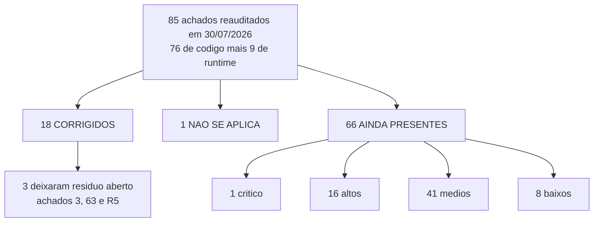

# Estado Atual — o que já funciona, o que falta e o que está quebrado

Este documento existe por causa de uma frase: **"eu não consigo entender o que falta"**.

A resposta curta é a tabela do [placar](#placar-da-auditoria): dos 85 achados reauditados em
30/07/2026, **18 foram corrigidos, 1 não se aplica e 66 continuam de pé**. A resposta longa é o
resto do arquivo — semáforo por área, estado do banco, saúde da engenharia e o que o produto
simplesmente não tem.

Vocabulário em [`04-GLOSSARIO.md`](04-GLOSSARIO.md), diretórios e abstrações em
[`02-ARQUITETURA.md`](02-ARQUITETURA.md), panorama em [`01-VISAO-GERAL.md`](01-VISAO-GERAL.md).
Aqui não se explica o que é `DataVault` nem onde mora cada pasta — aqui se diz **o que está de pé
e o que não está**, com `arquivo:linha` reaberto hoje.

Ordem de execução do que está listado aqui: [`../backlog/BACKLOG.md`](../backlog/BACKLOG.md) e
[`../backlog/ROADMAP.md`](../backlog/ROADMAP.md).

---

## Como este placar foi feito

Cada um dos 85 achados da `AUDITORIA_2026-07-29.md` foi reaberto contra o código **de hoje** e,
quando o achado era sobre banco, contra o **corpo vivo** da função no Postgres de produção
(`pg_get_functiondef`, `pg_policies`, `information_schema`, `pg_proc.proacl`) — leitura apenas,
nenhuma escrita.

Quatro veredictos possíveis:

| Veredicto | O que significa |
| --- | --- |
| ✅ **CORRIGIDO** | O defeito descrito não existe mais. A correção foi lida no código atual ou no corpo vivo da função. |
| ❌ **AINDA PRESENTE** | O código está igual, ou mudou sem corrigir o defeito. Reaberto linha a linha. |
| ⚪ **NÃO SE APLICA** | A premissa do achado é falsa contra o sistema real. Não foi "corrigido": nunca foi verdade. |
| ⬜ **NÃO VERIFICÁVEL** | Nenhum. Todos os 85 receberam veredicto com evidência. |

> **Severidade original ≠ severidade hoje.** Vários achados continuam presentes mas perderam
> gravidade porque **não há dado em produção que ative o caminho**: só existem 18 produtos ativos,
> 2 variantes, 0 cupons com validade, 0 pedidos com desconto. Onde isso acontece, a tabela mostra
> as duas severidades e o motivo do rebaixamento. Isso é dívida latente, não problema resolvido.

---

## Semáforo por área funcional

🟢 estável · 🟡 funciona com ressalva · 🔴 quebrado ou ausente

| Área | | Evidência | O que falta |
| --- | --- | --- | --- |
| **Catálogo** | 🟡 | `.limit(200)` em `StoreContext.tsx:391` e `:402`; erro da view pública só propaga se o ramo admin também falhou (`:405-410`) e o `else` de `:431-433` troca a lista por `[]`; produto com soft delete volta ao cache pelo UPDATE (`realtimeSyncEngine.ts:430-436`) | Paginação de verdade, fetch por id na tela de detalhe (`App.tsx:1939-1943` faz `return null`), tratar `deleted_at` como remoção lógica, e parar de zerar o catálogo em falha de rede |
| **Busca** | 🟡 | Três implementações, nenhuma normaliza acento: `useSearch.ts:22-28`, `SearchBar.tsx:108-173`, `HomeView.tsx:129-136`. Nenhum `tsvector`/`pg_trgm` nas migrations | `normalizeText` compartilhado aplicado dos dois lados da comparação. É o 🟡 mais próximo do vermelho da tabela: quem digita "alianca" no teclado do celular não acha "Aliança" |
| **Carrinho** | 🟡 | `variantNames` não está no schema Zod (`CartContext.tsx:19-24`) e o Zod v4 descarta a chave na reidratação; `sync_cart_atomic` (corpo vivo) não escreve `variant_names`, coluna que existe e fica NULL; merge Last-Write-Wins mantém o `product` velho (`:317-319`) | Declarar `variantNames` no schema, incluir a coluna no INSERT da RPC, e reidratar o snapshot de produto — hoje o preço velho faz a RPC recusar o pedido |
| **Cupons** | 🟡 | Validação é server-side de verdade (`validate_coupon_secure_v2`, `FOR UPDATE`); limpar a validade não grava (`useCoupons.ts:155-166` manda `undefined`, que o JSON descarta); validade nasce em meia-noite UTC (`AdminCouponFormView.tsx:459-471`); cancelamento não devolve `usage_count` | Converter `undefined` → `null` no update, montar fim de dia local, devolver o uso no cancelamento. Falta também tudo que é por pessoa: primeira compra, uso único por cliente, cupom por categoria |
| **Frete** | 🟡 | As 5 correções de 29/07 estão no corpo vivo: `NULLIF(free_shipping_min,0)`, regra de logado espelhada, cotação validada contra `shipping_quotes_cache`, parser de faixa de CEP (`calculate-shipping/index.ts:88-115`), `fireAndForget` (`:60-68`) | Duas telas ainda comparam subtotal × mínimo **sem checar `user`** (`ShippingCalculator.tsx:201-203`, `CartReminder.tsx:25-27`), e a contingência de preço 15 não é gravada no cache — ver Fluxo 2 em [`05-FLUXOS-CRITICOS.md`](05-FLUXOS-CRITICOS.md) |
| **Checkout convidado** | 🟡 | Fecha pedido: o bloqueio de frete grátis foi resolvido nos dois lados (achados 1, 12, 27, 28). Depois disso o convidado depende de OTP para achar o próprio pedido | O envio do OTP está quebrado (achado 32) e o próprio OTP vaza pedido de terceiro (achado 2). Fechar a aba perde o pedido: `OrderSearch.tsx:110-113` é a única "sessão" que convidado tem |
| **Checkout logado** | 🟡 | RPC zero-trust: relê preço, tranca linha, recusa divergência acima de R$ 0,05 (`20260729000002_shipping_quote_validation_v23.sql:305-316`) | Guarda de reentrância síncrona no submit (`CheckoutView.tsx:378-389` só seta `isSubmitting` depois de um `await`), chave de idempotência no banco, e validação de carrinho vazio — hoje `p_items = []` é aceito |
| **Pagamento / WhatsApp** | 🔴 | Zero gateway no repo (grep por mercadopago/stripe/pagseguro/asaas/pagarme em `src/`, `supabase/`, `package.json`: nada). `PaymentMethod` é rótulo de texto (`src/types/index.ts:116`). Sem redirecionamento para WhatsApp em lugar nenhum | Tudo. Nenhum valor é cobrado, nenhum status de pagamento é acompanhado, e o estoque é debitado no ato mesmo sem pagamento. É a maior lacuna do produto |
| **Pedidos** | 🔴 | `generate_order_otp_v1` (corpo vivo) casa WhatsApp **OU** e-mail e aceita fragmento vazio; `update_order_status_atomic` usa `!=` contra `user_id` NULL de convidado; a lista do admin é substituída pela consulta pessoal a cada reconexão (`useOrders.ts:536`, `:591`, `:608`) | Amarrar o OTP a um `order_id`, trocar `!=` por `IS DISTINCT FROM`, rate limit, e direcionar a recarga do realtime para `loadOrders` quando `isAdmin` |
| **Admin de produtos** | 🟡 | Formulário completo e com rascunho automático. Mas o botão volta a ser clicável 1,5 s antes de navegar (`AdminProductFormView.tsx:1139` vs `:1147-1150`); desmarcar promoção manda `undefined` e o `preco_original` fica no banco (`:1069-1072` + `useProducts.ts:638-639`); o rascunho é apagado ~1 s depois de abrir (`:774-784`) | Guarda de duplo clique, `null` em vez de `undefined` nos três campos limpáveis, e só apagar rascunho após decisão explícita |
| **Admin de pedidos** | 🟡 | Push é disparado **antes** da RPC de status (`AdminOrdersView.tsx:442-468` vs `:471`); fila offline sem serialização reenvia RPC já concluída e trava para sempre (`useOrders.ts:39-102`) | Inverter a ordem, resolver o `userId` por `selectedOrder` como fallback, serializar a fila por promessa de módulo e descartar erro terminal |
| **Admin de configuração** | 🟡 | `upsert_store_config` virou update parcial de verdade (corpo vivo com `CASE WHEN config_json ? 'chave'` em 18 das 19 colunas de configuração do UPDATE; `enabled_shipping_methods` usa `CASE WHEN v_has_methods`). Mas `updateConfig` engole o erro e não re-lança (`StoreContext.tsx:506-509`), então todo `catch` das telas de admin é código morto | Fazer `updateConfig` devolver `Promise<boolean>`; decidir o destino de `home_sections` (coluna não existe no banco, a vitrine nunca salva); e ligar o switch de avaliações a alguma coisa |
| **Push** | 🔴 | `send-push` devolve `{success:true}` sem contar os `rejected` do `Promise.allSettled` (`supabase/functions/send-push/index.ts:127-130`); `subscribe()` cria a inscrição antes de checar sessão e retorna mudo se não houver usuário (`usePushNotifications.ts:64-73`); medido: **8 linhas em `push_subscriptions`, 6 com `user_id` NULL** | Contar falhas e devolver isso ao admin; checar sessão antes do `subscribe`; e fazer fan-out por usuário — notificação global (`usuario_id` NULL) nunca fica lida porque a policy de UPDATE exige `auth.uid() = usuario_id` |
| **Q&A** | 🟡 | `answer_question_atomic` (corpo vivo, as duas sobrecargas) só faz INSERT; não há índice único em `answers(question_id)`. O modal do admin se comporta como editor (`AdminQAView.tsx:212-223`) | Caminho de UPDATE na RPC. Hoje cada "edição" empilha uma segunda resposta na página do produto, e não existe UI para apagar |
| **Avaliações** | 🟡 | O mapper da página do produto não copia `merchant_reply` (`useReviews.ts:93-104`), então a resposta da loja nunca aparece; "Útil" soma 2 na tela e 1 no banco (`ReviewCard.tsx:153` + `useReviews.ts:188`); `increment_helpful` só soma, sem tabela de votos | Uma linha no mapper, um contador único de origem, e uma tabela de votos. O switch "Avaliações dos Clientes" não desliga nada: grep por `enableReviews` não encontra nenhuma view de cliente |
| **Favoritos** | 🟡 | Lista montada por interseção com o catálogo em memória (`FavoritesContext.tsx:186-190`), que é truncado em 200 e só traz ativos; `isFavorite` lê outra fonte (`:249`, `:262`) | Buscar o favorito por id quando ele não está no array. Medido hoje: 18 produtos na `vw_produtos_public`, 5 favoritos, **0 apontando para fora da view** — o defeito existe, a vítima não |
| **PWA / offline** | 🟡 | Precache de **1,85 MB / 77 entradas** (era 6,6 MB). Comparação semver por núcleo e trava de 2 purges em `useUpdateCheck.ts:24-33`, `:38-39`, `:271-280` | Guarda de conectividade no purge nuclear (hoje ele roda em `ChunkLoadError`, erro típico de rede ruim), saída na tela de spinner do `GlobalErrorBoundary.tsx:104-116`, e early-return de `/version.json` no SW — cada `?t=<timestamp>` vira entrada nova no Cache Storage |
| **Autenticação** | 🟡 | A autorização real está no RLS: 29/29 tabelas com RLS, 71 policies. Os furos são de cliente e de UX: semáforo global aplica o resultado de admin do usuário **anterior** (`AuthContext.tsx:150-158`), logout offline não limpa nada (`:531-541`), e `ikcous_orders_cache_<uid>` / `ikcous_addresses_cache_<uid>` sobrevivem ao logout | Coalescer a verificação de admin por `userId`, limpar sessão localmente sempre, varrer os caches de PII por prefixo, e revogar `check_user_confirmation_status` de `anon` (hoje dá para enumerar a base de e-mails) |
| **SEO** | 🟡 | `react-helmet-async` foi removido e `useDocumentMeta.ts` injeta title, metas e JSON-LD direto no DOM (usado em `HomeView.tsx:219`, `ProductView.tsx:689`, `AdminLayout.tsx:515`) | `public/sitemap.xml` tem 4 URLs e **nenhuma de produto**; a URL é `/product-detail?id=<uuid>`, sem slug; `vercel.json` reescreve `/(.*)` para `index.html`, então URL inválida responde 200 com a Home; e crawler sem JS (o do WhatsApp) só lê as tags estáticas do `index.html` |

**Nenhuma área saiu 🟢.** Isso não é pessimismo de redação: é o mesmo padrão que o
[`01-VISAO-GERAL.md`](01-VISAO-GERAL.md) já tinha registrado na tabela de maturidade — núcleos bem
pensados, cercados de camadas que saíram de sincronia sem erro visível.

---

## Placar da auditoria

| Veredicto | Quantos | % |
| --- | --- | --- |
| ✅ CORRIGIDO | **18** | 21% |
| ❌ AINDA PRESENTE | **66** | 78% |
| ⚪ NÃO SE APLICA | **1** | 1% |
| ⬜ NÃO VERIFICÁVEL | **0** | — |
| **Total** | **85** | |

Severidade original dos 85: 9 críticos, 31 altos, 43 médios, 2 baixos.
Severidade **hoje** dos 66 que ficaram: **1 crítico, 16 altos, 41 médios, 8 baixos**.

Onde estão os 66 que ficaram:

| Área | Quantos | Área | Quantos |
| --- | --- | --- | --- |
| Admin (telas de gestão) | 14 | PWA | 4 |
| Catálogo | 12 | Banco | 3 |
| Infra / build / qualidade | 9 | Cupons | 3 |
| Pedidos | 7 | Push | 3 |
| Autenticação | 6 | Carrinho | 2 |
| | | Checkout | 2 |
| | | Busca | 1 |

> **Dos 8 críticos da auditoria, 7 se reduzem a 5 causas-raiz** — achado 8 é duplicata do 4, e
> achado 7 é o achado 3 visto pelo lado do banco — **e essas cinco foram fechadas** no commit
> `9542f04` (29/07) e nas migrations `20260729000000/000001/000002`, as três presentes no ledger
> `supabase_migrations.schema_migrations`, conferido hoje. **O 8º crítico é o achado 2, o OTP de
> rastreio: ele não entra em nenhuma das cinco causas-raiz e continua aberto — é o
> [risco nº 1](#os-5-riscos-que-mais-ameaçam-a-loja-hoje) desta página.** O achado 12 também é
> duplicata do 1, mas é alto, não crítico: não muda a conta. As causas-raiz A–E estão em
> `AUDITORIA_2026-07-29.md:44-77` e cobrem só os críticos #1, #3, #4, #5, #6, #7 e #8.

### ✅ Os 18 corrigidos

| id | Achado | Sev. orig. | Class. | Evidência |
| --- | --- | --- | --- | --- |
| 1 | Frete grátis divergia entre front e banco e travava checkout de convidado | crítico | ✅ | Corpo vivo de `create_marketplace_order_v23`: `COALESCE(NULLIF(free_shipping_min,0),999999)` + `v_user_id IS NOT NULL`. Fonte: `20260729000000_fix_free_shipping_rule_parity.sql:131-139` e `20260729000002_shipping_quote_validation_v23.sql:224-229`. Front inalterado em `CartContext.tsx:746-751` — agora é o banco que casa |
| 3 | `upsert_store_config` resetava a loja inteira a cada save parcial | crítico | ✅ | Corpo vivo com `CASE WHEN config_json ? 'chave'` em 18 das 19 colunas de configuração do `ON CONFLICT ... DO UPDATE`; a 19ª, `enabled_shipping_methods`, usa `CASE WHEN v_has_methods`, calculado em `:49-51`. Fonte: `20260729000001_fix_upsert_store_config_partial.sql:90-148`. **Resíduo aberto:** `StoreContext.tsx:487-488` ainda envia `home_sections`, coluna que não existe em nenhuma relação do banco |
| 4 | `minAppVersion` com `!==` causava loop infinito de purge + reload | crítico | ✅ | `useUpdateCheck.ts:24-33` (`isOlderThan`, fail-safe em `:22-23`), condição em `:266-270`, trava de 2 purges em `:38-39` e `:271-280`. Dado de produção: `min_app_version = '1.0.0'` contra build `1.0.0-sha.<7>` → não dispara |
| 5 | Máscara de moeda dividia preços redondos por 100 na edição de produto | crítico | ✅ | `LocalBufferedInput.tsx:51-56` (`decimalToCurrencyDisplay`), usado em `:74-76`; bug irmão do efeito fechado em `:99-103`. Corrigido na origem, cobre os 4 campos de moeda |
| 6 | Edge de frete caía sempre no fallback de R$ 15 por `.catch()` em query builder | crítico | ✅ | Zero `.catch(` em `supabase/functions/calculate-shipping/index.ts` fora do comentário de `:51`; helper `fireAndForget` em `:60-68`; os 4 pontos migrados em `:466-476`, `:705-716`, `:719-727`, `:730-740`. **Deploy da função não verificado** |
| 7 | `upsert_store_config` zerava colunas ausentes do payload parcial | crítico | ✅ | Mesmo defeito do 3 pelo lado do banco. Defaults hardcoded (`100`, `15`, `'5534999999999'`) sobraram só no `VALUES` do INSERT, que não roda: a linha `id=1` existe |
| 8 | Update obrigatório em loop de purge + reload (duplicata do 4) | crítico | ✅ | Mesmo patch. `useUpdateCheck.ts:266-270` usa `isOlderThan`; `isTimestampVersion` de `:262-263` ficou inofensivo |
| 12 | Checkout de convidado quebrava ao atingir o frete grátis (duplicata do 1) | alto | ✅ | Mesma migration. UI coerente em `FreeShippingBlock.tsx:96` e `CartView.tsx:257`; front passou a enviar `p_destination_cep`/`p_shipping_option_id` (`useOrders.ts:857-858`) |
| 27 | Desligar frete grátis no admin (limite = 0) derrubava todos os checkouts | alto | ✅ | `20260729000002_shipping_quote_validation_v23.sql:224` com `NULLIF(...,0)`, idêntico ao corpo vivo. Front já tratava 0 como regra desligada |
| 28 | Convidado acima do mínimo de frete grátis não conseguia finalizar pedido | alto | ✅ | Escolheram a Opção A do relatório (alinhar o banco ao front): `:226-228` exige `v_user_id IS NOT NULL` |
| 29 | `ShippingCalculator` não era renderizado: config de frete por CEP era inútil | alto | ✅ | `CartView.tsx:27` importa e `:397-405` renderiza; CEP e opção chegam ao pedido via `CheckoutView.tsx:424-425` → `useOrders.ts:838-859`; RPC valida contra `shipping_quotes_cache` |
| 30 | Faixa de CEPs locais nunca casava no formato do placeholder do admin | alto | ✅ | Parser reescrito em `calculate-shipping/index.ts:88-115`; formato do placeholder (`AdminShippingView.tsx:876`) cai no ramo `:109-112`. Espelho SQL `is_local_cep` existe no banco |
| 33 | RPC ignorava `p_shipping_cost` e derrubava o checkout com "Divergência de valores" | alto | ✅ | `20260729000002...sql:231-267` resolve o frete por `p_shipping_option_id`. `p_shipping_cost` segue sem uso — **por desenho**, o preço vem do servidor |
| 63 | Home anunciava meta de frete grátis de R$ 100 com a regra desativada | médio | ✅ | `FreeShippingBlock.tsx:17-20` tem early-return `if (!(config.freeShippingMin > 0)) return null;`. **Resíduo aberto:** `CartReminder.tsx:25-27` sem a guarda `> 0` → `isFree` sempre true e `progress` travado em 100 (ou `NaN` com o carrinho vazio, porque `:27` é `Math.min(100, ...)`): a barra nasce cheia com a regra desligada |
| R1 | Build de produção não sobe — tela branca por env vazio | crítico | ✅ | `.env.production.local:25-27` com as chaves comentadas e justificativa escrita; validação virou `src/lib/env.ts`, importado por `src/lib/supabase.ts:6` antes do `createClient`. **Build de produção não foi executado** |
| R2 | `react-helmet-async` incompatível com React 19 — SEO era código morto | alto | ✅ | "helmet" não aparece em `package.json`; `src/hooks/useDocumentMeta.ts` grava direto no DOM (JSON-LD em `:79-87`, cleanup em `:92`). **DOM em runtime não foi medido** |
| R3 | Service Worker fazia precache de 6,6 MB, ~5 MB inúteis | alto | ✅ | `vite.config.ts:364-382` (`globIgnores`), `public/` = 167 KB sem nenhum arquivo > 100 KB, `og-image.png` de 673 kB → 30 kB. Precache medido: 1,85 MB / 77 entradas |
| R5 | Imagens servidas em resolução original (0 URLs com transformação) | alto | ✅ | `src/lib/imageUrl.ts:35-62` + `LazyImage.tsx:129-134`; aplicado em `BannerCarousel.tsx:123-124`, `ProductCard.tsx:154`, `ProductView.tsx:730`. **Resíduo aberto:** `PremiumOffers.tsx:367-372` e `ReviewCard.tsx:129-133` sem `sizes` |

### ⚪ O único que não se aplica

| id | Achado | Sev. orig. | Class. | Evidência |
| --- | --- | --- | --- | --- |
| 22 | Sync realtime grava banners truncados no DataVault | alto | ⚪ | Premissa refutada: `banners` tem **8 colunas** no banco (`id, image_url, title, link, position, active, order, created_at`), não 23; `select subtitle from banners` falha. O `mapRecord` de `realtimeSyncEngine.ts:74-86` mapeia tudo que existe. **Mas apareceu outro problema, maior:** `src/types/database.types.ts:145-170` declara 23 colunas e `useBanners.ts:300-327` / `:415-443` escrevem nelas — o PostgREST rejeita, e o modo "completo" do formulário de banners não salva |

### ❌ Os 66 que ainda estão de pé

Ordenados por severidade **hoje**. Esta tabela é a resposta literal a "o que falta".

| id | Achado | Sev. orig. | Sev. hoje | Class. | Evidência |
| --- | --- | --- | --- | --- | --- |
| 2 | OTP de rastreio entrega pedidos de terceiros para o e-mail do atacante | crítico | **crítico** | ❌ | Corpo vivo de `generate_order_otp_v1`: `OR` entre WhatsApp e e-mail, `o.id::text ILIKE '%' \|\| p_order_fragment`, e `INSERT INTO otp_verifications (email, ...) VALUES (p_email, ...)`. `otp_verifications` não ganhou `order_id` nem `attempts`. Ambas as funções com EXECUTE para `anon`. UI: `OrderSearch.tsx:233` ("ID DO PEDIDO (OPCIONAL)") e `:76-80` |
| 9 | Carrinho guarda snapshot congelado do produto e nunca reidrata | alto | alto | ❌ | Ramo vazio do LWW em `CartContext.tsx:317-319`; early-return de convidado em `:184-190`; grep por `revalidate` em `src/` só acha comentário em `dataVault.ts:8` |
| 10 | Zod remove `variantNames` ao reidratar o carrinho do localStorage | alto | alto | ❌ | `CartContext.tsx:19-24` (schema sem o campo), reidratação em `:112-127`. Confirmado empiricamente com a zod instalada: a chave é descartada. Consumidor vivo em `CheckoutView.tsx:401-402` |
| 11 | `sync_cart_atomic` descarta `variant_names` ao sincronizar entre dispositivos | alto | alto | ❌ | Corpo vivo: INSERT sem a coluna. A coluna **existe** em `cart_items` e fica NULL. `grep -rn variant_names supabase/migrations/` → 0. Cliente envia (`CartContext.tsx:471`) e lê (`:266-267`) |
| 13 | Reconexão do realtime zera a lista de pedidos do admin | alto | alto | ❌ | `useOrders.ts:536`, `:591`, `:608` chamam `fetchUserOrdersRef.current()` sem guarda de modo; `fetchUserOrders` filtra `.eq("user_id", user.id)` (`:194`) e faz `setOrders` (`:204`). Não existe `refreshOrdersRef` |
| 14 | `OrderDetailsView` em loop de requisições quando o usuário não tem pedidos | alto | alto | ❌ | `OrderDetailsView.tsx:145` (deps incluem `orders`), `:122-126`, `:147-149`; origem em `useOrders.ts:202-204` — `[]` é truthy, `setOrders([])` troca a referência a cada volta |
| 15 | Falha na consulta pública de produtos zera o catálogo em silêncio | alto | alto | ❌ | `StoreContext.tsx:405-410` (erro só propaga se o ramo admin também falhou), `:431-433` (`setProducts([])`), `:434-436` (catch só loga) |
| 19 | `send-push` responde `success:true` mesmo com todos os envios falhando | alto | alto | ❌ | `supabase/functions/send-push/index.ts:127-130` sem contar `fulfilled`/`rejected` do `Promise.allSettled` (`:85`, `:124`); `AdminPushView.tsx:376` não captura `data`, `:391-400` mostra sucesso, `:330` grava `recipient_count` antes do disparo |
| 20 | Assinatura push criada no navegador e nunca salva quando o visitante está deslogado | alto | alto | ❌ | `usePushNotifications.ts:64-73`: `subscribe()` antes do guard, depois `if (!user) return` mudo. Policy `push_subscriptions_all_policy` só aceita `authenticated` com `auth.uid() = user_id`. Medido: 6 das 8 linhas com `user_id` NULL |
| 21 | ErrorBoundary de chunk trava numa tela de spinner sem saída | alto | alto | ❌ | `GlobalErrorBoundary.tsx:49-65` (guarda de 10 s) e `:104-116` (tela só com spinner, sem botão nem timeout). Segundo mecanismo concorrente em `useUpdateCheck.ts:358` e `:370`, com outra chave |
| 23 | Duplicar banner e cancelar apaga do storage a imagem do banner original | alto | alto | ❌ | `AdminBannersView.tsx:1181-1235` (`setEditingBanner(null)` em `:1196`, copia a URL em `:1210`) e `:1237-1251` (comparação sempre verdadeira, `deleteStorageFile(...).catch(() => {})`). `useBanners.ts:453-459` também apaga sem checar uso compartilhado |
| 24 | Esc dentro do editor de imagem fecha o formulário e apaga a imagem recém-enviada | alto | alto | ❌ | `AdminBannersView.tsx:851-865` testa `isDialogOpen` antes de `isAdjusterOpen`; `handleOpenChange` (`:1237-1251`) sem guard; `ImageAdjuster` renderizado em `:5327-5329`, fora do bloco do diálogo |
| 25 | Desativar promoção não remove o preço "De:" no banco | alto | alto | ❌ | `AdminProductFormView.tsx:1069-1072` manda `undefined`; `useProducts.ts:638-639` só aplica com `!== undefined`. Mesmo padrão em `:1068` (custo) e `:1081` (SKU) |
| 32 | OTP de rastreio nunca envia e-mail: chave sumiu de `app_settings` | alto | alto | ❌ | `SELECT key FROM app_settings` → **zero linhas**. Trigger `on_otp_created_send_email` ativo; corpo vivo cai no fallback `(current_setting('request.headers'))->>'apikey'`, que `send-otp-email/index.ts:29-37` recusa. UI promete entrega em `OrderSearch.tsx:82` |
| 34 | Comparação NULL-insegura permite cancelar pedido de convidado alheio | alto | alto | ❌ | Corpo vivo: `IF v_user_id != v_caller_id AND NOT v_is_admin` — `NULL != <uuid>` avalia NULL e o `RAISE` não dispara. Igual a `20260707000000_fix_update_order_status_atomic.sql:48`. ACL: `authenticated` tem EXECUTE |
| 35 | `get_orders_by_otp_v1` permite força bruta do código de 6 dígitos e devolve PII | alto | alto | ❌ | Corpo vivo valida só e-mail + código + expiração, sem contador; devolve `customer_data` e `to_jsonb(addr.*)`. `otp_verifications` não tem coluna `attempts`. `anon` pode chamar |
| R4 | Requisições duplicadas no boot (até 5× o mesmo endpoint) | alto | alto | ❌ | `StoreContext.tsx:514-523` depende de `[fetchConfig, fetchProducts]`, que dependem de `isAdmin`/`loading` (`:375`, `:439`); mesmo padrão em `FavoritesContext.tsx:36-52` e `NotificationContext.tsx:109-165`. StrictMode em `main.tsx:93`. **Contagens exatas não foram remedidas** |
| 16 | `ProductView` reaproveitada entre produtos mantém estado obsoleto | alto | médio | ❌ | `App.tsx:1945-1959` renderiza sem `key` (checkout em `:1967` e perfil em `:1979` têm); nenhum efeito reseta `quantity`/`currentImageIndex`/`selectedVariants`. Rebaixado: os 18 produtos ativos têm 1 imagem cada |
| 26 | Validade do cupom gravada como meia-noite UTC | alto | médio | ❌ | `AdminCouponFormView.tsx:459-471` faz `new Date('AAAA-MM-DD').toISOString()`; `coupons.valid_until` é `timestamptz` e o banco está em UTC. Rebaixado: 0 cupons com validade cadastrada hoje |
| 31 | Editar resposta de pergunta cria uma segunda resposta em vez de atualizar | alto | médio | ❌ | Corpo vivo de `answer_question_atomic` (2 e 3 args): só INSERT. Sem índice único em `answers(question_id)`. `AdminQAView.tsx:212-223`, `:299-305`; exibição em `ProductQA.tsx:269` |
| 36 | Checkout não valida carrinho vazio e envia pedido sem itens | médio | médio | ❌ | `CheckoutView.tsx:378-395` não checa `cart.length`; botão com `disabled={!isValid \|\| isSubmitting}` (`:1027`). RPC entra direto no `FOR ... jsonb_array_elements(p_items)` sem guarda, com EXECUTE para `anon` |
| 37 | Sem guarda de reentrância nem idempotência no envio do pedido | médio | médio | ❌ | `CheckoutView.tsx:378-389` (`setIsSubmitting` só em `:389`, depois de `await`); catch em `:460-469` não limpa o carrinho e `finally` (`:471`) reabilita. `marketplace_orders` não tem `idempotency_key` |
| 38 | Semáforo global `checkingLock` aplica o resultado de admin do usuário anterior | médio | médio | ❌ | `AuthContext.tsx:57-59` (variáveis de módulo), `:150-158` (espera e retorna sem calcular), closure de `:161-180` captura o primeiro chamador, promise órfã sobrevive ao timeout de `:183-187` |
| 39 | RPC `check_user_confirmation_status` exposta a `anon` permite enumerar e-mails | médio | médio | ❌ | `proacl` hoje: `anon=X` e `authenticated=X`. SECURITY DEFINER, consulta `auth.users`, sem rate limit. Front vira oráculo em `AuthContext.tsx:566-571`, `:592-599`, `:601-624` |
| 40 | Logout falha silenciosamente offline e mantém o usuário autenticado | médio | médio | ❌ | `AuthContext.tsx:531-541`: em erro só mostra toast, não limpa nada. Não existe `clearLocalUserData` no repo. Critério de sessão inválida em `:310-313` não trata 401 nem erro de rede |
| 41 | Limpeza de logout usa chave morta e deixa PII do usuário anterior no localStorage | médio | médio | ❌ | `AuthContext.tsx:459-471` remove `app.favorites` (sem writer). Não remove `ikcous_orders_cache_<uid>` (`useOrders.ts:121`,`:147`,`:164`…) nem `ikcous_addresses_cache_<uid>` (`useAddresses.ts:12`,`:33`,`:49`…) |
| 42 | Push de "status atualizado" é enviado antes de confirmar a alteração no banco | médio | médio | ❌ | `AdminOrdersView.tsx:440` (`orders.find`), `:442-468` (invoke) e só em `:471` o `await updateOrderStatus`. Deep link → `order` undefined → nenhum push, sem aviso |
| 43 | Fila offline de status roda em várias instâncias e trava com erro permanente | médio | médio | ❌ | `useOrders.ts:39-102` sem guarda de promessa em voo; catch de `:67-74` reenfileira sem classificar erro terminal; efeito de `:997-1020` registra o listener mesmo com `enabled=false` (`CheckoutView.tsx:89`, `AdminLayout.tsx:56`) |
| 45 | Scroll infinito da Home volta para 12 itens a cada sync em tempo real | médio | médio | ❌ | `ProductList.tsx:36-38` reseta por **referência** do array; `StoreContext.tsx:566-578` faz `setProducts(freshProducts)` sem comparar igualdade |
| 46 | Busca não normaliza acentuação: produto com acento não é encontrado | médio | médio | ❌ | `useSearch.ts:22-28`, `SearchBar.tsx:108-173`, `HomeView.tsx:129-136` — todos `toLowerCase()` puro. A técnica NFD já existe no repo em `useCategories.ts:121`, só para slug |
| 47 | `RealtimeSyncEngine` pode nunca iniciar porque o efeito depende de um ref | médio | médio | ❌ | `StoreContext.tsx:526-541` sai por `if (!vaultRef.current) return` com deps `[isLoaded, isLeader, isAdmin]`; ref não é reativo. E o catch de `:119-134` não reatribui `vaultRef.current` |
| 48 | `catchUp` refaz o fetch em lote sem chunking e ignorando erro | médio | médio | ❌ | `realtimeSyncEngine.ts:804-808` (`.in("id", outOfDateIds)` sem fatiar e sem checar `error`), `:852` loga "CatchUp complete" incondicional, `:750` guarda fraca, deleções de `:756-780` antes do refetch |
| 49 | Produto com soft delete volta ao cache pelo evento UPDATE | médio | médio | ❌ | `realtimeSyncEngine.ts:430-436`: `INSERT`/`UPDATE` grava qualquer linha sem olhar `deleted_at`. O filtro `.is("deleted_at", null)` só existe no catchUp (`:585`) |
| 50 | Conexão do DataVault fechada por `onversionchange` continua sendo usada | médio | médio | ❌ | `dataVault.ts:129-136` fecha e zera o singleton, mas as referências já distribuídas continuam vivas. Sem `ensureDb`. `getAll` resolve `[]` no catch (`:234`) e `getById` resolve `undefined` (`:261`) |
| 51 | Listeners de sync ignoram resultado vazio: excluir o último item nunca some da tela | médio | médio | ❌ | `StoreContext.tsx:571-575`, `useBanners.ts:610-613`, `useCategories.ts:282-285` — os três com `if (length > 0)`. Depende de corrigir o 50 junto: hoje `[]` é ambíguo |
| 52 | SW cacheia cada `/version.json?t=<timestamp>` como entrada nova | médio | médio | ❌ | `src/sw/sw.ts:73-183` sem early-return para `/version.json`; `cache.put` em `:180-182` sem filtro de query e sem `.catch()`. Produtor: `useUpdateCheck.ts:69` a cada 3 min (`:113`) e em cada `visibilitychange` (`:115-120`) |
| 53 | Nuclear purge sem guarda de conectividade deixa o PWA inutilizável offline | médio | médio | ❌ | `useUpdateCheck.ts:136-211` sem menção a `navigator.onLine`; `:202` usa `href` e não `replace`; `deleteDatabase` de `:164-172` não é aguardado; `:380` dispara o purge em `ChunkLoadError`. Itens 3 e 4 da correção original **já foram feitos** |
| 54 | `globalBannersCache` nunca é atualizado após mutação; Home exibe lista antiga | médio | médio | ❌ | `useBanners.ts:69-76` (`persistToVault` não toca o cache de módulo); únicas escritas em `:125` e `:207`; state inicializa do cache com `isLoaded=true` (`:64-65`) e throttle de 60 s em `:236` |
| 55 | `reorderBanners` muta objetos do state e o rollback não restaura nada | médio | médio | ❌ | `useBanners.ts:518` (`b.order = idx + 1` direto no objeto do state), snapshot raso em `:531` **depois** da mutação, catch de `:525-527` não vê o `{error}` do supabase-js, rollback em `:566-567` |
| 56 | Vitrines mostram "salvas com sucesso" mesmo quando o `updateConfig` falhou | médio | médio | ❌ | `StoreContext.tsx:50` (`Promise<void>`), `:444-447` (early-return sem sinal) e `:506-509` (catch não re-lança) → `AdminCarouselsView.tsx:113-127` tem catch morto. Mesmo padrão em Shipping, Push, Reviews e Coupons |
| 57 | Duplo clique em Publicar cadastra o produto duas vezes | médio | médio | ❌ | `AdminProductFormView.tsx:990` (guarda só por `isSubmitting`), `:1139` libera o botão antes do `setTimeout` de `:1147-1150`, `disabled` de `:1742-1744` sem `showSuccess`, e o timer não é cancelado no unmount |
| 58 | Exclusão de produto move imagens para backup antes do UPDATE | médio | médio | ❌ | `useProducts.ts:741-762` (backup sequencial) antes do UPDATE de `:764-772`; rollback de `:780-787` não desfaz o Storage; `imagem_urls: backedUpImages` (`:769`) sem guard de array vazio |
| 59 | Rascunho de edição é apagado ~1 s após abrir, antes de o admin restaurá-lo | médio | médio | ❌ | `AdminProductFormView.tsx:774-784` — o `else` de `:781-783` apaga o rascunho sempre que o formulário **não** está sujo, que é exatamente o estado em que ele abre (`isProductFormDirty(formData, initialData)` em `:775`); `:672` libera o efeito e o `setTimeout` de `:774` dispara ~1 s depois do mount, antes de o admin clicar em "Restaurar" no toast de `:648-660` (`duration: 10000`) |
| 60 | Remover a validade de um cupom nunca é gravado, mas a UI confirma | médio | médio | ❌ | `useCoupons.ts:155-166` monta `valid_until: updates.validUntil`; `AdminCouponFormView.tsx:461` seta `undefined`, que o `JSON.stringify` do supabase-js descarta. Update otimista + `toast.success` em `:170` |
| 61 | `get_category_analytics` é SECURITY DEFINER sem checagem de admin, liberada para `authenticated` | médio | médio | ❌ | Corpo vivo: `prosecdef = true`, zero ocorrência de `is_admin`, ACL `authenticated=X`. Fonte: `20260704170000_reconcile_category_analytics_frete.sql:10-19`. Qualquer cliente cadastrado extrai faturamento por categoria |
| 62 | Falha da análise por categoria é engolida; dashboard mostra "Sem Dados Registrados" | médio | médio | ❌ | `useAnalytics.ts:407-412` (catch só loga, retorna null) e `:417-425` (não expõe `categoryError`); `:351-378` descarta o erro. Empty state em `StrategicIntelligenceBlocks.tsx:324` |
| 64 | Notificações globais (`usuario_id` NULL) nunca ficam lidas nem podem ser excluídas | médio | médio | ❌ | `NotificationContext.tsx:32-37` lê `usuario_id.is.null`, mas `:79-93`/`:63-77`/`:95-107` atualizam otimista. `pg_policies`: SELECT inclui `usuario_id IS NULL`, UPDATE/DELETE exigem `auth.uid() = usuario_id`. Origem em `AdminPushView.tsx:345-352` |
| 65 | Resposta da loja (`merchant_reply`) nunca aparece para o cliente | médio | médio | ❌ | `useReviews.ts:93-104`: o mapper de `getReviewsByProduct` não copia `merchant_reply`, embora a query de `:82-89` traga o campo. `AdminReview` (`:9-13`) declara `merchantReply` — só o caminho admin propaga |
| 66 | Switch "Avaliações dos Clientes" (`enableReviews`) não desliga nada na loja | médio | médio | ❌ | grep por `enableReviews` só acha `AdminReviewsView`, `StoreContext` e `realtimeSyncEngine.ts:103` — nenhuma view de cliente. `ProductView.tsx:839`, `:1088`, `:1158-1161` sem gate; `reviews_insert_policy` não checa o flag |
| 68 | Contador "Útil" soma 2 por clique e o voto pode ser repetido sem limite | médio | médio | ❌ | `ReviewCard.tsx:153` soma o estado local ao global; `useReviews.ts:173-223` já incrementa. `increment_helpful` (corpo vivo) só faz `UPDATE ... helpful + 1`; não existe tabela `review_helpful_votes` |
| 70 | Painel admin perde o tema escuro quando o StoreContext reaplica config | médio | médio | ❌ | `App.tsx:542-560` sem `else` final; `StoreContext.tsx:97-105` e `:167-180` removem a classe `dark` quando `primaryColor`/`themeMode` mudam, sem que o efeito do App re-execute |
| 72 | Filtro de categoria da Home é zerado a cada troca de aba | médio | médio | ❌ | `App.tsx:1541-1543` relê `?category` em todo `syncWithUrl`, chamado em `:1682` e `:1774`, com efeito dependente de `currentView` (`:1788-1797`). As URLs das outras abas não carregam o parâmetro |
| 73 | `* { outline: none !important }` mata todo indicador de foco de teclado | médio | médio | ❌ | `src/index.css:138` dentro do seletor universal do `@layer base`; a regra `:focus-visible` de `:423-425` não tem `!important` e é código morto. `Header.tsx:179` e `CategoryFilter.tsx:57` ainda usam `outline-none` |
| 74 | Prefetch preditivo/Markov roda a cada render e nunca prevê nada | médio | médio | ❌ | `useBehavioralPrefetch.ts:57-69` sem guarda de path (não há `useRef` no arquivo); `useNetworkAdaptive.ts` devolve objeto literal novo a cada render, invalidando `usePrefetchOnHover.ts:56`. `console.log` de produção em `:62-64` |
| R6 | Alvos de toque abaixo de 44×44 px, `alt` vazio e foco de teclado suprimido | médio | médio | ❌ | `BannerCarousel.tsx:259-262` (`h-1.5`/`w-2` = 8×6 px) e `:119` (`alt={banner.title \|\| ""}`); `Header.tsx:171`, `:343`, `:360` com `size-9` (36 px); `src/index.css:138`. **Números agregados do DOM não foram remedidos** |
| R7 | `npm run build` gera bundle de desenvolvimento se `NODE_ENV=development` no shell | médio | médio | ❌ | `vite.config.ts:143` — `process.env.NODE_ENV === "development" && inspectAttr()`, embora `:38` já calcule `isDev = mode === "development"`. Sintoma medido: precache 2,69 MB contaminado vs 1,85 MB limpo |
| R8 | ~500 `console.*` vão para produção e `console.warn` é sobrescrito globalmente | médio | médio | ❌ | 506 ocorrências em `src/` (270 error, 168 log, 66 warn, 2 debug) e **523 no `dist/` medido**. Zero `drop_console`/`pure_funcs`/`esbuild.drop` no `vite.config.ts`. PII em `AuthContext.tsx:239`; filtro global em `main.tsx:5-17` |
| R9 | Não existe rota 404 — URL inválida renderiza a Home | médio | médio | ❌ | `App.tsx:1434` valida contra a lista literal de `:1396-1433`; o `else` de `:1677-1679` só reseta um ref. Nenhum componente de 404 em `src/`; `vercel.json` reescreve `/(.*)` para `index.html` |
| 17 | Preço cobrado depende da ordem de clique nas variações | alto | baixo | ❌ | `ProductView.tsx:534-537` fica com o **último** override e `:586` envia a variação do **primeiro** grupo. Rebaixado: `product_variants` tem 2 linhas, ambas `Cor/Rosa` com `price_override` NULL — nenhum produto com 2 grupos |
| 18 | Catálogo do cliente travado em 200 produtos, sem paginação | alto | baixo | ❌ | `StoreContext.tsx:391` e `:402`; sem `.range()`. `App.tsx:1939-1943` devolve tela branca. Rebaixado: 18 produtos ativos / 22 no total — o teto está longe |
| 44 | Nenhuma migration adiciona `marketplace_orders` à publicação `supabase_realtime` | médio | baixo | ❌ | `20260708020000_enable_realtime_for_monitored_tables.sql:5` não lista pedidos. Mas `pg_publication_tables` **hoje inclui** `marketplace_orders`, `marketplace_order_items` e `notificacoes`, com `relreplident = 'f'`. Funciona em produção; foi habilitado fora das migrations |
| 67 | Favoritos somem quando o produto sai dos 200 do catálogo ou fica inativo | médio | baixo | ❌ | `FavoritesContext.tsx:186-190` (interseção com `allProducts`), `isFavorite` em `:249`/`:262` lê outra fonte. Rebaixado: 18 linhas na view, 5 favoritos, **0 apontando para fora** |
| 69 | Cancelamento devolve estoque mas nunca devolve o uso do cupom | médio | baixo | ❌ | Corpo vivo de `update_order_status_atomic`: restaura estoque e nada mais; `create_marketplace_order_v23` faz `usage_count + 1`. Rebaixado: 0 pedidos com `coupon_id` preenchido hoje |
| 71 | Tela de produto fica em branco quando o produto não está entre os 200 carregados | médio | baixo | ❌ | `App.tsx:1939-1943` (`return null`); o verificador de `:1819-1866` só loga "avoiding redirect" (`:1842`). Rebaixado pelo tamanho do catálogo, mas continua alcançável offline com cache parcial |
| 75 | Guard de admin confia em `app_metadata` lido do localStorage | baixo | baixo | ❌ | `AuthContext.tsx:70-82` (`getCachedSession`), `:85-89`, `:97` semeia o state, e o Fast Path de `:129-135` retorna cedo com `setIsAdmin(true)`. Não é escalonamento real — o RLS segura —, é invariante quebrada e ruído de UX |
| 76 | KPI "Volume Total" e total do donut de categorias não batem com cupom | baixo | baixo | ❌ | `get_category_analytics` soma `oi.price * oi.quantity` + frete sem subtrair desconto; `get_admin_analytics_v2` usa `SUM(total)`, já líquido. Telas: `KpiSummaryCards.tsx:24-26` vs `StrategicIntelligenceBlocks.tsx:221-225`. Rebaixado: 0 pedidos com desconto |

---

## Estado do banco

### O ledger não descreve o banco

| Medição | Número |
| --- | --- |
| Linhas em `supabase_migrations.schema_migrations` | 121 |
| Arquivos `.sql` em `supabase/migrations/` | 137 (135 com prefixo, 2 sem, 1 prefixo duplicado → **134 versões distintas**) |
| Casadas arquivo ↔ ledger | 93 |
| Arquivos locais **sem** linha no ledger | 42 arquivos / 41 versões |
| Versões no ledger **sem** arquivo | 28 |
| Tabelas em `public` | 29 — RLS ligado em 29/29, todas com pelo menos 1 policy |
| Policies vivas em `public` | 71 |
| Funções em `public` | 66 |

**As "41 migrations pendentes" não são fila de deploy.** Comparando `prosrc` vivo contra o corpo
extraído dos arquivos (ignorando comentário e whitespace), **24 pares função/arquivo pendente
produzem exatamente o corpo que já está no banco** — entre eles `get_admin_analytics_v2`,
`update_order_status_atomic`, `generate_order_otp_v1`, `is_admin` e as cinco `get_admin_*_paged`.
Isso prova que essas migrations já foram aplicadas e registradas sob outro timestamp: são as 28
versões órfãs. **O ledger é que está errado, não o banco.**

E o front está codificado contra o **banco vivo**, não contra os arquivos:

| Objeto | Corpo vivo | Último arquivo aplicado | Quem o front usa |
| --- | --- | --- | --- |
| `generate_order_otp_v1` | `RETURNS boolean` | `20260612000000_security_definer_and_otp_fix.sql` declara `RETURNS text` | `useOrders.ts:886-896` faz `return !!data` (`:896`) → **o vivo** |
| `update_order_status_atomic` | 4 args (`p_order_id, p_new_status, p_notes, p_silent`) | mesma migration declara 2 args | `useOrders.ts:56` e `:734` passam `p_new_status`/`p_notes`/`p_silent` → **o vivo** |

> **Reconstruir o banco a partir das migrations do repositório produz um schema que o front atual
> não consegue usar.** É a razão concreta da regra "nunca rodar `supabase db push`".

### O que aconteceria se alguém rodasse `supabase db push`

| Grupo | Quantos | Risco | Por quê |
| --- | --- | --- | --- |
| **Bloqueador**: `20260708150000_database_deep_cleanup_and_optimization.sql` | 1 arquivo | 🔴 alto | `:113-116` faz `CREATE OR REPLACE FUNCTION generate_order_otp_v1(...) RETURNS TEXT` e a função viva `RETURNS boolean`. O arquivo tem só dois `DROP FUNCTION` (`:198`, `:436`) e nenhum deles é essa função. O Postgres levanta "cannot change return type of existing function" e **o push aborta aqui** |
| As 25 que rodam **antes** do erro | 25 arquivos | 🔴 alto | Somadas: **190 `DROP POLICY` contra 127 `CREATE POLICY` (saldo −63)** e 96 `REVOKE`. As migrations que reconstroem as policies (`20260708160000`, `20260708230000` com 56 `CREATE POLICY`, `20260709001500`, `20260709002000`) estão **depois** do ponto de falha e nunca rodam. O resultado não é "meio atualizado": é RLS desmontado sem o passo que reconstrói |
| Regressão do `is_admin` | 1 arquivo (`20260703080000_optimize_remaining_rls.sql`) | 🔴 alto | O vivo lê o papel do JWT (`app_metadata.role`) com fallback em `auth.users`; o pendente lê de `public.profiles.role`. Fontes da verdade diferentes, **57 policies dependem dela** — e a correção de recursão (`20260708220000_fix_profiles_rls_recursion.sql`) fica depois do ponto de falha |
| Regressão do `upsert_store_config` | 2 arquivos (`20260708080000`, `20260712230000`) | 🔴 alto | Reintroduzem o `EXCLUDED.x` que o fix de 29/07 removeu, mais `COALESCE(config_json->>'whatsapp_number','5534999999999')`. Salvar um campo isolado voltaria a resetar a loja inteira |
| Regressão do OTP | 1 arquivo (`20260708190000_secure_otp_flow.sql`) | 🔴 alto | Reaponta o `net.http_post` para o projeto **principal**; o corpo vivo aponta para o **segundo projeto** (`jvgyjlbjhbfrncwbytls`) com o comentário `updated to jvgyjlbjhbfrncwbytls`. Faz `DROP TRIGGER` + `CREATE TRIGGER`, com janela sem trigger |
| `20260708210000_enable_missing_rls_and_cleanup.sql` | 1 arquivo | 🟡 médio | 27 `DROP TABLE ... CASCADE` mirando tabelas do projeto antigo. Nenhuma existe hoje → no-ops. Médio, não alto, só por isso — o `CASCADE` é cego |
| Redefinições que são no-op | 24 pares | 🟢 baixo | São a prova de que o ledger está mentindo (ver acima) |
| Aditivas (realtime, colunas, índices, views, FKs) | ~12 arquivos | 🟢 baixo | Ressalva: os `CREATE OR REPLACE VIEW` sobre `vw_produtos_public` (`20260701000000`, `20260708070000`, `20260713000000`) precisam ser lidos antes — é o único caminho de leitura do catálogo do `anon` |

### Divergências medidas hoje

| O quê | Evidência | Impacto |
| --- | --- | --- |
| **`custo` legível por qualquer usuário logado** | `SET LOCAL ROLE authenticated` numa transação read-only: `SELECT count(*), count(custo) FROM produtos WHERE ativo = true` → **18 linhas, 18 custos não nulos**. Com `SET LOCAL ROLE anon`: "permission denied for table produtos" | Margem de lucro de todos os produtos ativos exposta a quem criar conta. O `anon` não vê porque passa por `vw_produtos_public`, que não tem a coluna |
| **`vw_produtos_public` não é `security_invoker`** | `pg_class.reloptions`: as outras três views têm `security_invoker=on`; essa tem NULL | Roda com privilégios do dono e ignora o RLS de `produtos`. Funciona hoje só porque a lista de colunas não inclui `custo` — proteção por omissão, não por regra |
| **`anon` tem INSERT/UPDATE/DELETE/TRUNCATE em `produtos`** | `role_table_grants`: `anon` tem os quatro e **não** tem SELECT. As policies de escrita têm `roles={authenticated}` | Defesa em camada única. `TRUNCATE` não é filtrado por RLS. Não há caminho prático via PostgREST — é grant que não deveria existir |
| **`marketplace_orders` tem dois pares de colunas de valor** | Colunas vivas incluem `total, subtotal, shipping, discount` **e** `total_amount, shipping_cost`. A v23 escreve no primeiro par; a `create_marketplace_order` v1 legada escreve no segundo (`:98`, `:102` do corpo vivo) e **continua com EXECUTE para `anon`** | Se alguém chamar a v1, o pedido nasce com `total` NULL e aparece zerado no painel, sem erro |
| **`create_marketplace_order_v23` tem EXECUTE para PUBLIC** | `proacl` começa com `=X/postgres`; a v22 e a v1 não têm | Efeito nulo hoje (o PostgREST só expõe `anon`/`authenticated`), mas qualquer role nova herda EXECUTE do checkout |
| **Sobrecargas duplicadas** | `answer_question_atomic` e `reply_review_atomic` (2 e 3 args, sem default → sem ambiguidade); `get_sales_analytics` (só difere `timestamp`×`timestamptz`) e `get_retention_analytics` (0 args × `p_days DEFAULT 90`) | As duas primeiras são lixo morto. As duas últimas dariam **300 Multiple Choices** na primeira chamada — hoje ninguém as chama |
| **O grep ingênuo de RPC subconta pela metade** | `grep -rn "\.rpc(" src/` → 17 linhas. Varredura que cobre `(supabase.rpc as any)("nome")` e nome na linha seguinte → **41 call sites, 30 nomes distintos** | Qualquer inventário anterior baseado no grep cobriu ~40% do uso real. **Cruzamento contra `pg_proc`: 30 de 30 existem**, com assinatura compatível. Não existe P0 de RPC ausente |

---

## Saúde da engenharia

Sem adjetivo. Os números foram medidos em 30/07/2026 e **oito linhas foram remedidas em 04/08/2026**,
marcadas com `↻`. As oito mudaram porque o repositório mudou entre as duas datas — CI, hooks e scripts
entraram nos PRs #10 e #11 —, não porque a medição anterior estivesse errada. As linhas sem `↻`
continuam sendo a medição de 30/07 e **não** foram reconferidas.

| Medição | Número |
| --- | --- |
| ↻ Script `test` no `package.json` | **existe**: `test` → `test:edge` → `deno test ... calculate-shipping/index_test.ts` (`package.json:12-13`). Em 30/07 eram 15 scripts e nenhum de teste |
| Arquivos `*.test.*` / `*.spec.*` / `__tests__` versionados | **0** |
| Casos de teste que **existem** no repo | **12**, todos em `supabase/functions/calculate-shipping/index_test.ts` (`grep -c '^Deno.test'`) |
| ↻ Casos de teste que **alguém executa** | **12** — `npm test` devolve `ok \| 12 passed \| 0 failed`, e o job `Testes (Deno)` do CI roda em todo PR (11 s na run `30950836440`). O `npx knip` **continua** classificando o arquivo como "Unused files (1)": o `knip.json` não foi atualizado |
| Testes SQL | 1 arquivo, `supabase/tests/database_verification_test.sql` (897 bytes), sem nenhum script ou hook que o chame |
| ↻ Workflows de CI | **1**, com **5 jobs**: `.github/workflows/ci.yml` (175 linhas, versionado) — Tipos, Testes (Deno), Build e tamanho, Varredura de segredo e Catraca de lint. `.github/` tem 8 arquivos: mais `CODEOWNERS`, o template de PR, 4 de issue e o `copilot-instructions.md` |
| Cobertura de teste | Não computável — não há ferramenta de cobertura instalada |
| ↻ `npm run typecheck` | exit 0, **0 erros, 14 a 18 s**, e **checa de verdade**: o script virou `tsc -b --force` (`package.json:11`), então entra nos projetos referenciados. Erro de tipo injetado num clone descartável produziu `error TS2322` e **exit 2**. Roda também no `pre-push` e no job `Tipos` |
| Typecheck **real** (`npx tsc -p tsconfig.app.json --noEmit`) | exit 0, **0 erros**, 14,16 s, 911 arquivos carregados (177 sob `src/`), com `strict`, `noUnusedLocals`, `noUnusedParameters` e `noFallthroughCasesInSwitch` ligados |
| ↻ `npm run lint` (eslint) | exit 1 — **560 problemas: 7 erros + 553 warnings**, idêntico ao teto de `.lint-baseline.json`. O `1120 / 14 / 1106` de 30/07 estava **dobrado**: a varredura pegou `.claude/worktrees/`, uma cópia do repo. Top continua `tailwindcss/classnames-order`, `security/detect-object-injection` e `react-hooks/exhaustive-deps` |
| ↻ `npm run biome:check` | **31 erros + 3 warnings no CI**, lidos do log da Catraca em duas runs (`30944348274`, `30950836440`) e iguais ao teto gravado. No Windows o mesmo comando devolve **103 erros**, porque cada `␍` de CRLF vira erro de formatação que o Linux não vê — foi daí que saiu o `337 + 6` de 30/07. **O número que a Catraca cobra é o do CI** |
| `npm run lint:css` | exit 2 — **13 erros**, todos em `src/index.css:1227-1295`, todos auto-corrigíveis com `--fix` |
| `npx knip` | 1 unused file, 3 unused devDeps (`@commitlint/cli`, `pg`, `puppeteer`), 1 unlisted dep (`jsr`), 1 unlisted binary (`sqlfluff`), 38 unused exports, 29 unused types |
| ↻ Linhas ativas em `lefthook.yml` | **36 de 83** — deixou de ser boilerplate. Define `pre-commit` (guarda-de-branch, secretlint, eslint), `commit-msg` (commitlint) e `pre-push` (guarda-de-branch, typecheck) |
| ↻ Hooks git realmente instalados | **3**: `pre-commit`, `commit-msg` e `pre-push`, todos disparando de verdade — verificado em cada commit desta sessão. O `prepare-commit-msg` duplamente morto saiu |
| `console.*` em `src/` | **506** (270 `error`, 168 `log`, 66 `warn`, 2 `debug`) |
| `console.*` no bundle de produção | **523** em 80 arquivos JS, medidos no `dist/` presente no disco. Zero opção de `drop`/`pure_funcs`/`terser` no `vite.config.ts` |

> **Contradição com o contexto base e com o [`01-VISAO-GERAL.md`](01-VISAO-GERAL.md).** Os dois
> dizem "0 testes automatizados". São **12 casos escritos e bons** — testam `calculateSmartFallback`,
> `getCartHash` e `isLocalCep`, incluindo o bug do hífen na faixa de CEP. Em 30/07 nenhum era
> executado; **em 04/08 os 12 rodam**, por `npm test` e pelo job `Testes (Deno)` do CI. Onde o 01 diz
> "Testes automatizados: 0", leia "12, e passam".
>
> **A frase mais importante desta seção era uma previsão, e ela se cumpriu.** A versão de 30/07 dizia:
> *"o typecheck verde é o pior sinal do repositório... corrigir o wiring do script não abre cratera
> nenhuma, é correção barata que devolve uma rede de segurança inteira"*. Foi feito. O script virou
> `tsc -b --force`, passou a reprovar de verdade, e o resultado continua **0 erros** — a cratera não
> existia mesmo. Fica registrado porque é o único caso deste documento em que a estimativa de custo
> foi conferida contra a execução.

### ~~Armadilha que impede consertar o CI~~ — resolvida em 30/07/2026

Era: `git check-ignore -v .github/workflows/ci.yml` devolvia `.gitignore:60:*.yml`, exit 0 — a regra
`*.yml` tinha entrado como colateral de uma limpeza de screenshots do Playwright, e **criar `ci.yml`
e dar `git add` falhava em silêncio**.

Hoje o mesmo comando sai **vazio, exit 1**, e o `ci.yml` está versionado. A lição sobrevive ao
sintoma e está detalhada na armadilha 6 do
[`03-SETUP-AMBIENTE.md`](03-SETUP-AMBIENTE.md): padrão global sem escopo no `.gitignore` faz
`git add` falhar sem erro, e o `*.txt` da `:19` continua nessa forma.

### Higiene do repositório

| Item | Situação |
| --- | --- |
| `.playwright-mcp/` versionado | **205 arquivos, 15,53 MB — 72% de todo o conteúdo do HEAD.** Os 12 maiores arquivos versionados do projeto são screenshots dele. Está no `.gitignore:54`, tarde demais |
| PNGs na raiz | 39 no disco (6,62 MB), **11 versionados**. `*.png` foi para o `.gitignore:55` depois de já estarem rastreados |
| `.env.bak` | Na raiz, **não versionado e não ignorado** (`git check-ignore` devolve UNTRACKED, não IGNORED). Um `git add .` distraído comita. **O conteúdo não foi aberto** |
| `"name": "my-app"` | `package.json:2` — nome de template do Vite nunca trocado |
| Markdown órfão versionado | `AGENTS_inactive.md`, `GEMINI_inactive.md`, `SECURITY_REPORT.md` e `DEPLOYMENT.md` (os dois últimos de 24/03, nunca mais tocados); `email_template.html` na raiz |
| Tamanho | `.git` = 33 MB; HEAD = 21,48 MB em 650 arquivos; árvore de trabalho sem `node_modules` = 109 MB. Nenhum arquivo de código está no top 15 de tamanho |
| Raiz | **100 entradas não-diretório** (51 versionadas, 5 não versionadas, 44 ignoradas). Para um Vite + React, o esperado seria ~20 |
| `origin/master` zumbi | Último commit 21/04/2026 (SHA `5b58bb8`), divergente de `origin/main`. Com um segundo dev entrando, ter `master` e `main` no mesmo remote é convite a push no lugar errado |
| Ferramental que ninguém executa | `.size-limit.json` sem chamador; `sqlfluff:lint` aponta para binário não instalado; `@commitlint/cli` nunca é invocado. Sem CI, os 11 scripts de qualidade dependem de alguém lembrar |

---

## Lacuna de produto

Duas listas diferentes, e a confusão entre elas é parte do "não consigo entender o que falta".

### O que **não existe** — nem começou

| O que falta | Como confirmei a ausência | Impacto | Tamanho |
| --- | --- | --- | --- |
| **Pagamento de verdade** — nem PIX dinâmico, nem cartão, nem boleto, nem link | grep por mercadopago/stripe/pagseguro/asaas/pagarme/paypal/`payment_intent` em `src/`, `supabase/`, `package.json` e `vercel.json`: nenhuma ocorrência real. `PaymentMethod` é `'pix'\|'card'\|'cash'` (`src/types/index.ts:116`), mandado cru para a RPC (`useOrders.ts:848`). `marketplace_orders` não tem coluna de status de pagamento nem id de transação | A loja não recebe dinheiro pelo site. Toda cobrança é fora do sistema, sem conciliação — e **o estoque é debitado no ato, sem ninguém ter pago** | GG |
| **Devolução, troca e estorno** | Nenhum `CREATE TABLE` de devolução nas migrations. A constraint de status (`20260327000003_sync_order_status_constraint.sql:13-17`) aceita só `pending, processing, shipping, delivered, cancelled, new` — não existe `returned` nem `refunded`. Curiosidade: `20260630150000_restore_get_segmented_push_targets.sql:42` filtra por um status `'returned'` que a constraint não permite gravar | Arrependimento de 7 dias (CDC art. 49) e troca por defeito são obrigatórios. Hoje isso vive no WhatsApp, sem registro e sem prazo controlado | G |
| **Documento fiscal (NF-e/NFC-e)** | Sem emissor, sem integração, e o CPF nem é perguntado: o schema do checkout exige só nome e WhatsApp (`CheckoutView.tsx:119-120`); `profiles.cpf` é nullable e opcional. `OrderReceipt.tsx` é layout de impressão interno, sem numeração fiscal | Vender com estoque próprio e sem nota é risco fiscal direto, e bloqueia quem precisa de nota | G |
| **Kit, combo e venda casada** | grep por kit/combo/bundle/cross-sell/upsell em `src/`: 1 hit, e é comentário sobre prefetch de bundle JS (`App.tsx:991`). O único agrupamento é `product_variants`, que é outra coisa | Ticket médio preso no que a pessoa já ia comprar | G |
| **E-mail transacional de pedido** | O Resend só é chamado em `supabase/functions/send-otp-email/index.ts:59`, e o payload exige `record.otp_code` (`:49-52`). O outro e-mail é o do Supabase Auth. grep por sendgrid/nodemailer/smtp/mailgun/postmark: zero | O cliente sai do checkout sem nenhum comprovante fora do app | M |
| **Aviso automático ao lojista quando entra um pedido** | `send-push` exige que **quem chama** seja admin (`send-push/index.ts:28-45`), então um pedido de cliente nunca a dispara. `marketplace_orders` não tem trigger non-internal. O toast de pedido novo está atrás de `if (!isAdmin && ...)` (`useOrders.ts:326-328`) | Pedido pode ficar horas parado sem ninguém ver. Em loja de estoque imediato é o maior gerador de cancelamento | M |
| **Métrica de funil** | A tabela `analytics_events` **existe** (`database.types.ts:38-66`) e o código **nunca escreve nela**: grep por `analytics_events` fora de `src/types/` → zero. Sem gtag/posthog/plausible/mixpanel/`@vercel/analytics` | Não dá para saber por que não vende. Toda decisão de preço, layout e frete é chute | M |
| **Recuperação de carrinho abandonado** | O carrinho persiste em `cart_items` e o admin vê "Carrinho Atual (Abandonado)" em `AdminUserDetailView.tsx:1036` — só isso. Sem `pg_cron`, e `get_segmented_push_targets` só conhece uuid, `vip`, `inactive`, `new` e `all` | O dado já está no banco e a alavanca de receita mais barata está 100% intocada | M |
| **Cupom por cliente** (primeira compra, uso único por pessoa, por categoria, de frete grátis) | `coupons` (`database.types.ts:305-344`) não tem coluna de usuário, de primeira compra nem de categoria; não existe tabela de uso por usuário; o tipo é só `'percentage'\|'fixed'` | Impede a promoção mais comum de loja nova e deixa código vazado em grupo de WhatsApp sem limite por pessoa | M |
| **Exportação de dados** (CSV/XLSX/PDF) | grep por `.csv`/`text/csv`/`createObjectURL`/`download=` em `src/` → 2 linhas, e nenhuma é export (`OrderDetail.tsx:125` imprime **um** pedido; `AdminProductFormView.tsx:72` é preview de imagem). Sem papaparse/xlsx/jspdf | Fechamento de mês e entrega ao contador viram copiar número da tela | P |

### O que **existe pela metade**

| O que | O que falta nele | Evidência |
| --- | --- | --- |
| **Cancelamento pelo cliente** | Só em pedido `pending`, com `globalThis.confirm()` nativo, sem motivo, sem estorno e sem avisar o lojista. Depois de `processing` o cliente não tem saída dentro do app | `OrderDetailsView.tsx:103-118`, `:355`; `useOrders.ts:17-35`; `20260707000000_fix_update_order_status_atomic.sql:52-60` |
| **Rastreio de entrega** | Existe só a metade do lojista. O código é digitado à mão e vira link para `linkrastreio.com` — e **nunca é renderizado para o cliente** (grep por `trackingCode` em `src/views/customer/` e `src/components/ui/custom/`: zero). Melhor Envio e Frenet só são chamados para **cotar**, nunca para gerar etiqueta ou puxar evento | `OrderDetail.tsx:558-664`, `:634`, `:975`; `src/lib/mappers.ts:234`; `calculate-shipping/index.ts:220-296` |
| **Aviso de status para o cliente** | Só Web Push, disparado manualmente. Não grava linha em `notificacoes`, então quem não deu permissão ou abriu o app depois não vê nada. Sem e-mail de fallback | `AdminOrdersView.tsx:443-465`; INSERT em `notificacoes` só em `AdminPushView.tsx:338`, `:346`, `:368`; `NotificationContext.tsx:33` |
| **Relatório de vendas** | Tem faturamento do dia/mês, sumário executivo, ROI de estoque e top produtos com filtro 30/90/tudo. Falta período arbitrário, relatório por produto/cliente/cupom, e qualquer forma de tirar o dado da tela | `useAnalytics.ts:53-97`; `OperationalPerformanceChart.tsx:42`; a view `sales_overview` existe e nunca é consultada |
| **Gestão de estoque** | A baixa é sólida (validação e decremento atômicos na v23, devolução no cancelamento). Falta o **alerta**: `inventoryAlerts` é devolvido pela RPC e declarado no tipo, e **nenhum componente o renderiza**. O único sinal é uma barra vermelha com limiar 5 cravado no código | `20260729000002...sql:213-214` e `:345-367`; `useAnalytics.ts:92` e `src/types/index.ts:329` são as **únicas** 2 ocorrências de `inventoryAlerts`; `AdminProductsView.tsx:1458` e `:1529` |
| **SEO** | Metas estáticas boas e JSON-LD por view. Falta: sitemap sem nenhuma URL de produto, URL sem slug, SPA 100% client-side com rewrite de tudo, `robots.txt` apontando o sitemap por caminho relativo | `index.html:9-35`; `useDocumentMeta.ts:52-94`; `public/sitemap.xml` (4 URLs); `public/robots.txt:4`; `vercel.json` |
| **Busca** | Nenhuma das três implementações indexa. Cliente: `includes()` em memória sobre lista truncada em 200. Admin: `ILIKE '%termo%'` (com unaccent), que é varredura. Sem `tsvector` nem `pg_trgm` em nenhuma migration | `useSearch.ts:20-41`; `StoreContext.tsx:391`/`:402`; `20260704210000_admin_search_rpc_optimization.sql:162-163` |
| **Cadastro e endereço** | Múltiplos endereços estão **completos**: CRUD, `is_default`, seleção no checkout, cache local. Falta identificação fiscal — o CPF existe em `profiles`, é opcional e nunca é pedido na compra | `useAddresses.ts:97`, `:159`, `:217-229`, `:64-68`; `CheckoutView.tsx:119-120` |
| **Cupom de desconto** | Funciona o básico e é **validado no servidor**: código, percentual ou fixo, mínimo de compra, validade e limite global. Falta tudo que é por pessoa (ver lista acima) | `database.types.ts:305-344`; `20260526000000_coupon_percentage_fixes.sql:35` |
| **Frete grátis progressivo** | Está completo e aplicado no servidor. A única lacuna real: **a regra só vale para usuário logado** — decisão de produto que não está documentada em lugar nenhum a não ser aqui | `20260729000002...sql:224-227`; `CartView.tsx:257-262`; `CartReminder.tsx:25-27` |

---

## Os 5 riscos que mais ameaçam a loja hoje

Ordenados por impacto × probabilidade. **A lista mudou em relação ao
[`01-VISAO-GERAL.md`](01-VISAO-GERAL.md)** — o que mudou e por quê está logo abaixo.

**1. Qualquer anônimo lê os pedidos de qualquer cliente (achados 2 e 35).**

Abrir "Rastrear sem Conta", digitar o WhatsApp da vítima e o **próprio** e-mail, deixar o ID do
pedido em branco, receber o código na própria caixa. Com ele, vêm nome, e-mail, telefone, itens,
totais e endereço completo de todos os pedidos daquela pessoa. As três causas estão no corpo vivo
da função: `OR` entre WhatsApp e e-mail, fragmento vazio virando `ILIKE '%'`, e o OTP gravado com
o e-mail do chamador. Sem rate limit, com `EXECUTE` para `anon`, e 1.000.000 de combinações contra
um endpoint sem trava. **Impacto: vazamento de PII. Probabilidade: qualquer pessoa, hoje, sem
conta.**

**2. `supabase db push` desmonta o RLS de produção pela metade.**

O comando aborta na 26ª migration (troca de tipo de retorno impossível em
`20260708150000...sql:113-116`) **depois** de as 25 anteriores já terem executado 190 `DROP POLICY`
contra 127 `CREATE POLICY`, e **antes** das que reconstroem. O banco não fica "meio atualizado":
fica sem boa parte do RLS, com um `is_admin` lendo de outra fonte de verdade. A regra existe e está
escrita, mas **entrou um segundo dev no projeto em 30/07** e este é o comando mais natural do mundo
para quem vem do fluxo padrão do Supabase.

**3. `custo` legível por qualquer usuário logado.**

Medido hoje com leitura real sob `SET LOCAL ROLE authenticated`: 18 produtos ativos, 18 custos não
nulos. Basta criar uma conta na loja. Refinamento em relação ao 01: **o visitante anônimo não vê** —
ele passa por `vw_produtos_public`, que não tem a coluna. É segurança, não performance.

**4. Qualquer usuário logado cancela o pedido de um convidado (achado 34).**

`NULL != <uuid>` avalia NULL, o `IF` não dispara e a exceção de autorização nunca acontece. O id do
pedido aparece na tela de sucesso, no rastreio e em prints. Cancela, devolve o estoque, e o pedido
some — sem log de quem fez.

**5. Zero teste executado, zero CI, e um typecheck que não checa nada.**

Não há rede de segurança para nenhuma das quatro correções acima. Pior: o sinal verde é falso
(`tsconfig.json:2`), o `.gitignore:60` impede criar `ci.yml`, o `lefthook.yml` é 100% comentário e
os 12 testes que **existem** nunca rodam.

### O que mudou em relação aos 5 do `01-VISAO-GERAL.md`

| Risco no 01 | Hoje | Por quê |
| --- | --- | --- |
| 1. Divergência de centavos derruba o checkout | **saiu do topo** | As duas ocorrências conhecidas (achados 27 e 28) foram fechadas em 29/07 e **verificadas no corpo vivo hoje**. O mecanismo continua: guard de R$ 0,05, sete escritas da regra e a contingência que não grava cache. Mas não há defeito ativo conhecido — é vigilância, não incêndio |
| 2. `custo` legível por qualquer logado | **continua, agora em 3º** | Reconfirmado por leitura real, e refinado: `anon` não lê |
| 3. Teto de 200 produtos | **saiu** | Medido: 18 produtos ativos, 22 no total, 5 favoritos, **0 apontando para fora da view**. Latente, não ativo. Continua nos achados 18, 67 e 71 |
| 4. Zero teste e zero CI | **continua, agora em 5º** | Agravado por dois fatos novos: o typecheck é falso-verde e o `*.yml` no `.gitignore` bloqueia a correção |
| 5. Mudança de status offline nunca vira push | **desceu para 6º** | Continua verdadeiro, e agora se sabe que é a classe inteira do push que é não confiável (achados 19, 20, 42 e 64), não só o caso offline. Desceu porque o **alcance medido é pequeno**: 8 linhas em `push_subscriptions`, 6 delas com `user_id` NULL |
| — | **entraram 1, 2 e 4** | O achado 2 não estava no top-5 do 01 porque a reauditoria de hoje foi a primeira a ler o corpo vivo de `generate_order_otp_v1` e a confirmar que `otp_verifications` não tem `order_id` nem `attempts`. O risco do `db push` ganhou número (o ponto exato do aborto e o saldo −63 de policies). O achado 34 foi confirmado no corpo vivo, não só no arquivo — o [`05-FLUXOS-CRITICOS.md`](05-FLUXOS-CRITICOS.md) o registrava como ressalva "descreve o arquivo" |

---

## Não verificado

Aberto de propósito. Preferi deixar em branco a preencher por dedução.

### Banco

- **Se `supabase db push` realmente aborta em `20260708150000`.** A conclusão vem da regra do
  Postgres (`CREATE OR REPLACE` não troca tipo de retorno) mais a leitura do arquivo, que não tem
  `DROP FUNCTION` para `generate_order_otp_v1`. **O push não foi executado** — a regra 1 do projeto
  proíbe. Para confirmar sem risco: restaurar um dump em projeto descartável e rodar lá.

- **O mapeamento versão-órfã → arquivo.** Provei a equivalência por **conteúdo** para 24 funções, o
  que é forte, mas o ledger não guarda o SQL aplicado nesta instalação.

- **Se existem pedidos gravados pela v1 legada** (`total` NULL e `total_amount` preenchido). A
  contagem não foi rodada.

- **Se `pg_cron` existe e se há job chamando `clean_expired_shipping_quotes` /
  `clean_old_shipping_logs`.** Sem isso, "as tabelas de cache crescem sem limite" é inferência.

- **Se as 3 FKs de `20260708180000` passariam** — não verifiquei se há linha órfã em
  `public_profiles`.

- **Se `get_admin_list_paginated` sanitiza o `p_table_name`** que recebe como texto. Marquei como
  padrão ruim sem ler o corpo.

- **O conteúdo funcional das 17 migrations pendentes que não mexem em função.** Classifiquei pelos
  verbos DDL contados por regex; o saldo −63 é soma bruta de comandos, não delta líquido medido.

### Runtime e deploy

- **Não rodei a aplicação.** Todo comportamento afirmado vem de leitura de código e de introspecção
  do banco. Isso vale em particular para o achado R4: confirmei que a **estrutura** que causava as
  requisições duplicadas não mudou, não as contagens (5×, 4×, 3×).

- **Se a edge function `calculate-shipping` publicada em produção é a versão corrigida.** Li o
  código-fonte; confirmar exigiria a Management API. Mesma ressalva para `send-push` e
  `send-otp-email`.

- **Se `VAPID_PUBLIC_KEY` / `VAPID_PRIVATE_KEY` estão no ambiente da edge function.** Sem elas o
  Fluxo 4 inteiro é teórico.

- **Se o projeto `jvgyjlbjhbfrncwbytls` tem a `send-otp-email` publicada e respondendo.** Só li a
  URL no corpo do trigger; não fiz requisição e não tenho acesso ao projeto.

- **O 401 do OTP em runtime** (achado 32). Disparar um OTP escreveria no banco, o que a regra 2
  proíbe. A conclusão vem de `app_settings` vazia + o `if` de `send-otp-email/index.ts:29-37`.

- **Com qual `NODE_ENV` o `dist/` medido foi construído.** A contagem de 523 `console.*` é um fato
  sobre aquele artefato; como não há nenhuma opção de drop no `vite.config.ts`, a conclusão vale
  para qualquer build — mas o build não foi refeito.

- **Se o build de produção sobe de fato** (achado R1). Verifiquei o código e os arquivos de env;
  não executei `npm run build` nem carreguei `localhost:4173`.

### Qualidade

- **Se alguém já rodou `deno test`** em `index_test.ts` alguma vez, ou o
  `database_verification_test.sql` contra algum banco. Sei que hoje nada os executa
  automaticamente.

- **Se os 293 diagnósticos `format` do Biome são todos CRLF.** As amostras mostram `␍` como única
  diferença; não inspecionei os 293.

- **Os números agregados de acessibilidade** (64 elementos abaixo de 44×44 px, 1 botão sem nome
  acessível) vieram de varredura do DOM em runtime e **não foram remedidos**. Os quatro casos
  citados no achado R6 foram, esses sim, reconferidos no código.

- **Se `origin/master` guarda commit único** que não está em `origin/main`. Confirmei divergência e
  não-merge; não rodei o `git log` comparativo.

- **O que `.env.bak` contém.** Não abri o arquivo de propósito. Registrei só que ele não está
  protegido pelo `.gitignore`.

---

## Por onde continuar

| Documento | Para quê |
| --- | --- |
| [`../backlog/BACKLOG.md`](../backlog/BACKLOG.md) | Os 66 que ficaram, virados em tarefa com critério de aceite |
| [`../backlog/ROADMAP.md`](../backlog/ROADMAP.md) | Em que ordem, e por quê nessa ordem |
| [`05-FLUXOS-CRITICOS.md`](05-FLUXOS-CRITICOS.md) | A mecânica dos 5 caminhos que param a loja — leia antes de mexer em frete, checkout ou push |
| [`03-SETUP-AMBIENTE.md`](03-SETUP-AMBIENTE.md) | As regras de banco e os 11 arquivos `.env` |
| [`01-VISAO-GERAL.md`](01-VISAO-GERAL.md) | Panorama e as 10 coisas a saber antes de tocar em qualquer coisa |

**Se você tem 10 minutos:** leia o [semáforo](#semáforo-por-área-funcional) e os
[5 riscos](#os-5-riscos-que-mais-ameaçam-a-loja-hoje). São as duas seções que respondem "o que
falta" sem precisar do resto.
