# Kanban — manual de operação do quadro

**Board:** [IKCOUS — Desenvolvimento](https://github.com/users/BielWeed/projects/1)

Este é o manual de operação. O processo que ele serve está na
[`METODOLOGIA.md`](METODOLOGIA.md); o fluxo de branch e PR está no
⧗ [`CONTRIBUTING.md`](../../CONTRIBUTING.md).

> **⧗** = ainda vive em Pull Request aberto em 30/07/2026. `CONTRIBUTING.md` chega no PR #11;
> `docs/backlog/` chega no PR #9; `METODOLOGIA.md`, `RITUAIS.md` e `DEFINITION-OF-DONE.md`
> chegam no PR #12.

---

## A regra de fronteira

> **Task nova nasce como issue no GitHub. Notion nunca recebe task. Se você está prestes a
> criar um cartão no Notion, ele é uma ideia — vai em Ideias e descobertas.**

Esta frase está escrita com as mesmas palavras aqui e no
[`NOTION-SETUP.md`](NOTION-SETUP.md). Se as duas divergirem, uma das duas camadas virou
trabalho dobrado.

| Fica no GitHub | Fica no Notion |
| --- | --- |
| Toda task, sem exceção | Roadmap em visão de linha do tempo |
| Quem está fazendo o quê, agora | Ideias que ainda não são task |
| Critério de aceite e evidência | Índice dos ADRs (que vivem no repo) |
| Bloqueios entre tasks | Notas de planejamento e retro |
| Estado do trabalho (as 6 colunas) | Métricas acompanhadas ao longo do tempo |
| Ligação issue ↔ branch ↔ PR ↔ commit | Contexto de produto e de negócio |

**Nada é espelhado à mão.** A database do backlog no Notion é um retrato somente-leitura,
importado uma vez do CSV. Se você se pegar atualizando a mesma informação nos dois lugares,
pare: um dos dois está errado, e o certo é o GitHub.

---

## O `BACKLOG.md` virou retrato

As 111 tarefas de ⧗ `docs/backlog/BACKLOG.md` foram importadas como issues em 30/07/2026.
**A partir dessa data, a issue é a fonte de verdade da execução** — estado, discussão,
critério de aceite marcado, quem está fazendo.

O `BACKLOG.md` continua valendo como o documento que **explica** o backlog: a triagem por
onda, a lista "Por onde o Netim começa", os motivos de cada prioridade. Ele não recebe mais
estado. Task nova não entra nele — entra como issue.

---

## As seis colunas

Cada coluna tem uma pergunta que precisa ser respondida **sim** para o cartão sair dela.

| Coluna | O que significa | Para sair, precisa ser verdade |
| --- | --- | --- |
| **Backlog** | Existe, ainda não foi triado para um ciclo | Passou na [Definition of Ready](DEFINITION-OF-DONE.md#definition-of-ready) — conferido no planejamento de segunda |
| **Pronto pra pegar** | Dá para puxar sem perguntar nada a ninguém | Alguém puxou, e essa pessoa tem menos de 2 cartões em `Em progresso` |
| **Em progresso** | Alguém está trabalhando nisso agora | Existe PR aberto contra `develop`, com os cinco jobs do CI verdes |
| **Em revisão** | PR aberto, esperando revisão do outro | O revisor aprovou e o PR foi mergeado |
| **Em teste (preview)** | Mergeado na `develop`, sendo verificado de verdade | O comportamento foi conferido **no preview deploy da Vercel**, não no `localhost` |
| **Feito** | Acabou | — |

**Por que `Em teste (preview)` existe.** "Mergeia para a principal quando tiver testado"
precisa de um lugar físico onde o *testado* acontece. Esse lugar é o preview deploy da
Vercel. Sem a coluna, "testado" vira uma afirmação que ninguém confere.

Cuidado para não confundir com o item 4 da Definition of Done ("Testei no preview deploy da
Vercel"): **aquele é o preview do PR, antes da revisão**; esta coluna é o deploy da `develop`
depois do merge, antes de o conjunto virar release. São dois momentos, e os dois existem.

---

## Limite de WIP: 2 cartões em `Em progresso` por pessoa

Kanban sem limite de WIP é só uma lista com colunas.

**O GitHub não força esse limite** — não existe configuração de WIP em Projects v2. É acordo,
e por isso está escrito aqui.

**Quando estourar** — a ordem é esta, e a última opção é a que quase todo mundo escolhe
primeiro:

1. **Termine um dos dois.** Cartão parado em `Em progresso` não é trabalho, é trabalho
   perdido de vista.
2. **Se está travado esperando o outro**, não abra um terceiro: cobre a revisão. PR parado
   passa a ser cobrável em 48h.
3. **Se está travado por decisão pendente**, mova para `Backlog`, preencha o campo
   `Bloqueado por` e ponha a label `precisa-decisao`. Sai da sua conta de WIP.
4. **Só então** puxe outro — e diga no Discord por que estourou. Duas vezes na mesma semana
   é assunto da retro, não da sua consciência.

---

## Quem move o cartão, e quando

**Quem fez o trabalho move.** Não existe alguém "responsável pelo board".

Enquanto as automações nativas não forem ligadas (ver *Automações*, abaixo), **todo movimento
é manual.** Isso é chato de propósito na primeira semana: mover o cartão é o que faz o outro
saber onde você está sem perguntar.

| Movimento | Quem faz | Quando |
| --- | --- | --- |
| `Backlog` → `Pronto pra pegar` | Os dois, juntos | No planejamento de segunda |
| `Pronto pra pegar` → `Em progresso` | Quem puxou | Ao criar a branch |
| `Em progresso` → `Em revisão` | Autor | Ao abrir o PR |
| `Em revisão` → `Em teste (preview)` | Quem mergeou | No merge |
| `Em teste (preview)` → `Feito` | Autor | Depois de conferir no preview e marcar o critério de aceite |
| Qualquer coluna → `Backlog` | Qualquer um | Quando o cartão trava por decisão pendente |

---

## Como escolher a próxima task

Regra de decisão, na ordem. Não é "escolha o que quiser":

1. **Existe P0 aberto?** Pega P0. P0 é "a loja está perdendo dinheiro agora" — são 4 no
   backlog inteiro.
2. **Existe cartão seu bloqueando o outro dev?** Pega esse. Desbloquear alguém vale mais do
   que avançar sozinho.
3. **Existe decisão travando uma trilha inteira?** Ela vira ADR antes de qualquer código.
   São 20 cartões `tipo:decisao`, e 10 deles travam a Onda 0.
4. **Só então:** o próximo da onda corrente no ⧗ [`ROADMAP.md`](../backlog/ROADMAP.md),
   respeitando as notas de paralelização — `StoreContext.tsx`, `CartContext.tsx`,
   `useOrders.ts`, `CheckoutView.tsx`, `mappers.ts` e `vite.config.ts` são os arquivos que
   geram conflito de verdade, e cada um tem **dono por ciclo**.

**Se você está chegando agora**, use a visão `Bom pra começar`: 7 cartões escolhidos por
entregarem valor real, terem escopo fechado e atravessarem uma camada inteira do sistema com
risco baixo.

---

## Cartão bloqueado

Um cartão está bloqueado quando **não dá para avançar sem alguém ou alguma coisa**.

1. Preencha o campo **`Bloqueado por`** com o ID do cartão ou com a pergunta em aberto.
2. Se o bloqueio é uma decisão do Gabriel, ponha a label `precisa-decisao`.
3. **Mova de volta para `Backlog`.** Cartão bloqueado ocupando `Em progresso` mente sobre o
   WIP e esconde o bloqueio.
4. Escreva no Discord no mesmo dia. Bloqueio que só existe no board é bloqueio que ninguém viu.

A visão **`Bloqueados`** mostra tudo que tem `Bloqueado por` preenchido. Se ela crescer duas
semanas seguidas, o problema não é o board — é a fila de decisões.

---

## Como isto se encaixa no GitFlow e nos rituais

```mermaid
flowchart LR
    A["Pronto pra pegar"] -->|"git switch -c feat/x a partir de develop"| B["Em progresso"]
    B -->|"gh pr create --base develop"| C["Em revisao"]
    C -->|"merge squash"| D["Em teste (preview)"]
    D -->|"conferido no preview da develop"| E["Feito"]
    E -->|"quando a onda fecha"| F["release/x.y.z para main"]
```



| Ritual | O que ele faz no board |
| --- | --- |
| Planejamento de ciclo (segunda) | Move cartões de `Backlog` para `Pronto pra pegar` e define dono por ciclo dos arquivos de conflito |
| Sincronização diária (Discord) | Não toca no board. O board é que deveria tornar a mensagem quase desnecessária |
| Fechamento + retro (sexta) | Conta quantos cartões chegaram em `Feito`. Esse número é a única métrica que a dupla tem |
| Revisão do backlog (1ª segunda do mês) | Fecha o que já está feito e ninguém fechou, e arquiva o que perdeu sentido |

---

## Campos, labels e o que cada um serve

O board tem campos; o repositório tem labels. Eles se sobrepõem de propósito: o **campo**
serve para filtrar e agrupar dentro do board; a **label** serve para filtrar na aba Issues,
onde o board não existe, e para os templates de issue aplicarem automaticamente.

| Campo do board | Valores | Label equivalente |
| --- | --- | --- |
| `Status` | Backlog · Pronto pra pegar · Em progresso · Em revisão · Em teste (preview) · Feito | — (só existe no board) |
| `Prioridade` | P0 · P1 · P2 · P3 | `prio:p0` … `prio:p3` |
| `Tamanho` | P (< 2h) · M (meio dia) · G (2 dias) | — |
| `Área` | 15 áreas, iguais ao prefixo do ID do cartão | `area:<nome>` |
| `Épico` | texto livre | — |
| `Bom pra começar` | Sim · Não | `bom-primeiro-issue` |
| `Bloqueado por` | texto livre | `precisa-decisao`, quando o bloqueio é uma decisão |

Mais três labels sem campo correspondente:

- **`tipo:bug` · `tipo:feature` · `tipo:divida` · `tipo:infra` · `tipo:doc` · `tipo:decisao`** —
  as três primeiras são aplicadas automaticamente pelos templates de issue.
- **`toca-banco`** — existe sozinha porque alteração de banco tem processo próprio: DoD mais
  rígida, validação em `BEGIN; … ROLLBACK;` e só o Gabriel aplica. São 27 cartões.
- **`precisa-decisao`** — o cartão depende de uma resposta que ninguém escreveu ainda.

**Convenção de nome:** `familia:valor`, sem espaço e sem acento (`tipo:divida`,
`area:catalogo`). Não é preferência: os templates de issue do PR #11 já usam `tipo:bug`,
`tipo:feature` e `tipo:divida`, e label que não bate exatamente não é aplicada.

> **`Bom pra começar` é um select `Sim`/`Não`, não um checkbox.** GitHub Projects v2 não tem
> tipo de campo checkbox — os tipos são texto, número, data, seleção única e iteração.

---

## As visões

| Visão | Para quê | Filtro |
| --- | --- | --- |
| **Board** | O quadro. É onde os dois olham todo dia | `-status:Feito` |
| **Por prioridade** | Tabela para decidir o que entra no ciclo | `-status:Feito` |
| **Bom pra começar** | Os 7 cartões de entrada do Netim | `label:bom-primeiro-issue -status:Feito` |
| **Meu trabalho** | O que é seu, e só | `assignee:@me -status:Feito` |
| **Bloqueados** | O que não anda, e por quê | `-no:"Bloqueado por" -status:Feito` |
| **Fila de decisões** | Os 20 cartões que dependem de resposta do Gabriel | `label:tipo:decisao -status:Feito` |

Todas filtram `Feito` fora. Para ver o que já fechou, tire o filtro na própria visão — ou
olhe as issues fechadas no repositório, que é onde a história fica.

---

## Automações — o que é automático e o que não é

O GitHub Projects v2 tem seis automações nativas. **Nenhuma delas pode ser ligada por API** —
existe mutation para apagar workflow, não para criar ou habilitar. Então isto é passo manual,
uma vez, em *Project → ⋯ → Workflows*:

| Workflow nativo | Ligar? | Configurar para |
| --- | --- | --- |
| `Item added to project` | **sim** | `Status` = `Backlog` |
| `Pull request linked to issue` | **sim** | `Status` = `Em revisão` |
| `Pull request merged` | **sim** | `Status` = `Em teste (preview)` |
| `Item closed` | **sim** | `Status` = `Feito` |
| `Auto-close issue` | não | Fecharia a issue ao chegar em `Feito`. O `Closes #N` do PR já faz isso |
| `Auto-add sub-issues to project` | já vem ligado | Não atrapalha |

**Duas limitações honestas destas automações:**

1. **`Pull request merged` não distingue a branch de destino.** Ela dispara em qualquer merge
   do PR vinculado, inclusive `release → main`. Na prática funciona, porque quase todo merge
   é para `develop` — mas não é a regra "mergeado em `develop`" e sim "mergeado".
2. **Issue nova no repositório não entra no board sozinha.** Nenhuma das seis automações faz
   isso. Ou você adiciona o cartão à mão ao abrir a issue, ou roda:
   ```bash
   gh project item-add 1 --owner BielWeed --url <url-da-issue>
   ```

Duas coisas mais que a API não configura e ficam manuais na primeira abertura do board:
**agrupar o Board por `Status`** e **ordenar a visão `Por prioridade` por `Prioridade`
crescente**. A API de Projects v2 só aceita `visibleFieldIds` na configuração de visão.
