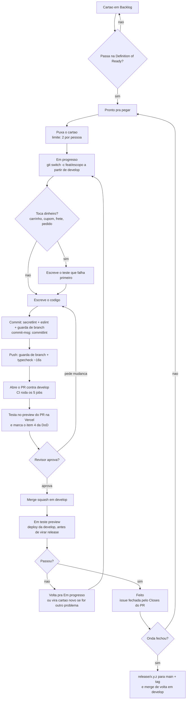

# Metodologia — como esta dupla trabalha

Dois desenvolvedores, assíncronos, com uma loja no ar. Gabriel construiu tudo e tem o
contexto na cabeça; Netim entrou em 30/07/2026 e não tem nenhum.

Este documento é o processo de trabalho, não teoria. Cada prática adotada aponta um
problema medido deste projeto — se você não achar a evidência, a prática não deveria estar
aqui e pode ser cortada.

O que fica em outro lugar:

| Assunto | Documento |
| --- | --- |
| Branch, commit, PR, release, hotfix | ⧗ [`CONTRIBUTING.md`](../../CONTRIBUTING.md) |
| Quando um cartão entra e quando fecha | [`DEFINITION-OF-DONE.md`](DEFINITION-OF-DONE.md) |
| Dia, hora e formato dos rituais | [`RITUAIS.md`](RITUAIS.md) |
| Os 5 primeiros dias do Netim | [`PRIMEIRA-SEMANA-NETIM.md`](PRIMEIRA-SEMANA-NETIM.md) |
| Comandos na sequência de uso | ⧗ [`GITFLOW-CHEATSHEET.md`](GITFLOW-CHEATSHEET.md) |
| Decisões técnicas registradas | [`../decisoes/`](../decisoes/) |
| Colunas do Kanban e regra de escolha de cartão | `docs/processo/KANBAN.md` (entregável do prompt 5, **ainda não escrito**) |

> **⧗ = ainda vive em Pull Request aberto, em 30/07/2026.** Estes links só resolvem depois do
> merge:
> - `CONTRIBUTING.md` e `GITFLOW-CHEATSHEET.md` → **PR #11** (`chore/gitflow-e-ci` → `develop`)
> - `docs/backlog/` e `docs/onboarding/06-ESTADO-ATUAL.md` → **PR #9**
> - `docs/onboarding/01` a `05` → **PR #8**
>
> Atenção à ordem: a cadeia **#8 → #9 mira a `main`**, e a **#10 / #11 mira a `develop`**.
> `docs/backlog/` só aparece na `develop` depois de um backmerge `main → develop`. Até lá,
> leia com `git show 'docs/estado-e-backlog:docs/backlog/BACKLOG.md'`.

---

## 1. Princípios

Cinco. Cada um existe porque a alternativa já custou caro aqui. Entre eles carregam as cinco
coisas que sustentam o resto: comunicação, simplicidade, feedback, coragem e respeito.

**1. Evidência antes de afirmação.**
Nenhuma alegação sobre o comportamento do sistema vale sem `arquivo:linha` ou uma execução
observada.
→ *Consequência prática:* "testei" não é resposta de revisão; o passo reproduzível é. A
reauditoria de 30/07 deu veredicto com evidência aos 85 achados de 29/07 e **refutou 1** —
verificador que só confirma é verificador quebrado, e o mesmo vale para revisor.

**2. A loja no ar vem antes do código bonito — e isso não é desculpa para não mexer.**
Todo commit na `main` é um deploy para clientes reais de Monte Carmelo.
→ *Consequência prática:* nada entra na `main` sem passar por `develop` e por um preview
deploy, e toda mudança precisa de um caminho de volta escrito antes de subir. Tendo a rede,
mexa: evitar o núcleo por medo é como o `AdminBannersView.tsx` chegou a 5.385 linhas.

**3. Feedback curto vale mais que plano detalhado.**
Um ciclo de uma semana com uma coisa entregue ensina mais sobre esta dupla do que um
cronograma de quatro meses.
→ *Consequência prática:* PR pequeno, ciclo de 7 dias, e a estimativa do
⧗ [`ROADMAP.md`](../backlog/ROADMAP.md) (16 a 22 semanas) tratada como chute até a Onda 0
fechar e dar a primeira medição real.

**4. Simplicidade agora, não depois.**
A resposta padrão para "e se um dia a gente precisar" é não.
→ *Consequência prática:* o `vite.config.ts` tem 13 ramos de `manualChunks` que ninguém sabe
justificar (`PWA-030`) e existem três implementações independentes de busca no cliente
(`BUSCA-010`). Nenhuma foi decidida de propósito; todas cresceram.

**5. Conhecimento é do time, e quem pergunta não paga preço por isso.**
Hoje há 20 tarefas no backlog que só o Gabriel consegue responder. Isso é o gargalo, não o
código.
→ *Consequência prática:* toda resposta dele que destrava trabalho vira documento — ADR,
comentário no cartão ou correção em `docs/onboarding/`. Resposta que ficou só no Discord não
aconteceu. E ninguém é cobrado por perguntar: quem não sabe pergunta, quem sabe responde por
escrito. O custo de perguntar tem que ser menor que o de errar sozinho, senão o gargalo nunca
se desfaz.

---

## 2. Práticas adotadas

Onze. Para cada uma: o que é, por que **este** projeto precisa, como funciona para dois, e
como saber que está funcionando.

---

### 2.1 Ciclo de uma semana

**O que é.** Uma unidade fechada de sete dias: segunda escolhe o que entra, sexta fecha o que
saiu. Sem estimativa em pontos, sem velocity. (O horário é assunto da
[`RITUAIS.md`](RITUAIS.md).)

**Por que este projeto precisa.** O ⧗ [`ROADMAP.md`](../backlog/ROADMAP.md) estima 16 a 22
semanas para 111 tarefas e o próprio documento chama isso de chute grosso, porque não existe
registro de duração de nenhuma tarefa anterior. Sem ciclo não há medição; sem medição, a
estimativa continua sendo chute daqui a três meses.

**Como funciona para dois.** Cada um puxa cartão de `Pronto pra pegar` no limite de 2 em
`Em progresso`. O que não fechou na sexta volta para `Pronto pra pegar` sem cerimônia — não
existe "carregar para o próximo sprint", porque não existe sprint.

**Sinal de que está funcionando.** Ao fim da Onda 0 existe um número: quantos cartões esta
dupla fecha por semana. Se depois de quatro ciclos ninguém souber esse número, o ciclo virou
calendário e não medição.

---

### 2.2 Planejamento de ciclo

**O que é.** 30 minutos na segunda escolhendo o que entra, com o critério de escolha escrito
e não improvisado.

**Por que este projeto precisa.** São 111 cartões em 22 épicos e 4 ondas. Sem regra de
escolha, os dois puxam o que parece interessante — e o que parece interessante quase nunca é
o vazamento de dado pessoal que está aberto agora (risco nº 1 de
⧗ [`06-ESTADO-ATUAL.md`](../onboarding/06-ESTADO-ATUAL.md)).

**Como funciona para dois.** A regra de escolha vai morar no `docs/processo/KANBAN.md`
(entregável do prompt 5, ainda não escrito). Até lá vale esta, nesta ordem:

1. Existe P0 aberto? Pega P0.
2. Existe cartão bloqueando o outro dev? Pega esse.
3. Existe decisão do Gabriel travando uma trilha? Ele responde antes de escrever código.
4. Só então: o próximo da onda corrente, respeitando as notas de paralelização do ROADMAP.

**Sinal de que está funcionando.** Ninguém termina a semana bloqueado esperando o outro. Se
acontecer duas semanas seguidas, a regra de escolha está errada, não as pessoas.

---

### 2.3 Par sob demanda, por risco — não o dia inteiro

**O que é.** Programação em par existe aqui em três formatos, escolhidos por risco da tarefa,
e nenhum deles é "os dois no mesmo código o dia inteiro".

**Por que este projeto precisa.** Estes dois estão em lugares diferentes e conversam por
Discord. Par o dia todo aqui é uma regra que morre na primeira semana. Mas existem lugares
onde trabalhar sozinho é caro demais: o `StoreContext.tsx` recebe 5 tarefas na Onda 1 e o
ROADMAP diz, com todas as letras, que "não existe divisão limpa aqui".

**Como funciona para dois.**

| Formato | Quando | Como |
| --- | --- | --- |
| **Par síncrono marcado** | Cartão de risco **alto**, qualquer coisa que toca banco, e o primeiro cartão do Netim | Até 90 min, marcado com meio dia de antecedência. Um compartilha a tela, o outro dirige |
| **Par assíncrono no PR** | Padrão para todo o resto | Quem revisa comenta em linha propondo alternativa, não só apontando erro. Revisão que só diz "ok" não é par |
| **Sessão de arqueologia** | Alguém travado há mais de 40 min numa parte que o outro conhece | Chamada **imediata**, ~20 min, sem agenda e sem antecedência. Único objetivo: tirar o contexto da cabeça de quem sabe |

A regra dos 40 minutos é a mais importante das três: travar sozinho por orgulho é o
desperdício mais caro de uma dupla assíncrona. Os três formatos estão detalhados na
[`RITUAIS.md`, §4](RITUAIS.md#4-sessão-de-par-e-sessão-de-arqueologia).

**Sinal de que está funcionando.** As sessões de arqueologia diminuem com o tempo. Se depois
de dois meses o Netim ainda precisar de uma por dia, a documentação é que está falhando, e
isso vira cartão de tipo `doc`.

---

### 2.4 TDD só no fluxo de dinheiro — e é aqui que começa

**O que é.** Teste escrito antes do código, obrigatório em quatro áreas: carrinho, cupom,
frete e criação de pedido. Fora delas, teste é bem-vindo e não é exigido.

**Por que este projeto precisa.** O número real: existem **12 testes automatizados**, todos
em `supabase/functions/calculate-shipping/index_test.ts`, cobrindo **3 funções puras**
(`calculateSmartFallback`, `isLocalCep`, `getCartHash`). Carrinho, cupom, checkout, RPC de
pedido e o front inteiro têm **zero**. Enquanto o PR #11 não mergear, esses 12 continuam sem
rodar em lugar nenhum: não há script `test` na `develop` e o `npx knip` classifica o arquivo
como não utilizado.

E é exatamente no fluxo de dinheiro que a auditoria concentrou o estrago, e a Onda 1 do ROADMAP
é quase inteira carrinho / cupom / frete / checkout.

> **O número "66 abertos" era de 30/07/2026 e não vale mais para planejar.** A reauditoria de
> 22/08/2026 mediu, no código de hoje, **51 dos 85 achados: 25 fechados e 26 abertos** — as
> faixas 26-50 e os 9 de runtime ainda estavam sendo medidos quando isto foi escrito. O estado
> por achado está em
> [`../auditoria/2026-08-22-reauditoria-de-julho.md`](../auditoria/2026-08-22-reauditoria-de-julho.md).

**Como funciona para dois.** Exigir TDD em tudo hoje seria exigir uma suíte que não existe e
um runner de front que ninguém instalou (`INFRA-150`). Então o começo é este, nesta ordem:

1. **`INFRA-150`** instala o runner de front e cobre `src/lib/mappers.ts`. É a fundação —
   sem ela, "escreva o teste antes" não tem onde escrever.
2. A partir do merge de `INFRA-150`, **todo cartão que toca `src/contexts/CartContext.tsx`,
   `src/hooks/useCoupons.ts`, `src/views/customer/CheckoutView.tsx` ou a RPC de pedido abre
   com um teste que falha.** Sem exceção, inclusive para o Gabriel.
3. Bug corrigido nessas quatro áreas entra com o teste que reproduzia o bug. O teste é a
   prova de que o bug existia.
4. O resto do sistema: teste opcional, decidido por quem escreve.

Enquanto `INFRA-150` não estiver mergeada, o substituto honesto é o passo reproduzível no
campo "Como testar" do PR — e ele é obrigatório desde já.

**Sinal de que está funcionando.** A contagem de testes que **rodam** sobe todo ciclo. Hoje
são 12 (e 0 enquanto o CI não entrar). Se em quatro semanas continuarem 12, esta prática está
no papel e não no código.

> Alvo de hoje: quatro áreas cobertas por teste antes do código.
> Alvo a revisar em **30/10/2026**: `npm test` cobrindo os cinco fluxos críticos de
> ⧗ [`05-FLUXOS-CRITICOS.md`](../onboarding/05-FLUXOS-CRITICOS.md).
> **Não existe meta de percentual de cobertura** — num projeto que sai de 12 testes, número
> de cobertura vira teste escrito para subir número.

---

### 2.5 Integração contínua

**O que é.** Todo mundo integra na `develop` pelo menos uma vez ao dia, e o CI roda em todo PR.

**Por que este projeto precisa.** Até 30/07/2026 **nunca houve um workflow neste repositório**
— na `develop` e na `main`, `git log --diff-filter=A -- '.github/workflows/*'` sai vazio, e o
motivo de nunca ter havido não está documentado em lugar nenhum. (Com `--all` o comando já
encontra um: o commit que **cria** o `ci.yml`, na branch do PR #11.) Desde 28/07 havia ainda
um agravante: a regra
`*.yml` do `.gitignore:60` fazia `git add .github/workflows/ci.yml` falhar **em silêncio**.
O **PR #11, aberto em 30/07/2026**, resolve as duas coisas e traz cinco jobs bloqueantes
(`Tipos`, `Testes (Deno)`, `Build e tamanho`, `Varredura de segredo`, `Catraca de lint`),
nenhum com `continue-on-error`.

**Como funciona para dois.** Branch de feature vive no máximo dois dias. Se um cartão levar
mais que isso, ele é maior do que um cartão e volta para o backlog quebrado — a exceção são
as trilhas que o ROADMAP marca como "um dev único, num PR só", e essas o planejamento já sabe
de antemão.

**"Bloqueante" aqui é acordo, não trava.** Branch protection retorna 403 neste repositório
(privado, plano Free). O GitHub não impede merge no vermelho; os dois é que combinaram de não
fazer. Está detalhado em
⧗ [A trava que não existe](../../CONTRIBUTING.md#a-trava-que-não-existe).

**Sinal de que está funcionando.** Nenhum PR fica mais de **três** dias aberto (o prazo de
revisão é 48h; três dias dá margem para o ajuste e o merge) e ninguém mergeia no vermelho.
Quando alguém mergear no vermelho — vai acontecer —, isso vira assunto da retro, não bronca.

---

### 2.6 Regra do escoteiro, com catraca

**O que é.** Deixe o arquivo um pouco melhor do que encontrou, dentro do escopo do cartão.
É a limpeza pequena e oportunista — a reestruturação grande é a prática 2.7.

**Por que este projeto precisa.** A dívida é grande e antiga. São **quatro** números na
catraca, todos medidos **no CI**, em Linux: **7 erros e 553 warnings de eslint**, **31 erros
e 3 warnings de Biome**. Fora da catraca, e sem teto nenhum, há **506 `console.*`** em `src/`.
Nenhum dos dois criou isso. Sem uma
regra, ou ninguém limpa nada, ou alguém "aproveita" um PR de bug para reformatar 40 arquivos
e o PR fica irrevisável.

**Como funciona para dois.** A catraca (`npm run lint:ratchet`) compara com
`.lint-baseline.json` e **reprova só o que subir**. Então:

- Limpar o que está no arquivo que você já ia tocar: sim, no mesmo PR.
- Baixou um número? Abaixe o teto no mesmo PR — é isso que impede a dívida de voltar.
- Reformatação ampla, renomeação em massa, "arrumei tudo de passagem": não. Vira cartão de
  `divida tecnica` e PR próprio.
- Subir um teto exige explicação escrita no PR. Sempre.

**Sinal de que está funcionando.** Os quatro números do `.lint-baseline.json` só descem.

> **Só um dos quatro números tem cartão de zeragem.** `INFRA-250` zera os **553 warnings** de
> eslint e diz explicitamente que "os 7 erros estão fora do escopo desta task". Os **7 erros
> de eslint** e os **31 erros + 3 warnings do Biome** não têm cartão — abrir dois, antes de
> prometer chegar a zero.
>
> Duas divergências para arrumar dentro do próprio PR #11, senão o Netim lê números diferentes
> na mesma semana: o comentário do `lefthook.yml` ainda diz **1106 warnings** (é 553×2, cheira
> a dupla contagem por varrer `.claude/worktrees`), e o comentário do `.lint-baseline.json`
> ainda aponta a `INFRA-220` como o cartão do Biome — ela não é.

---

### 2.7 Refatoração contínua, com gatilho

**O que é.** Reestruturação de verdade — quebrar arquivo gigante, unificar regra duplicada,
tirar camada morta. Diferente da regra do escoteiro, que é limpeza local.

**Por que este projeto precisa.** A dívida estrutural está medida e nomeada:
`AdminBannersView.tsx` com **5.385 linhas** num componente (`ADMIN-120`), `App.tsx` com
**2.712 linhas** e roteador manual, três implementações independentes de busca (`BUSCA-010`),
a regra de frete grátis escrita em sete lugares (`FRETE-020`). Nada disso move número de
linter, então a catraca da 2.6 é cega para tudo isso.

**Como funciona para dois — a decisão é adotar, mas com gatilho, não em qualquer momento:**

- **Gatilho:** só entra reestruturação em arquivo que já tenha cartão de `divida tecnica`
  aberto. Sem cartão, vira cartão primeiro. Isso impede refatoração de oportunidade dentro
  de PR de bug.
- **Teto:** reestruturação vai em PR próprio, sem mudança de comportamento junto. Se o diff
  mistura os dois, o revisor não consegue separar regressão de reorganização.
- **Trava temporária:** enquanto `INFRA-150` não existir, reestruturação de `CartContext`,
  `CheckoutView`, `useCoupons` ou da RPC de pedido **não acontece**. São os quatro lugares
  sem nenhum teste e com o maior custo de errar. Reestruturar sem rede aqui é apostar a loja.

**Sinal de que está funcionando.** Ao fim de cada onda, pelo menos um dos arquivos gigantes
citados acima encolheu — e o cartão de dívida correspondente fechou. Se nenhum encolher em
duas ondas, o gatilho está apertado demais e vale afrouxar.

---

### 2.8 Propriedade coletiva — com rota de saída, não como slogan

**O que é.** Qualquer um pode mexer em qualquer parte. Ninguém é dono de arquivo.

**Por que este projeto precisa — e por que hoje é mentira.** O Gabriel escreveu 100% do
código, e o `.github/CODEOWNERS` (que chega no PR #11) começa com um catch-all
`*  @BielWeed` e depois nomeia as áreas onde um erro derruba a loja: `/supabase/`,
`/src/contexts/`, `/scripts/`, `vite.config.ts`, `vercel.json`, `middleware.ts`,
`.env.example`, mais toda a infraestrutura do processo (`/.github/`, `lefthook.yml`,
`.commitlintrc.json`, `.gitignore`, `CONTRIBUTING.md`). Isso é o oposto de propriedade
coletiva, e é a decisão certa **hoje**. Dizer "o código é de todos" nesse cenário seria
escrever algo que a realidade desmente na primeira semana.

> Duas coisas para arrumar no próprio PR #11: o comentário do `CODEOWNERS` diz que "o Netim
> ainda não é colaborador", e ele já é (`wpfsilvaa`, permissão de escrita, sem convite
> pendente). Acrescentar `@wpfsilvaa` na linha `*` e apagar o comentário.

**Como funciona para dois — o plano de sair disso, com marco.**

| Quando | O que muda |
| --- | --- |
| Ciclos 1–2 (Onda 0) | Netim trabalha fora de `/supabase/`, `/src/contexts/` e `/scripts/`. **Os dois revisam o PR um do outro** — a revisão é mútua desde o primeiro dia |
| Onda 1 | Divisão de trilha do ROADMAP: Dev A leva `StoreContext` + `CartContext` + `CheckoutView` + catálogo (a trilha densa); Dev B leva CI + testes + banco + push/PWA + docs (a trilha larga) |
| **Onda 2 — troca obrigatória de trilha** | O ROADMAP já prevê: "trocar na Onda 2, senão o Dev B nunca aprende o núcleo". Quem levou o núcleo passa a revisar; quem revisava passa a escrever |
| Quando o Netim tiver mergeado 3 PRs em `src/contexts/` | Revisar o `CODEOWNERS`. Se ele continuar igual, a propriedade coletiva não aconteceu |

**Existe uma segunda camada de propriedade, e ela é temporária de propósito:** o planejamento
de ciclo dá **dono por ciclo** aos seis arquivos que geram conflito de merge de verdade
(`StoreContext.tsx`, `CartContext.tsx`, `useOrders.ts`, `CheckoutView.tsx`, `mappers.ts`,
`vite.config.ts`). Isso é alocação de trabalho, não propriedade: expira no fim do ciclo e é
redecidida na segunda seguinte.

**Sinal de que está funcionando.** A pergunta "quem sabe mexer nisso?" tem duas respostas
possíveis em pelo menos metade das áreas. Enquanto tiver uma só, o gargalo continua.

---

### 2.9 Padrão de código decidido por ferramenta

**O que é.** Estilo não se discute em revisão. Biome e ESLint decidem; o commitlint decide o
formato da mensagem.

**Por que este projeto precisa.** Dois devs, um em Windows com o disco em CRLF, e o Biome
formatando em LF. Sem regra, cada PR vira um diff de arquivo inteiro. É medido, e os dois
números vêm de máquinas diferentes: **31 erros no CI** (Linux, LF) contra **337 diagnósticos
no disco do Gabriel** (Windows, CRLF), dos quais **293 são só formatação**. É por isso que o
Biome roda **no CI e não no hook**.

**Como funciona para dois.** Discussão de estilo em revisão de PR é fora de escopo. Se você
discorda da regra, mude a regra num PR de `tooling` — e aí sim discute-se, uma vez, para
sempre.

> **Não existe cartão para normalizar fim de linha.** `INFRA-220` é "fazer o Biome cobrir as
> edge functions e remover o ignore de caminho absoluto" — não toca `.gitattributes` e o
> próprio cartão avisa que vai **gerar** mais diagnóstico de formatação, não menos. Antes de
> mover o Biome para o hook, abrir um cartão de normalização de `.gitattributes`.

**Sinal de que está funcionando.** Nenhum comentário de revisão sobre aspas, vírgula ou ordem
de import.

---

### 2.10 Simplicidade / YAGNI

**O que é.** Escreva o que o cartão pede. Abstração entra quando o terceiro caso aparece, não
quando o primeiro é imaginado.

**Por que este projeto precisa.** Três exemplos medidos, todos com cartão aberto:
`AdminBannersView.tsx` com 5.385 linhas (`ADMIN-120`), 13 ramos de `manualChunks` sem
justificativa (`PWA-030`), e três implementações independentes de busca no cliente
(`BUSCA-010`).

**Como funciona para dois.** Na revisão, a pergunta é "o cartão pedia isso?". Código a mais
não é bônus — é superfície que o outro vai ter que entender e manter.

**Sinal de que está funcionando.** O diff do PR cabe na tela do revisor sem rolagem infinita,
e o "Como testar" descreve exatamente o que o cartão prometia.

---

### 2.11 Ritmo sustentável

**O que é.** Nem madrugada, nem fim de semana, exceto loja parada.

**Por que este projeto precisa.** Pelo relato do Gabriel, a conversa que originou toda esta
estrutura aconteceu por volta das 00:30 — não é medição, é o que ele contou. O que **é**
medido: dos **88 commits** do histórico, 22h é o pico (17 commits) e a faixa de 00h às 06h
tem **11 — 12,5%**. Não é catástrofe; é a assinatura de quem toca projeto sozinho
e não tem com quem dividir. Agora tem.

**Como funciona para dois.**

- Mensagem fora do horário combinado é normal (é assíncrono). **Esperar resposta fora dele,
  não.**
- `hotfix` de madrugada é legítimo quando a loja está parada. Feature de madrugada não é.
- Ninguém cobra ninguém por tempo de tela. A cobrança é sobre cartão parado, e ela acontece
  no ritual.

**Sinal de que está funcionando.** A fatia de commits entre 00h e 06h **não cresce** em
relação à linha de base de 30/07/2026 (11 de 88, 12,5%). Medível a qualquer momento com
`git log --format=%ad --date=format:%H`, e conferido na revisão mensal do backlog.

---

## 3. Práticas não adotadas

Recusar prática por bom motivo vale mais que adotar doze no papel. Estas ficaram de fora, e
cada uma tem o motivo escrito para que a decisão possa ser revista com base em algo.

| Prática | Por que não |
| --- | --- |
| **Cliente presente em tempo integral** | Não existe cliente separado do time: o Gabriel é dono do produto e desenvolvedor. Criar o papel formal seria ele marcando reunião consigo mesmo. O substituto é a fila de ADRs — as 20 decisões de produto pendentes no backlog |
| **Stand-up diário formal** | Reunião com hora marcada entre dois assíncronos custa mais em coordenação do que entrega em informação. Substituído pela mensagem de 3 linhas no Discord, sem hora marcada ([`RITUAIS.md`, §2](RITUAIS.md#2-sincronização-diária--assíncrona-sem-hora-marcada)) |
| **Metáfora do sistema** | Uma metáfora compartilhada para nomear as coisas não ajuda aqui: o projeto já tem nomes inventados demais — DataVault, shared-brain, silent-guardian, OMNIVERSE, nuclear purge. Mais uma camada piora. O substituto é o ⧗ [`04-GLOSSARIO.md`](../onboarding/04-GLOSSARIO.md), que chega com o PR #8 |
| **Planejamento com velocity histórica** | Não há histórico. Nenhuma tarefa anterior tem duração registrada. Velocity inventada vira compromisso inventado. Volta a ser avaliada depois de 4 ciclos medidos |
| **Estimativa em pontos de história** | O backlog já tem tamanho P/M/G e isso basta para caber num cartão. Converter para pontos só acrescenta uma unidade que ninguém sabe calibrar |
| **Par presencial o dia inteiro** | Assíncrono, lugares diferentes. Substituído pelos três formatos do item 2.3 |
| **TDD universal** | Não há runner de teste no front (`INFRA-150` está aberta). Exigir TDD em tudo hoje é exigir o impossível, e regra impossível ensina a ignorar regra. Restrito ao fluxo de dinheiro (item 2.4) |
| **Release a cada ciclo** | A `main` é a loja no ar e ainda há achados de auditoria abertos (estado medido em [`2026-08-22-reauditoria-de-julho.md`](../auditoria/2026-08-22-reauditoria-de-julho.md); o antigo "66" é de 30/07 e não foi remedido desde então). Release semanal por calendário aumentaria exposição sem melhorar nada. Release sai quando uma onda do ROADMAP fecha, ou quando um conjunto coeso está testado em preview |
| **Dono de módulo formal** | O `CODEOWNERS` já concentra em uma pessoa por necessidade. Formalizar isso como método congelaria o gargalo que o item 2.8 existe para desfazer |

---

## 4. Fluxo de uma task, do começo ao fim

Seis pontos deste fluxo que costumam ser esquecidos:

1. **A branch sai de `develop`, não da `main`.** A única exceção é `hotfix/`, que sai da
   `main` e **não** aparece neste diagrama — o passo a passo dele está em
   ⧗ [`CONTRIBUTING.md`](../../CONTRIBUTING.md#hotfix).
2. **Preview e coluna `Em teste (preview)` são dois momentos diferentes**, e confundi-los
   esvazia a coluna:
   - o **item 4 da DoD** ("Testei no preview deploy da Vercel") é o preview **do PR**, antes
     de pedir revisão;
   - a **coluna `Em teste (preview)`** é o deploy da `develop`, **depois** do merge, antes de
     o conjunto virar release.
3. **Merge é squash** para PR de feature — está ligado no repositório (`allow_squash_merge`,
   `delete_branch_on_merge`). Release e hotfix usam merge commit, para preservar os commits
   individuais.
4. **Quem move o cartão é quem fez o trabalho**, exceto a passagem para `Em teste (preview)`,
   que o merge dispara.
5. **Se o preview da `develop` reprovar, o cartão volta**; ele não fecha "com ressalva". Se o
   problema descoberto for outro, abre cartão novo e o original segue.
6. **`release` e `hotfix` mergeiam em duas branches.** Esquecer o merge de volta em `develop`
   é a causa mais comum de regressão em GitFlow.

---

## 5. Como os dois se comunicam

Assíncrono é o padrão. Chamada é a exceção, e a exceção precisa de motivo.

| Assunto | Onde | Prazo de resposta |
| --- | --- | --- |
| Andamento de cartão | Comentário na issue | Não precisa de resposta |
| Dúvida técnica sobre código | Comentário na issue ou no PR, com `arquivo:linha` | 1 dia útil |
| Revisão de PR | GitHub | **48h.** Passou disso, cobre no Discord |
| Bloqueio ("não consigo seguir sem X") | Discord, marcando a pessoa | Mesmo dia |
| Loja parada | Discord + ligação | Imediato |
| Decisão de produto ou arquitetura | Vira ADR em [`docs/decisoes/`](../decisoes/) | Ver item 6 |
| Combinado de processo | Este documento, num PR | — |
| Ideia que ainda não é tarefa | Notion, página *Ideias e descobertas* | — |

**Três regras que fazem o resto funcionar:**

1. **PR parado é o modo de falha número um de dupla assíncrona.** 48 horas sem revisão e a
   cobrança é obrigatória — do processo, não da pessoa. O mesmo prazo está no
   ⧗ [`CONTRIBUTING.md`](../../CONTRIBUTING.md#abrindo-um-pr); se um mudar, muda o outro.
2. **Conversa que destrava trabalho não morre no Discord.** Resposta que muda o que alguém
   vai codar volta para a issue ou vira ADR no mesmo dia. Discord é onde se conversa, não
   onde se guarda.
3. **Quem usar `--no-verify` avisa no Discord.** Não é proibido — tem hora que é a saída
   certa. É que ninguém mais tem como saber que aconteceu.

---

## 6. Como decisões técnicas são tomadas

As decisões ficam em [`docs/decisoes/`](../decisoes/), uma por arquivo, numeradas. O template
está em [`0000-template.md`](../decisoes/0000-template.md).

Isto não é burocracia inventada: o backlog tem **20 tarefas de tipo `decisao`**, e o ROADMAP
diz que a fila de decisões do Gabriel é o que mais provavelmente vai furar a estimativa —
**10 cartões, que são 8 conversas**, travam a Onda 0 inteira. A lista está em
[`docs/decisoes/README.md`](../decisoes/README.md).

**Exige ADR:**

- Escolher, trocar ou remover uma dependência que aparece no bundle
- Mudar schema de banco, RLS ou o contrato de uma RPC
- Mudar como o estado do app é guardado (contexto, DataVault, shared-brain, service worker)
- Decidir algo que o backlog marcou como tipo `decisao`
- Qualquer coisa que a gente vá querer explicar daqui a seis meses com "por que fizemos assim?"
- Reverter uma decisão registrada — vira ADR novo apontando para o antigo

**Não exige ADR:** escolher nome de variável, organizar pasta dentro de um módulo, corrigir
bug sem mudar contrato, ajustar estilo, qualquer coisa reversível em um PR.

**ADR aceito não se edita, com uma exceção:** o campo `Estado`, quando um ADR novo o
substitui. Corpo, contexto, opções e decisão nunca mudam — a história da decisão é metade do
valor do registro.

**Como acontece.** Quem tem a dúvida escreve o ADR em estado `Proposta`, com pelo menos duas
opções e a recomendação. O outro comenta no PR. Sem consenso em dois dias, decide quem vai
manter o código — e o desacordo fica registrado no próprio ADR, na seção *Consequências*.
Empate não vira reunião: vira decisão de quem carrega o custo.

---

## Como este documento morre

Se um mês depois nenhuma prática desta lista tiver sido cortada ou alterada, provavelmente
ninguém está lendo. A revisão do backlog, mensal, tem um bloco para revisar estas práticas —
é lá que este documento é podado. Alterar o processo é um PR de `docs/` como qualquer outro,
e o revisor é a outra pessoa, sempre.
